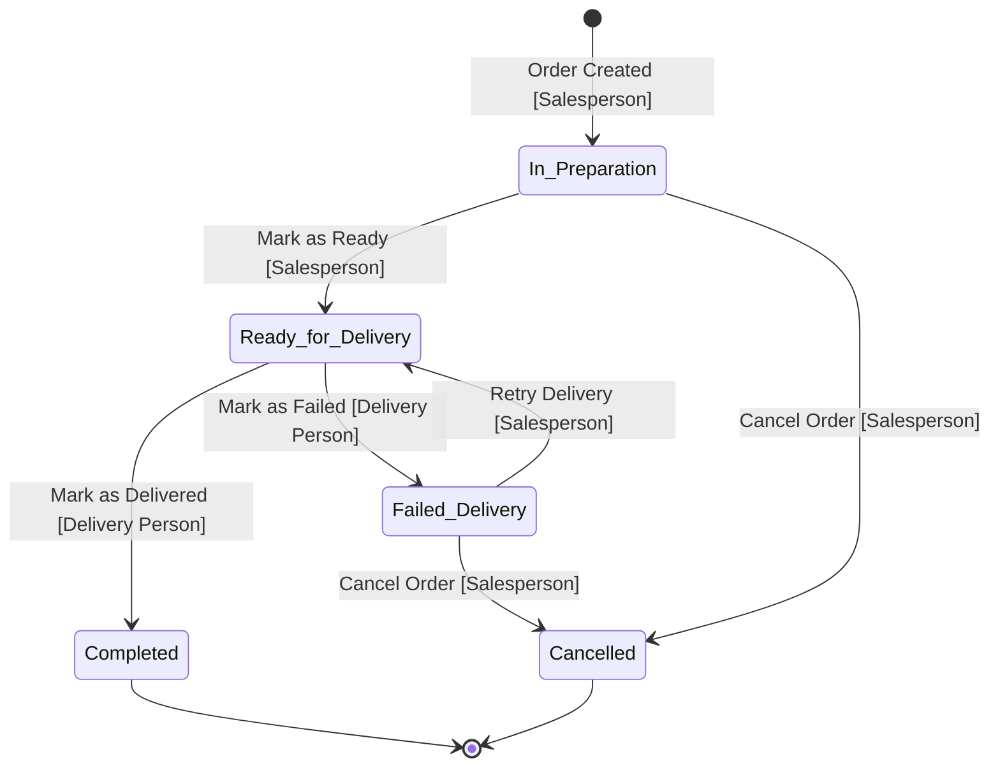
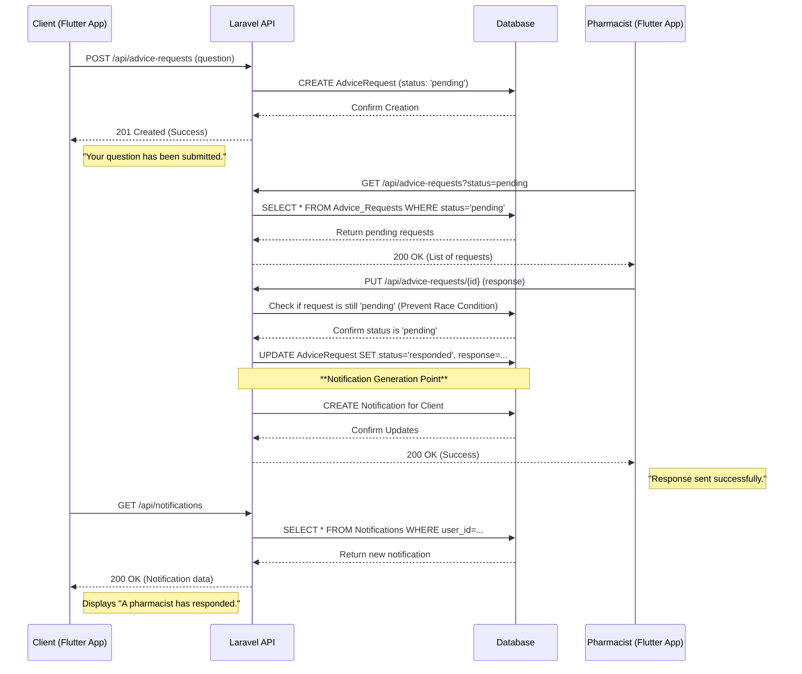
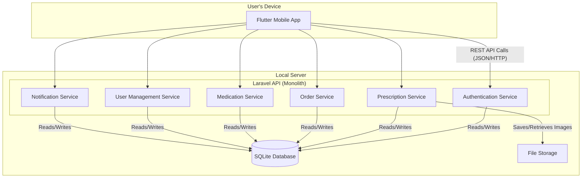
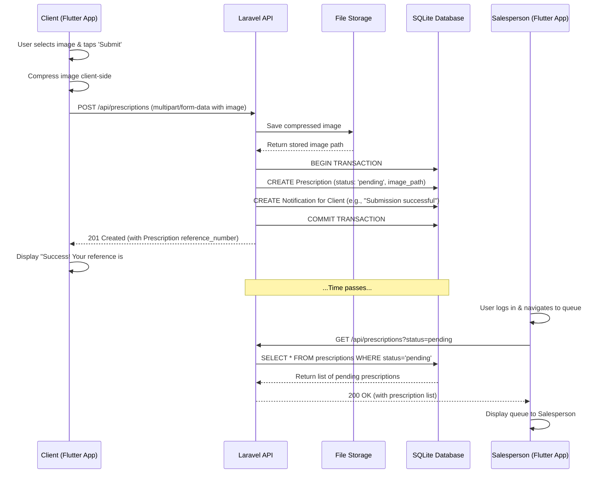
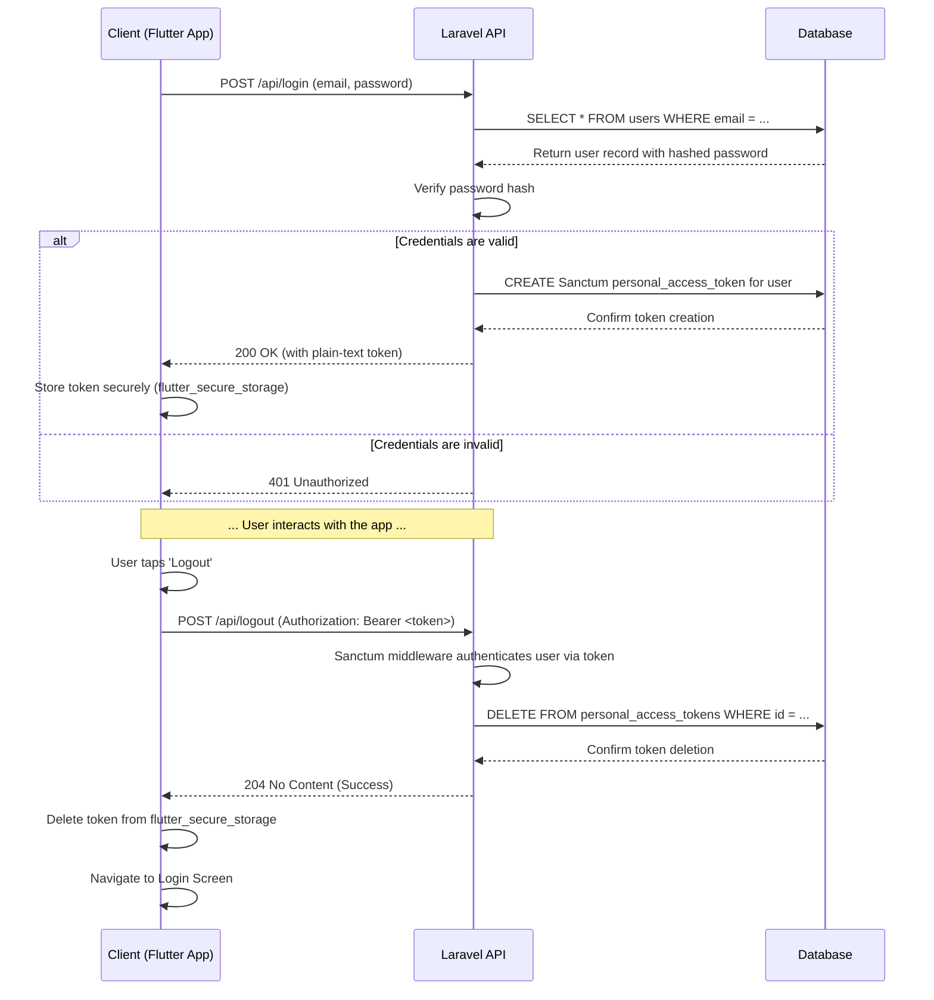
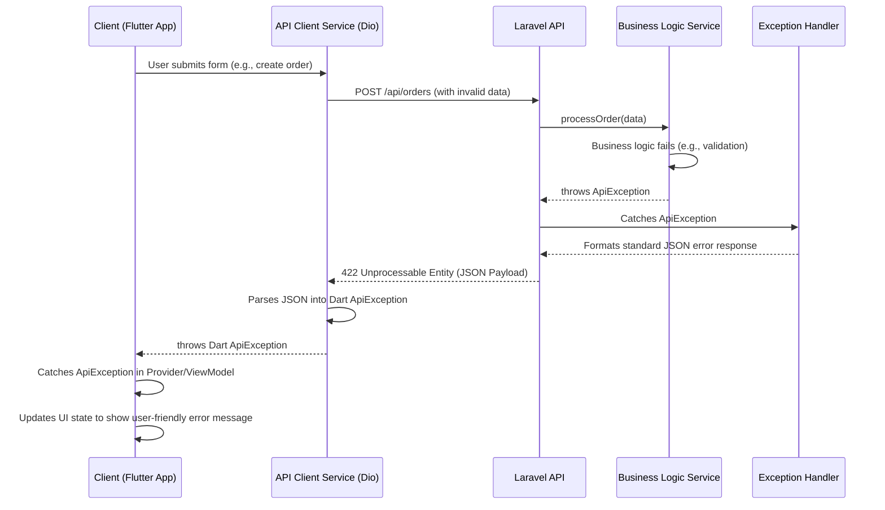

# Pharmacy Management System Fullstack Architecture Document

---

## Introduction

This document outlines the complete fullstack architecture for the Pharmacy Management System, including backend systems, frontend implementation, and their integration. It serves as the single source of truth for AI-driven development, ensuring consistency across the entire technology stack.

This unified approach combines what would traditionally be separate backend and frontend architecture documents, streamlining the development process for modern fullstack applications where these concerns are increasingly intertwined.

### Starter Template or Existing Project

N/A - Greenfield project.

Based on my analysis of the provided documents, this project will be built from scratch using the specified frameworks (Flutter and Laravel). No starter templates or existing codebases will be used as a foundation. This approach provides maximum control over the architecture and aligns with the educational goals of the project, but it requires manual setup for all tooling and configuration.

### Change Log

| Date           | Version | Description                                | Author            |
| :------------- | :------ | :----------------------------------------- | :---------------- |
| [Current Date] | 1.0     | Initial draft of the fullstack architecture. | Winston (Architect) |

---

## High Level Architecture

This section establishes the foundational architectural principles for the Pharmacy Management System. It defines the overall structure, key components, and guiding patterns that will inform all subsequent design and development decisions. The choices made here are derived directly from the project's explicit constraints as an educational capstone, prioritizing simplicity, portability, and learnability.

### Technical Summary

The system is designed as a **monolithic fullstack application** housed within a **single monorepo**. The user-facing component is a **Flutter mobile application for Android**, which communicates with a **Laravel backend API** via a standard **RESTful interface**. All application data is persisted in a local **SQLite database**, and prescription images are stored on the local filesystem. This self-contained architecture ensures zero-cost local development and maximum portability, directly supporting the PRD's goals of creating a streamlined, efficient, and easily manageable system for its educational context.

### Platform and Infrastructure Choice

-   **Platform:** Local Development Environment
-   **Key Services:** Flutter SDK, PHP/Composer, Local Web Server (e.g., Laravel Sail, Artisan Serve), SQLite Database Engine.
-   **Deployment Host and Regions:** N/A. The architecture is explicitly designed for local execution and is not intended for deployment to a cloud provider like AWS, Vercel, or Azure. This decision is a direct consequence of the project's zero-dollar budget constraint.

### Repository Structure

-   **Structure:** Monorepo
-   **Monorepo Tool:** N/A (Simple folder structure). For this project's scale, complex tooling like Nx or Turborepo is unnecessary.
-   **Package Organization:** The repository will contain two primary directories: `frontend/` for the Flutter application and `backend/` for the Laravel API. This structure simplifies version control and setup for a single developer.

### High Level Architecture Diagram

```mermaid
graph TD
    subgraph User
        U(Client / Staff)
    end

    subgraph "Device (Android)"
        F[Flutter Mobile App]
    end

    subgraph "Local Server Environment"
        A[Laravel REST API]
        D[SQLite Database]
        S[File Storage <br/>(Prescription Images)]
    end

    U -- Interacts with --> F
    F -- REST API Calls (HTTP/JSON) --> A
    A -- Reads/Writes --> D
    A -- Saves/Retrieves --> S
```

### Architectural Patterns

-   **Monolithic Architecture:** The backend is a single, unified Laravel application. This is the most pragmatic approach for a single-developer project, reducing deployment complexity and simplifying data management.
    -   *Rationale:* Aligns with the project's resource constraints and educational goals by focusing on core application logic rather than distributed systems overhead.
-   **Model-View-ViewModel (MVVM) with Provider:** The Flutter application will use the Provider package to implement the MVVM pattern, separating UI (View), state management (ViewModel), and data logic (Model).
    -   *Rationale:* This is a standard, effective pattern in the Flutter community that promotes a clean, testable, and maintainable frontend codebase.
-   **Repository Pattern:** The Laravel backend will use the Repository pattern to abstract data access logic. This decouples the business logic (services) from the data source (Eloquent models), making the application easier to test and maintain.
    -   *Rationale:* Directly supports the PRD's testing requirements by allowing business logic to be unit-tested without a live database connection.
-   **Role-Based Access Control (RBAC):** API endpoints will be protected using a clear, middleware-based RBAC system to enforce the permissions defined in the use case specifications.
    -   *Rationale:* This is a critical security pattern that ensures users can only perform actions appropriate for their assigned role.

---

## Tech Stack

This section serves as the **definitive and single source of truth** for all technologies, frameworks, and libraries to be used in the Pharmacy Management System. All development, tooling, and setup must adhere to these specific choices and versions. This precision is critical to ensure a stable, reproducible development environment, which is a core requirement for this educational project. Each selection is directly derived from the explicit constraints and preferences outlined in the provided PRD and technical requirements documents.

### Technology Stack Table

| Category | Technology | Version | Purpose | Rationale |
| :--- | :--- | :--- | :--- | :--- |
| **Frontend Language** | Dart | 3.4.x | Primary language for Flutter development. | Required by the Flutter framework. |
| **Frontend Framework**| Flutter | 3.22.x | UI toolkit for building the Android application. | A core, non-negotiable project requirement. |
| **UI Component Lib** | Material Design 3 | (Built-in) | Provides the foundational UI components and styling. | Specified in the UI/UX spec for a modern, dark theme. |
| **State Management** | Provider | 6.1.x | Manages application state on the frontend. | Explicitly required in the technical specifications. |
| **Backend Language** | PHP | 8.3.x | Primary language for the Laravel backend. | Required by the Laravel framework. |
| **Backend Framework**| Laravel | 11.x | Provides the core structure for the REST API. | A core, non-negotiable project requirement. |
| **API Style** | REST | (Standard) | Defines the communication protocol between frontend and backend. | Specified in the technical requirements. |
| **Database** | SQLite | 3.x | The exclusive database for all application data. | A critical, non-negotiable constraint for portability. |
| **File Storage** | Local Filesystem | N/A | Stores uploaded prescription images on the server. | Simplest approach for a local-only, zero-budget project. |
| **Authentication** | Laravel Sanctum | 4.x | Manages API token-based authentication. | Explicitly required in the technical specifications. |
| **Routing** | go_router | 14.1.x | Manages declarative, type-safe routing and navigation. | Chosen for its robust, centralized configuration, type-safe navigation, and built-in support for authentication guards, aligning with the architecture's security and maintainability goals. |
| **Frontend Testing** | flutter_test | (SDK) | For widget and unit testing the Flutter application. | Standard, built-in testing framework for Flutter. |
| **Backend Testing** | PHPUnit | 11.x | For unit and feature testing the Laravel API. | Standard, built-in testing framework for Laravel. |
| **E2E Testing** | integration_test | (SDK) | For full-stack, end-to-end user journey testing. | Flutter's official package for integration testing. |
| **CI/CD** | GitHub Actions | N/A | For automated testing on push (post-MVP). | Mentioned as a "Should-have" in the technical specs. |
| **Logging** | dart:developer / Laravel Logging | (Built-in) | Provides structured logging for debugging. | Specified in the technical requirements. |
| **IaC Tool** | N/A | N/A | Not applicable for a local-only development project. | Out of scope; no cloud infrastructure will be provisioned. |
| **Monitoring** | N/A | N/A | Not applicable for a non-production, educational project. | Out of scope; no production monitoring is required. |

---

## Data Models

This section defines the core data entities that form the backbone of the Pharmacy Management System. These models are a direct translation of the schema specified in the `technical-requirements.md` and serve as the conceptual blueprint for the SQLite database, Laravel Eloquent models, and the shared TypeScript interfaces. The creation of TypeScript interfaces is a key architectural decision to enforce type safety across the stack, which is a best practice for monorepo development that prevents entire classes of bugs at the integration boundary between the frontend and backend.

### User

**Purpose:** Represents any actor who can authenticate with the system. The `role` attribute is critical for the Role-Based Access Control (RBAC) system, determining the user's permissions and the interface they are presented with.

**Key Attributes:**
- `id`: number - Unique identifier for the user.
- `name`: string - The user's full name.
- `email`: string - The user's unique email address, used for login.
- `phone_number`: string | null - The user's contact phone number.
- `address`: string | null - The user's physical address for deliveries.
- `role`: 'client' | 'pharmacist' | 'salesperson' | 'delivery' | 'manager' - The user's assigned role.
- `status`: 'active' | 'disabled' - The current status of the user's account.

**TypeScript Interface:**
```typescript
export interface User {
  id: number;
  name: string;
  email: string;
  phone_number?: string | null;
  address?: string | null;
  role: 'client' | 'pharmacist' | 'salesperson' | 'delivery' | 'manager';
  status: 'active' | 'disabled';
  created_at: string;
  updated_at: string;
}
```

**Relationships:**
- A **User** can have many **Prescriptions**.
- A **User** can have many **Orders**.
- A **User** can have many **Advice Requests**.
- A **User** can have many **Notifications**.

### Medication

**Purpose:** Represents a single product in the pharmacy's inventory. It contains all details necessary for public display, order processing, and stock management.

**Key Attributes:**
- `id`: number - Unique identifier for the medication.
- `name`: string - The commercial name of the medication.
- `strength_form`: string - The strength and form (e.g., "500mg Tablet").
- `description`: string - A detailed description of the medication.
- `price`: number - The price per unit.
- `current_quantity`: number - The current stock level.
- `minimum_threshold`: number - The stock level at which a low-stock warning is triggered.
- `category`: 'Pain Relief' | 'Antibiotics' | 'Vitamins' | 'Cold & Flu' | 'Skincare' - The medication's category.
- `status`: 'active' | 'disabled' - Whether the medication is available for ordering.

**TypeScript Interface:**
```typescript
export interface Medication {
  id: number;
  name: string;
  strength_form: string;
  description: string;
  price: number;
  current_quantity: number;
  minimum_threshold: number;
  category: 'Pain Relief' | 'Antibiotics' | 'Vitamins' | 'Cold & Flu' | 'Skincare';
  status: 'active' | 'disabled';
  created_at: string;
  updated_at: string;
}
```

**Relationships:**
- A **Medication** can be in many **Orders** (through the `order_items` join table).

### Prescription

**Purpose:** Represents a client's uploaded prescription image and its state within the processing workflow. It is the initial artifact that triggers the order fulfillment process.

**Key Attributes:**
- `id`: number - Unique identifier for the prescription submission.
- `client_id`: number - Foreign key linking to the `User` who submitted it.
- `image_path`: string - The server-side path to the stored image file.
- `status`: 'pending' | 'processed' | 'rejected' - The current status of the prescription.
- `processed_by`: number | null - Foreign key linking to the staff `User` who processed it.
- `rejection_reason`: string | null - The reason provided if the status is 'rejected'.
- `reference_number`: string - A unique, user-facing reference number.

**TypeScript Interface:**
```typescript
export interface Prescription {
  id: number;
  client_id: number;
  image_path: string;
  status: 'pending' | 'processed' | 'rejected';
  processed_by?: number | null;
  rejection_reason?: string | null;
  reference_number: string;
  created_at: string;
  updated_at: string;
}
```

**Relationships:**
- A **Prescription** belongs to one **User** (the client).
- A **Prescription** can have one **Order** (after being processed).

### Order

**Purpose:** Represents a formal order for medications, created from a processed prescription. It tracks the order's contents, total cost, and fulfillment status.

**Key Attributes:**
- `id`: number - Unique identifier for the order.
- `client_id`: number - Foreign key linking to the `User` who owns the order.
- `prescription_id`: number | null - Foreign key linking to the source `Prescription`.
- `total_amount`: number - The calculated total cost of the order.
- `status`: 'in_preparation' | 'ready_for_delivery' | 'completed' | 'cancelled' | 'failed_delivery' - The current status in the fulfillment workflow.
- `assigned_delivery_user_id`: number | null - Foreign key linking to the `User` assigned to deliver the order.
- `cancellation_reason`: string | null - The reason provided if the status is 'cancelled'.

**TypeScript Interface:**
```typescript
import { OrderItem } from './order-item';

export interface Order {
  id: number;
  client_id: number;
  prescription_id?: number | null;
  total_amount: number;
  status: 'in_preparation' | 'ready_for_delivery' | 'completed' | 'cancelled' | 'failed_delivery';
  assigned_delivery_user_id?: number | null;
  cancellation_reason?: string | null;
  items?: OrderItem[]; // Eager loaded in some API responses
  created_at: string;
  updated_at: string;
}
```

**Relationships:**
- An **Order** belongs to one **User** (the client).
- An **Order** belongs to one **Prescription**.
- An **Order** has many **Order Items**.

### Order Item

**Purpose:** This is a pivot model that links a specific `Medication` to an `Order`. It stores the quantity and the price of the medication at the time the order was placed, which is crucial for accurate historical records.

**Key Attributes:**
- `id`: number - Unique identifier for the order line item.
- `order_id`: number - Foreign key linking to the `Order`.
- `medication_id`: number - Foreign key linking to the `Medication`.
- `quantity`: number - The quantity of the medication ordered.
- `unit_price`: number - The price of a single unit of the medication at the time of purchase.

**TypeScript Interface:**
```typescript
export interface OrderItem {
  id: number;
  order_id: number;
  medication_id: number;
  quantity: number;
  unit_price: number;
  created_at: string;
}
```

**Relationships:**
- An **Order Item** belongs to one **Order**.
- An **Order Item** belongs to one **Medication**.

### Advice Request

**Purpose:** Captures a client's health-related question and the subsequent interaction with a pharmacist. This model is central to the asynchronous advice workflow.

**Key Attributes:**
- `id`: number - Unique identifier for the advice request.
- `client_id`: number - Foreign key linking to the `User` who asked the question.
- `question`: string - The text of the client's question.
- `status`: 'pending' | 'responded' | 'rejected' - The current status of the request.
- `response`: string | null - The pharmacist's response text.
- `responder_id`: number | null - Foreign key linking to the staff `User` who responded.
- `rejection_reason`: string | null - The reason provided if the request was rejected.

**TypeScript Interface:**
```typescript
export interface AdviceRequest {
  id: number;
  client_id: number;
  question: string;
  status: 'pending' | 'responded' | 'rejected';
  response?: string | null;
  responder_id?: number | null;
  rejection_reason?: string | null;
  created_at: string;
  updated_at: string;
}
```

**Relationships:**
- An **Advice Request** belongs to one **User** (the client).
- An **Advice Request** can be handled by one **User** (the pharmacist).

### Notification

**Purpose:** Represents a single, asynchronous message delivered to a user within the application. This model is the foundation of the in-app notification system for communicating order status updates, advice responses, and other alerts.

**Key Attributes:**
- `id`: number - Unique identifier for the notification.
- `user_id`: number - Foreign key linking to the `User` who will receive the notification.
- `title`: string - The title of the notification.
- `message`: string - The body content of the notification.
- `type`: 'order_status' | 'prescription_update' | 'advice_response' | 'system_alert' - The type of notification, for potential UI differentiation (e.g., icons).
- `read_at`: string | null - A timestamp indicating when the user read the notification. Null if unread.

**TypeScript Interface:**
```typescript
export interface Notification {
  id: number;
  user_id: number;
  title: string;
  message: string;
  type: 'order_status' | 'prescription_update' | 'advice_response' | 'system_alert';
  read_at?: string | null;
  created_at: string;
}
```

**Relationships:**
- A **Notification** belongs to one **User**.

---

## API Specification

This section defines the formal contract for the REST API that the Flutter client will use to communicate with the Laravel backend. Adhering to this specification is mandatory for both frontend and backend development to ensure seamless integration. The API is designed to be resource-oriented, following standard RESTful principles.

As per the project requirements, we will use the **OpenAPI 3.0** standard to document the API. This provides a clear, language-agnostic contract that can be used to generate client libraries, documentation, and validation rules.

### REST API Specification

```yaml
openapi: 3.0.0
info:
  title: Pharmacy Management System API
  version: 1.0.0
  description: >
    The official REST API for the Pharmacy Management System. 

    This API provides endpoints for managing users, medications, prescriptions,
    and orders.

    Authentication is handled via bearer tokens issued by Laravel Sanctum.
servers:
  - url: 'http://localhost:8000/api'
    description: Local Development Server
paths:
  /register:
    post:
      summary: Register a new client account
      tags:
        - Authentication
      description: Creates a new user account with the 'client' role by default.
      requestBody:
        required: true
        content:
          application/json:
            schema:
              type: object
              required:
                - name
                - email
                - password
              properties:
                name:
                  type: string
                  example: John Doe
                email:
                  type: string
                  format: email
                  example: john.doe@example.com
                password:
                  type: string
                  format: password
                  minLength: 8
                  example: password123
      responses:
        '201':
          description: >-
            Account created successfully. Returns the new user object and a
            Sanctum token.
          content:
            application/json:
              schema:
                type: object
                properties:
                  user:
                    $ref: '#/components/schemas/User'
                  token:
                    type: string
                    example: 2|ghijklm789012
        '422':
          description: 'Validation error (e.g., email already exists, weak password).'
          content:
            application/json:
              schema:
                $ref: '#/components/schemas/ErrorResponse'
  /login:
    post:
      summary: Authenticate a user
      tags:
        - Authentication
      description: >-
        Validates user credentials and returns a plain-text Sanctum API token
        for subsequent requests.
      requestBody:
        required: true
        content:
          application/json:
            schema:
              type: object
              required:
                - email
                - password
              properties:
                email:
                  type: string
                  format: email
                  example: john.doe@example.com
                password:
                  type: string
                  format: password
                  example: password123
      responses:
        '200':
          description: Login successful. The response body contains the API token.
          content:
            application/json:
              schema:
                type: object
                properties:
                  token:
                    type: string
                    example: 1|abcdef123456
        '401':
          description: Invalid credentials.
          content:
            application/json:
              schema:
                $ref: '#/components/schemas/ErrorResponse'
  /logout:
    post:
      summary: Log out the current user
      tags:
        - Authentication
      security:
        - bearerAuth: []
      description: Revokes the user's current Sanctum API token on the server.
      responses:
        '204':
          description: Logout successful. No content returned.
        '401':
          description: Unauthenticated.
  /medications:
    get:
      summary: Search for medications
      tags:
        - Medications
      description: Publicly accessible endpoint to search the medication catalog by name.
      parameters:
        - in: query
          name: name
          schema:
            type: string
          description: The name of the medication to search for.
      responses:
        '200':
          description: >-
            A list of matching medications. Returns an empty array if no results
            are found.
          content:
            application/json:
              schema:
                type: array
                items:
                  $ref: '#/components/schemas/Medication'
    post:
      summary: Add a new medication
      tags:
        - Medications
      security:
        - bearerAuth: []
      description: Manager-only endpoint to add a new medication to the catalog.
      requestBody:
        required: true
        content:
          application/json:
            schema:
              $ref: '#/components/schemas/NewMedication'
      responses:
        '201':
          description: Medication created successfully.
          content:
            application/json:
              schema:
                $ref: '#/components/schemas/Medication'
        '401':
          description: Unauthenticated.
          content:
            application/json:
              schema:
                $ref: '#/components/schemas/ErrorResponse'
        '403':
          description: Forbidden. User does not have 'Manager' role.
          content:
            application/json:
              schema:
                $ref: '#/components/schemas/ErrorResponse'
        '422':
          description: 'Validation error (e.g., duplicate medication name, invalid price).'
          content:
            application/json:
              schema:
                $ref: '#/components/schemas/ErrorResponse'
  '/medications/{id}':
    put:
      summary: Update a medication
      tags:
        - Medications
      security:
        - bearerAuth: []
      description: Manager-only endpoint to update an existing medication's details.
      parameters:
        - in: path
          name: id
          required: true
          schema:
            type: integer
          description: The ID of the medication to update.
      requestBody:
        required: true
        content:
          application/json:
            schema:
              $ref: '#/components/schemas/UpdateMedication'
      responses:
        '200':
          description: Medication updated successfully.
          content:
            application/json:
              schema:
                $ref: '#/components/schemas/Medication'
        '401':
          description: Unauthenticated.
        '403':
          description: Forbidden.
        '404':
          description: Medication not found.
        '422':
          description: >-
            Validation error, such as attempting to create a duplicate
            medication (name + strength_form).
          content:
            application/json:
              schema:
                $ref: '#/components/schemas/ErrorResponse'
              example:
                message: The given data was invalid.
                errors:
                  name:
                    - >-
                      A medication with this name and strength/form already
                      exists.
    delete:
      summary: Disable a medication
      tags:
        - Medications
      security:
        - bearerAuth: []
      description: >-
        Manager-only endpoint to perform a soft delete on a medication by
        setting its status to 'disabled'.
      parameters:
        - in: path
          name: id
          required: true
          schema:
            type: integer
          description: The ID of the medication to disable.
      responses:
        '204':
          description: Medication disabled successfully. No content returned.
        '401':
          description: Unauthenticated.
        '403':
          description: Forbidden.
        '404':
          description: Medication not found.
        '409':
          description: >-
            Conflict. Cannot disable a medication that is part of an active
            order.
          content:
            application/json:
              schema:
                $ref: '#/components/schemas/ErrorResponse'
              example:
                message: Cannot disable a medication that is part of an active order.
  /medications/low-stock:
    get:
      summary: Get low stock report
      tags:
        - Medications
      security:
        - bearerAuth: []
      description: >-
        Manager-only endpoint to retrieve a list of all medications where the
        current quantity is at or below the minimum threshold.
      responses:
        '200':
          description: A list of low-stock medications.
          content:
            application/json:
              schema:
                type: array
                items:
                  $ref: '#/components/schemas/Medication'
        '401':
          description: Unauthenticated.
        '403':
          description: Forbidden.
  /prescriptions:
    get:
      summary: Get pending prescriptions
      tags:
        - Prescriptions
      security:
        - bearerAuth: []
      description: >-
        Staff-only endpoint to retrieve a list of prescriptions awaiting
        processing.
      parameters:
        - in: query
          name: status
          schema:
            type: string
            enum:
              - pending
            default: pending
          description: Filter prescriptions by status.
      responses:
        '200':
          description: A list of pending prescriptions.
          content:
            application/json:
              schema:
                type: array
                items:
                  $ref: '#/components/schemas/Prescription'
        '401':
          description: Unauthenticated.
        '403':
          description: Forbidden. User is not authorized staff.
    post:
      summary: Submit a new prescription
      tags:
        - Prescriptions
      security:
        - bearerAuth: []
      description: Client-only endpoint to upload a prescription image for processing.
      requestBody:
        required: true
        content:
          multipart/form-data:
            schema:
              type: object
              required:
                - image
              properties:
                image:
                  type: string
                  format: binary
                  description: 'The prescription image file (JPG, PNG, max 5MB).'
      responses:
        '201':
          description: >-
            Prescription submitted successfully. Returns the new prescription
            object.
          content:
            application/json:
              schema:
                $ref: '#/components/schemas/Prescription'
        '401':
          description: Unauthenticated.
        '403':
          description: Forbidden. User is not a 'client'.
        '422':
          description: 'Validation error (e.g., invalid file type, file too large).'
          content:
            application/json:
              schema:
                $ref: '#/components/schemas/ErrorResponse'
  '/prescriptions/{id}/process':
    put:
      summary: Process or reject a prescription
      tags:
        - Prescriptions
      security:
        - bearerAuth: []
      description: >
        Salesperson-only endpoint to perform an action on a pending
        prescription.

        - To **process**, provide a list of medication items. This creates a new
        order.

        - To **reject**, provide a status of 'rejected' and a reason.
      parameters:
        - in: path
          name: id
          required: true
          schema:
            type: integer
          description: The ID of the prescription to process.
      requestBody:
        required: true
        content:
          application/json:
            schema:
              oneOf:
                - $ref: '#/components/schemas/ProcessPrescriptionRequest'
                - $ref: '#/components/schemas/RejectPrescriptionRequest'
      responses:
        '200':
          description: Prescription rejected successfully.
          content:
            application/json:
              schema:
                $ref: '#/components/schemas/Prescription'
        '201':
          description: Prescription processed and order created successfully.
          content:
            application/json:
              schema:
                $ref: '#/components/schemas/ProcessPrescriptionResponse'
        '401':
          description: Unauthenticated.
        '403':
          description: Forbidden. User is not a 'salesperson'.
        '404':
          description: Prescription not found.
        '409':
          description: >-
            Conflict (e.g., insufficient stock for an item, or prescription
            already processed).
          content:
            application/json:
              schema:
                $ref: '#/components/schemas/ErrorResponse'
        '422':
          description: 'Validation error (e.g., missing rejection reason).'
          content:
            application/json:
              schema:
                $ref: '#/components/schemas/ErrorResponse'
  /orders:
    get:
      summary: Get a list of orders (Staff)
      tags:
        - Orders
      security:
        - bearerAuth: []
      description: >-
        Staff-only endpoint to retrieve a list of orders. Can be filtered by
        status.
      parameters:
        - in: query
          name: status
          schema:
            type: string
            enum:
              - in_preparation
              - ready_for_delivery
              - completed
              - cancelled
              - failed_delivery
          description: Filter orders by their current status.
      responses:
        '200':
          description: A list of orders matching the filter.
          content:
            application/json:
              schema:
                type: array
                items:
                  $ref: '#/components/schemas/Order'
        '401':
          description: Unauthenticated.
        '403':
          description: Forbidden. User is not authorized staff.
  '/orders/{id}':
    get:
      summary: Get a single order by ID (Staff)
      tags:
        - Orders
      security:
        - bearerAuth: []
      description: >-
        Staff-only endpoint to retrieve the full details of a single order,
        including its line items.
      parameters:
        - in: path
          name: id
          required: true
          schema:
            type: integer
          description: The ID of the order to retrieve.
      responses:
        '200':
          description: The detailed order object.
          content:
            application/json:
              schema:
                $ref: '#/components/schemas/Order'
        '401':
          description: Unauthenticated.
        '403':
          description: Forbidden.
        '404':
          description: Order not found.
    put:
      summary: Modify an order's items
      tags:
        - Orders
      security:
        - bearerAuth: []
      description: >-
        Salesperson-only endpoint to modify the items of an order that is in the
        'in_preparation' state.
      parameters:
        - in: path
          name: id
          required: true
          schema:
            type: integer
          description: The ID of the order to modify.
      requestBody:
        required: true
        content:
          application/json:
            schema:
              $ref: '#/components/schemas/UpdateOrderRequest'
      responses:
        '200':
          description: Order updated successfully.
          content:
            application/json:
              schema:
                $ref: '#/components/schemas/Order'
        '401':
          description: Unauthenticated.
        '403':
          description: >-
            Forbidden. User is not a salesperson or order is not in a modifiable
            state.
        '404':
          description: Order not found.
        '409':
          description: 'Conflict (e.g., insufficient stock for an item).'
          content:
            application/json:
              schema:
                $ref: '#/components/schemas/ErrorResponse'
  '/orders/{id}/status':
    put:
      summary: Update an order's status
      tags:
        - Orders
      security:
        - bearerAuth: []
      description: >-
        Staff-only endpoint to transition an order to a new status (e.g.,
        prepare, complete, cancel).
      parameters:
        - in: path
          name: id
          required: true
          schema:
            type: integer
          description: The ID of the order to update.
      requestBody:
        required: true
        content:
          application/json:
            schema:
              $ref: '#/components/schemas/UpdateOrderStatusRequest'
      responses:
        '200':
          description: Order status updated successfully.
          content:
            application/json:
              schema:
                $ref: '#/components/schemas/Order'
        '401':
          description: Unauthenticated.
        '403':
          description: >-
            Forbidden. User role not permitted to perform this status
            transition.
        '404':
          description: Order not found.
        '409':
          description: >-
            Conflict. The requested status transition is not valid from the
            order's current state.
          content:
            application/json:
              schema:
                $ref: '#/components/schemas/ErrorResponse'
  '/orders/{id}/assign':
    post:
      summary: Assign an order to a delivery person
      tags:
        - Orders
      security:
        - bearerAuth: []
      description: >-
        Salesperson-only endpoint to assign an order to a specific delivery
        person.
      parameters:
        - in: path
          name: id
          required: true
          schema:
            type: integer
          description: The ID of the order to assign.
      requestBody:
        required: true
        content:
          application/json:
            schema:
              $ref: '#/components/schemas/AssignOrderRequest'
      responses:
        '200':
          description: Order assigned successfully.
          content:
            application/json:
              schema:
                $ref: '#/components/schemas/Order'
        '401':
          description: Unauthenticated.
        '403':
          description: Forbidden. User is not a salesperson.
        '404':
          description: Order or Delivery User not found.
        '422':
          description: >-
            Validation error (e.g., the provided user ID does not have the
            'delivery' role or is disabled).
          content:
            application/json:
              schema:
                $ref: '#/components/schemas/ErrorResponse'
              example:
                message: The given data was invalid.
                errors:
                  delivery_user_id:
                    - >-
                      The selected user is disabled and cannot be assigned
                      orders.
  /my-orders:
    get:
      summary: Get my orders (Client)
      tags:
        - Orders
      security:
        - bearerAuth: []
      description: >-
        Client-only endpoint that returns a list of orders belonging to the
        authenticated user.
      responses:
        '200':
          description: A list of the user's orders.
          content:
            application/json:
              schema:
                type: array
                items:
                  $ref: '#/components/schemas/Order'
        '401':
          description: Unauthenticated.
        '403':
          description: Forbidden.
  '/my-orders/{id}':
    get:
      summary: Get a single one of my orders (Client)
      tags:
        - Orders
      security:
        - bearerAuth: []
      description: >-
        Client-only endpoint that returns a single order, if and only if it
        belongs to the authenticated user.
      parameters:
        - in: path
          name: id
          required: true
          schema:
            type: integer
          description: The ID of the order to retrieve.
      responses:
        '200':
          description: The detailed order object.
          content:
            application/json:
              schema:
                $ref: '#/components/schemas/Order'
        '401':
          description: Unauthenticated.
        '403':
          description: Forbidden. The user does not own this order.
        '404':
          description: Order not found.
  /clients:
    get:
      summary: Get a list of clients
      tags:
        - User Management
      security:
        - bearerAuth: []
      description: Manager-only endpoint to retrieve and search for client accounts.
      parameters:
        - in: query
          name: search
          schema:
            type: string
          description: Search clients by name or email.
      responses:
        '200':
          description: A list of client accounts.
          content:
            application/json:
              schema:
                type: array
                items:
                  $ref: '#/components/schemas/User'
        '401':
          description: Unauthenticated.
        '403':
          description: Forbidden. User is not a manager.
  '/clients/{id}':
    get:
      summary: Get a single client
      tags:
        - User Management
      security:
        - bearerAuth: []
      description: Manager-only endpoint to retrieve a single client's details.
      parameters:
        - in: path
          name: id
          required: true
          schema:
            type: integer
      responses:
        '200':
          description: The client's user object.
          content:
            application/json:
              schema:
                $ref: '#/components/schemas/User'
        '401':
          description: Unauthenticated.
        '403':
          description: Forbidden.
        '404':
          description: Client not found.
    put:
      summary: Update a client account
      tags:
        - User Management
      security:
        - bearerAuth: []
      description: Manager-only endpoint to update a client's account details.
      parameters:
        - in: path
          name: id
          required: true
          schema:
            type: integer
      requestBody:
        required: true
        content:
          application/json:
            schema:
              $ref: '#/components/schemas/UpdateClientRequest'
      responses:
        '200':
          description: Client updated successfully.
          content:
            application/json:
              schema:
                $ref: '#/components/schemas/User'
        '401':
          description: Unauthenticated.
        '403':
          description: Forbidden.
        '404':
          description: Client not found.
        '422':
          description: 'Validation error (e.g., email already in use).'
          content:
            application/json:
              schema:
                $ref: '#/components/schemas/ErrorResponse'
    delete:
      summary: Disable a client account
      tags:
        - User Management
      security:
        - bearerAuth: []
      description: Manager-only endpoint to soft-delete a client account.
      parameters:
        - in: path
          name: id
          required: true
          schema:
            type: integer
      responses:
        '204':
          description: Client account disabled successfully.
        '401':
          description: Unauthenticated.
        '403':
          description: Forbidden.
        '404':
          description: Client not found.
        '409':
          description: Conflict. Cannot disable a client with active orders.
          content:
            application/json:
              schema:
                $ref: '#/components/schemas/ErrorResponse'
  /employees:
    get:
      summary: Get a list of employees
      tags:
        - User Management
      security:
        - bearerAuth: []
      description: Manager-only endpoint to retrieve and search for employee accounts.
      parameters:
        - in: query
          name: search
          schema:
            type: string
          description: Search employees by name or email.
      responses:
        '200':
          description: A list of employee accounts.
          content:
            application/json:
              schema:
                type: array
                items:
                  $ref: '#/components/schemas/User'
        '401':
          description: Unauthenticated.
        '403':
          description: Forbidden.
    post:
      summary: Add a new employee
      tags:
        - User Management
      security:
        - bearerAuth: []
      description: >-
        Manager-only endpoint to create a new staff account with a specific
        role. This is the only way to create non-client users.
      requestBody:
        required: true
        content:
          application/json:
            schema:
              $ref: '#/components/schemas/NewEmployeeRequest'
      responses:
        '201':
          description: Employee account created successfully.
          content:
            application/json:
              schema:
                $ref: '#/components/schemas/User'
        '401':
          description: Unauthenticated.
        '403':
          description: Forbidden.
        '422':
          description: 'Validation error (e.g., email in use, invalid role).'
          content:
            application/json:
              schema:
                $ref: '#/components/schemas/ErrorResponse'
  '/employees/{id}':
    get:
      summary: Get a single employee
      tags:
        - User Management
      security:
        - bearerAuth: []
      description: Manager-only endpoint to retrieve a single employee's details.
      parameters:
        - in: path
          name: id
          required: true
          schema:
            type: integer
      responses:
        '200':
          description: The employee's user object.
          content:
            application/json:
              schema:
                $ref: '#/components/schemas/User'
        '401':
          description: Unauthenticated.
        '403':
          description: Forbidden.
        '404':
          description: Employee not found.
    put:
      summary: Update an employee account
      tags:
        - User Management
      security:
        - bearerAuth: []
      description: >-
        Manager-only endpoint to update an employee's details, including their
        role.
      parameters:
        - in: path
          name: id
          required: true
          schema:
            type: integer
      requestBody:
        required: true
        content:
          application/json:
            schema:
              $ref: '#/components/schemas/UpdateEmployeeRequest'
      responses:
        '200':
          description: Employee updated successfully.
          content:
            application/json:
              schema:
                $ref: '#/components/schemas/User'
        '401':
          description: Unauthenticated.
        '403':
          description: Forbidden.
        '404':
          description: Employee not found.
        '422':
          description: Validation error.
          content:
            application/json:
              schema:
                $ref: '#/components/schemas/ErrorResponse'
    delete:
      summary: Disable an employee account
      tags:
        - User Management
      security:
        - bearerAuth: []
      description: Manager-only endpoint to soft-delete an employee account.
      parameters:
        - in: path
          name: id
          required: true
          schema:
            type: integer
      responses:
        '204':
          description: Employee account disabled successfully.
        '401':
          description: Unauthenticated.
        '403':
          description: Forbidden.
        '404':
          description: Employee not found.
        '409':
          description: Conflict. Cannot disable an employee with active assignments.
          content:
            application/json:
              schema:
                $ref: '#/components/schemas/ErrorResponse'
  /advice-requests:
    get:
      summary: Get advice requests
      tags:
        - Advice System
      security:
        - bearerAuth: []
      description: >-
        Pharmacist-only endpoint to retrieve a list of advice requests,
        typically filtered for pending ones.
      parameters:
        - in: query
          name: status
          schema:
            type: string
            enum:
              - pending
              - responded
              - rejected
            default: pending
          description: Filter requests by status.
      responses:
        '200':
          description: A list of advice requests.
          content:
            application/json:
              schema:
                type: array
                items:
                  $ref: '#/components/schemas/AdviceRequest'
        '401':
          description: Unauthenticated.
        '403':
          description: Forbidden. User is not a pharmacist.
    post:
      summary: Submit an advice request
      tags:
        - Advice System
      security:
        - bearerAuth: []
      description: >-
        Client-only endpoint to submit a health-related question to a
        pharmacist.
      requestBody:
        required: true
        content:
          application/json:
            schema:
              $ref: '#/components/schemas/NewAdviceRequest'
      responses:
        '201':
          description: Request submitted successfully.
          content:
            application/json:
              schema:
                $ref: '#/components/schemas/AdviceRequest'
        '401':
          description: Unauthenticated.
        '403':
          description: Forbidden. User is not a client.
        '422':
          description: 'Validation error (e.g., question is empty).'
          content:
            application/json:
              schema:
                $ref: '#/components/schemas/ErrorResponse'
  '/advice-requests/{id}':
    put:
      summary: Respond to or reject an advice request
      tags:
        - Advice System
      security:
        - bearerAuth: []
      description: >-
        Pharmacist-only endpoint to perform an action on a pending advice
        request (either respond or reject).
      parameters:
        - in: path
          name: id
          required: true
          schema:
            type: integer
          description: The ID of the advice request to action.
      requestBody:
        required: true
        content:
          application/json:
            schema:
              oneOf:
                - $ref: '#/components/schemas/RespondToAdviceRequest'
                - $ref: '#/components/schemas/RejectAdviceRequest'
      responses:
        '200':
          description: Action completed successfully. Returns the updated advice request.
          content:
            application/json:
              schema:
                $ref: '#/components/schemas/AdviceRequest'
        '401':
          description: Unauthenticated.
        '403':
          description: Forbidden. User is not a pharmacist.
        '404':
          description: Advice request not found.
        '409':
          description: >-
            Conflict. The request has already been handled by another
            pharmacist.
          content:
            application/json:
              schema:
                $ref: '#/components/schemas/ErrorResponse'
        '422':
          description: 'Validation error (e.g., missing rejection reason).'
          content:
            application/json:
              schema:
                $ref: '#/components/schemas/ErrorResponse'
  /notifications:
    get:
      summary: Get my notifications
      tags:
        - Notifications
      security:
        - bearerAuth: []
      description: >-
        Retrieves a list of all notifications for the authenticated user, with
        the newest first.
      responses:
        '200':
          description: A list of notifications.
          content:
            application/json:
              schema:
                type: array
                items:
                  $ref: '#/components/schemas/Notification'
        '401':
          description: Unauthenticated.
  /notifications/mark-all-as-read:
    put:
      summary: Mark all notifications as read
      tags:
        - Notifications
      security:
        - bearerAuth: []
      description: Marks all unread notifications for the authenticated user as read.
      responses:
        '204':
          description: All notifications marked as read successfully. No content returned.
        '401':
          description: Unauthenticated.
  '/notifications/{id}/read':
    put:
      summary: Mark a single notification as read
      tags:
        - Notifications
      security:
        - bearerAuth: []
      description: Marks a specific notification as read for the authenticated user.
      parameters:
        - in: path
          name: id
          required: true
          schema:
            type: integer
          description: The ID of the notification to mark as read.
      responses:
        '200':
          description: >-
            Notification marked as read successfully. Returns the updated
            notification.
          content:
            application/json:
              schema:
                $ref: '#/components/schemas/Notification'
        '401':
          description: Unauthenticated.
        '403':
          description: Forbidden. The user does not own this notification.
        '404':
          description: Notification not found.
components:
  schemas:
    User:
      type: object
      properties:
        id:
          type: integer
          example: 1
        name:
          type: string
          example: John Doe
        email:
          type: string
          format: email
          example: john.doe@example.com
        role:
          type: string
          example: client
        status:
          type: string
          example: active
        created_at:
          type: string
          format: date-time
        updated_at:
          type: string
          format: date-time
    ErrorResponse:
      type: object
      required:
        - message
      properties:
        message:
          type: string
          example: The given data was invalid.
        errors:
          type: object
          description: Contains a list of validation errors for each field.
          additionalProperties:
            type: array
            items:
              type: string
          example:
            email:
              - The email has already been taken.
    Medication:
      type: object
      properties:
        id:
          type: integer
          example: 101
        name:
          type: string
          example: Paracetamol
        strength_form:
          type: string
          example: 500mg Tablet
        description:
          type: string
          example: For relief of mild to moderate pain.
        price:
          type: number
          format: float
          example: 15.99
        current_quantity:
          type: integer
          example: 250
        minimum_threshold:
          type: integer
          example: 50
        category:
          type: string
          enum:
            - Pain Relief
            - Antibiotics
            - Vitamins
            - Cold & Flu
            - Skincare
          example: Pain Relief
        status:
          type: string
          enum:
            - active
            - disabled
          example: active
        created_at:
          type: string
          format: date-time
        updated_at:
          type: string
          format: date-time
    NewMedication:
      type: object
      required:
        - name
        - strength_form
        - description
        - price
        - current_quantity
        - category
      properties:
        name:
          type: string
        strength_form:
          type: string
        description:
          type: string
        price:
          type: number
          format: float
        current_quantity:
          type: integer
        minimum_threshold:
          type: integer
        category:
          type: string
          enum:
            - Pain Relief
            - Antibiotics
            - Vitamins
            - Cold & Flu
            - Skincare
    UpdateMedication:
      type: object
      properties:
        name:
          type: string
        strength_form:
          type: string
        description:
          type: string
        price:
          type: number
          format: float
        current_quantity:
          type: integer
        minimum_threshold:
          type: integer
        category:
          type: string
          enum:
            - Pain Relief
            - Antibiotics
            - Vitamins
            - Cold & Flu
            - Skincare
        status:
          type: string
          enum:
            - active
            - disabled
    Prescription:
      type: object
      properties:
        id:
          type: integer
          example: 54321
        client_id:
          type: integer
          example: 1
        image_path:
          type: string
          example: /storage/prescriptions/1/2024/05/abc123def456.jpg
        status:
          type: string
          enum:
            - pending
            - processed
            - rejected
          example: pending
        processed_by:
          type: integer
          nullable: true
          example: 12
        rejection_reason:
          type: string
          nullable: true
        reference_number:
          type: string
          example: P1684321
        created_at:
          type: string
          format: date-time
        updated_at:
          type: string
          format: date-time
    ProcessPrescriptionRequest:
      type: object
      required:
        - items
      properties:
        items:
          type: array
          items:
            type: object
            required:
              - medication_id
              - quantity
            properties:
              medication_id:
                type: integer
                example: 101
              quantity:
                type: integer
                example: 30
    RejectPrescriptionRequest:
      type: object
      required:
        - status
        - rejection_reason
      properties:
        status:
          type: string
          enum:
            - rejected
        rejection_reason:
          type: string
          example: The image provided is blurry and unreadable.
    ProcessPrescriptionResponse:
      type: object
      properties:
        message:
          type: string
          example: Prescription processed and order created.
        order_id:
          type: integer
          example: 987
        order_status:
          type: string
          example: in_preparation
    Order:
      type: object
      properties:
        id:
          type: integer
          example: 987
        client_id:
          type: integer
          example: 1
        prescription_id:
          type: integer
          nullable: true
          example: 54321
        total_amount:
          type: number
          format: float
          example: 47.97
        status:
          type: string
          enum:
            - in_preparation
            - ready_for_delivery
            - completed
            - cancelled
            - failed_delivery
          example: in_preparation
        assigned_delivery_user_id:
          type: integer
          nullable: true
          example: 25
        cancellation_reason:
          type: string
          nullable: true
        items:
          type: array
          items:
            $ref: '#/components/schemas/OrderItem'
        created_at:
          type: string
          format: date-time
        updated_at:
          type: string
          format: date-time
    OrderItem:
      type: object
      properties:
        id:
          type: integer
        order_id:
          type: integer
        medication_id:
          type: integer
        quantity:
          type: integer
        unit_price:
          type: number
          format: float
    UpdateOrderRequest:
      type: object
      required:
        - items
      properties:
        items:
          type: array
          items:
            type: object
            required:
              - medication_id
              - quantity
            properties:
              medication_id:
                type: integer
              quantity:
                type: integer
    UpdateOrderStatusRequest:
      type: object
      required:
        - status
      properties:
        status:
          type: string
          enum:
            - ready_for_delivery
            - completed
            - cancelled
            - failed_delivery
        cancellation_reason:
          type: string
          description: Required when status is 'cancelled'.
    AssignOrderRequest:
      type: object
      required:
        - delivery_user_id
      properties:
        delivery_user_id:
          type: integer
          description: The ID of the user with the 'delivery' role.
    UpdateClientRequest:
      type: object
      properties:
        name:
          type: string
        email:
          type: string
          format: email
        phone_number:
          type: string
        address:
          type: string
        status:
          type: string
          enum:
            - active
            - disabled
    NewEmployeeRequest:
      type: object
      required:
        - name
        - email
        - password
        - role
      properties:
        name:
          type: string
        email:
          type: string
          format: email
        password:
          type: string
          minLength: 8
        role:
          type: string
          enum:
            - pharmacist
            - salesperson
            - delivery
            - manager
    UpdateEmployeeRequest:
      type: object
      properties:
        name:
          type: string
        email:
          type: string
          format: email
        role:
          type: string
          enum:
            - pharmacist
            - salesperson
            - delivery
            - manager
        status:
          type: string
          enum:
            - active
            - disabled
    AdviceRequest:
      type: object
      properties:
        id:
          type: integer
          example: 1
        client_id:
          type: integer
          example: 1
        question:
          type: string
          example: Is it safe to take this medication with grapefruit juice?
        status:
          type: string
          enum:
            - pending
            - responded
            - rejected
          example: pending
        response:
          type: string
          nullable: true
          example: >-
            It is generally not recommended. Please consult the medication's
            leaflet or call us for more details.
        responder_id:
          type: integer
          nullable: true
          example: 15
        rejection_reason:
          type: string
          nullable: true
        created_at:
          type: string
          format: date-time
        updated_at:
          type: string
          format: date-time
    NewAdviceRequest:
      type: object
      required:
        - question
      properties:
        question:
          type: string
    RespondToAdviceRequest:
      type: object
      required:
        - response
      properties:
        response:
          type: string
    RejectAdviceRequest:
      type: object
      required:
        - status
        - rejection_reason
      properties:
        status:
          type: string
          enum:
            - rejected
        rejection_reason:
          type: string
    Notification:
      type: object
      properties:
        id:
          type: integer
          example: 1
        user_id:
          type: integer
          example: 1
        title:
          type: string
          example: Order Status Update
        message:
          type: string
          example: 'Your order #987 is now ready for delivery.'
        type:
          type: string
          enum:
            - order_status
            - prescription_update
            - advice_response
            - system_alert
          example: order_status
        read_at:
          type: string
          format: date-time
          nullable: true
          example: null
        created_at:
          type: string
          format: date-time
  securitySchemes:
    bearerAuth:
      type: http
      scheme: bearer
      bearerFormat: JWT # Note: Sanctum tokens are not JWTs, but this is a common way to represent them.
```

### Order Status Workflow Diagram

This diagram visually represents the state machine for an `Order` as it moves through the fulfillment process. It clarifies the valid transitions between each status and identifies the specific user role responsible for triggering each change. This serves as a quick reference for the business logic that must be implemented in the `PUT /orders/{id}/status` endpoint.



### Advice Request Lifecycle Diagram
This sequence diagram illustrates the complete, end-to-end lifecycle of an advice request. It shows the interactions between the Client, the API, the Database, and the Pharmacist, highlighting the asynchronous nature of the communication and the exact point at which a notification is generated.


---

## Components

This section breaks down the Pharmacy Management System into its major logical components, defining their responsibilities, boundaries, and interactions. This component-based view provides a clear roadmap for development, ensuring a clean separation of concerns that aligns with the feature-based organization specified in the project's technical requirements. Each component is designed to have a single, well-defined responsibility, which is crucial for maintainability and for enabling effective, focused implementation by AI developer agents.

### Component List

#### Backend (Laravel API)

-   **Component: Authentication Service**
    -   **Responsibility:** Manages all aspects of user authentication and session management. It is the sole gatekeeper for accessing protected resources.
    -   **Key Interfaces:** Exposes the `/api/register`, `/api/login`, and `/api/logout` endpoints. Implements the Laravel Sanctum token issuance and validation logic.
    -   **Dependencies:** `User` data model.
    -   **Technology Stack:** Laravel, PHP, Laravel Sanctum.

-   **Component: Role-Based Access Control (RBAC) Middleware**
    -   **Responsibility:** A cross-cutting concern that protects API endpoints by verifying the authenticated user's role against the required permissions defined in the use case specifications.
    -   **Key Interfaces:** Acts as a middleware layer for all protected API routes.
    -   **Dependencies:** `Authentication Service` (to get the authenticated user).
    -   **Technology Stack:** Laravel Middleware.

-   **Component: Prescription Service**
    -   **Responsibility:** Handles the complete lifecycle of a prescription submission, from initial image upload and validation to its final state of 'Processed' or 'Rejected'.
    -   **Key Interfaces:** Exposes the `/api/prescriptions` and `/api/prescriptions/{id}/process` endpoints. Interacts with the File Storage component.
    -   **Dependencies:** `Order Service` (to trigger order creation), `Notification Service` (to inform the client), `File Storage`, `Prescription` data model.
    -   **Technology Stack:** Laravel, PHP, Filesystem API.

-   **Component: Order Service**
    -   **Responsibility:** Manages the entire order fulfillment workflow. This component contains the most critical business logic, including the **atomic, transactional stock management** required by the PRD.
    -   **Key Interfaces:** Exposes the `/api/orders` endpoints for creation, modification, and status updates.
    -   **Dependencies:** `Medication Service` (to check and reserve stock), `Notification Service`, `Order` and `OrderItem` data models.
    -   **Technology Stack:** Laravel, PHP, SQLite (with database transactions).

-   **Component: Medication & Inventory Service**
    -   **Responsibility:** Acts as the source of truth for the medication catalog and inventory levels. Manages all CRUD operations for medications and provides the low-stock report.
    -   **Key Interfaces:** Exposes the `/api/medications` and `/api/medications/low-stock` endpoints.
    -   **Dependencies:** `Medication` data model.
    -   **Technology Stack:** Laravel, PHP.

-   **Component: User Management Service**
    -   **Responsibility:** Provides administrative capabilities for managing client and employee accounts, including creation, modification, and disabling of users.
    -   **Key Interfaces:** Exposes the `/api/clients` and `/api/employees` endpoints.
    -   **Dependencies:** `User` data model.
    -   **Technology Stack:** Laravel, PHP.

-   **Component: Notification Service**
    -   **Responsibility:** An internal, backend-only service responsible for creating and persisting notifications in the database. It is called by other services (like `Order Service` and `Prescription Service`) to queue asynchronous updates for users.
    -   **Key Interfaces:** Internal methods (not a public API endpoint). Exposes the `/api/notifications` endpoint for users to fetch their messages.
    -   **Dependencies:** `Notification` data model.
    -   **Technology Stack:** Laravel, PHP.

#### Frontend (Flutter App)

-   **Component: API Client Service**
    -   **Responsibility:** A dedicated, singleton service that handles all HTTP communication with the Laravel backend. It is responsible for adding the authentication token to headers, handling base URLs, and parsing standard API responses and errors.
    -   **Key Interfaces:** Provides methods like `get()`, `post()`, `put()`, `delete()` for other frontend components to use.
    -   **Dependencies:** `dio` package, `flutter_secure_storage` (to retrieve the auth token).
    -   **Technology Stack:** Dart, Dio.

-   **Component: Authentication Module**
    -   **Responsibility:** Manages the user's authentication state and provides the UI for login, registration, and logout.
    -   **Key Interfaces:** Provides the Login and Registration screens. Manages the storage and retrieval of the auth token via `flutter_secure_storage`.
    -   **Dependencies:** `API Client Service`.
    -   **Technology Stack:** Flutter, Provider, `flutter_secure_storage`.

-   **Component: Core Feature Modules (Prescriptions, Orders, Admin, etc.)**
    -   **Responsibility:** Each module encapsulates a specific feature area of the application, containing all the necessary screens, widgets, and state management (ViewModels) for that feature. This aligns with the "clean, feature-based structure" requirement.
    -   **Key Interfaces:** Exposes the primary screens for each feature (e.g., `PrescriptionSubmissionScreen`, `OrderManagementScreen`).
    -   **Dependencies:** `API Client Service`, shared UI components.
    -   **Technology Stack:** Flutter, Provider.

### Component Diagrams

This diagram illustrates the high-level relationships between the primary system components, following the C4 model's "Container" diagram style. It provides a clear overview of the system's structure and the primary channels of communication.



---

## External APIs

Based on a thorough review of the PRD and technical requirements, the Minimum Viable Product (MVP) for the Pharmacy Management System **does not require any external API integrations**.

This architectural decision is a direct consequence of the project's core constraints:

1.  **Zero-Dollar Budget:** The project must be deliverable with no reliance on paid third-party services.
2.  **Portability & Simplicity:** The system is designed to be fully self-contained and runnable in a local development environment without external dependencies.
3.  **Focused Scope:** The MVP is tightly focused on core, internal workflows. Features that often require external services, such as push notifications (e.g., Firebase Cloud Messaging - FCM), are explicitly listed as "Nice-to-have" or post-MVP enhancements.

Should the project evolve beyond the MVP to include features like push notifications, payment gateways, or other third-party services, this section would be updated to document the integration details, including API endpoints, authentication methods, and data contracts. For the current scope, however, all functionality will be handled by the internal Laravel API.

---

## Core Workflows

This section illustrates the most critical end-to-end user journeys in the system using sequence diagrams. These diagrams provide a dynamic view of how different components—from the frontend application to the backend services and database—collaborate to achieve a user's goal. They are essential for clarifying complex interactions, validating the component architecture, and highlighting the asynchronous nature of the system's communication patterns.

### Prescription Submission and Initial Processing Workflow

The following diagram details the most critical user journey: a client submitting a new prescription. This workflow was chosen for visualization because it touches every major part of the architecture: the Flutter client, the Laravel API, file storage, the database, and the asynchronous notification system that eventually alerts a staff member. It makes the abstract concept of the "asynchronous workflow" concrete.



### Order Fulfillment and Transactional Stock Management Workflow

This diagram illustrates the process for `UC-17: Process Prescription into Order`. It is the system's most important business logic workflow, demonstrating how a salesperson's action triggers a series of coordinated, transactional steps in the backend to ensure data integrity. The diagram explicitly shows the separation of concerns between services and the critical "all-or-nothing" nature of the stock reservation and order creation process.

```mermaid
sequenceDiagram
    participant SalespersonApp as Salesperson (Flutter App)
    participant API as Laravel API
    participant PresSvc as Prescription Service
    participant OrderSvc as Order Service
    participant MedSvc as Medication Service
    participant NotifSvc as Notification Service
    participant DB as SQLite Database

    SalespersonApp->>API: PUT /prescriptions/{id}/process (items)
    API->>PresSvc: processPrescription(id, items)
    PresSvc->>OrderSvc: createOrderFromPrescription(items)

    box "Database Transaction"
        OrderSvc->>DB: BEGIN TRANSACTION
        loop For each item in order
            OrderSvc->>MedSvc: checkAndReserveStock(item)
            MedSvc->>DB: SELECT current_quantity
            alt Stock is sufficient
                MedSvc->>DB: UPDATE medications SET current_quantity = ...
            else Stock is insufficient
                MedSvc-->>OrderSvc: Throw InsufficientStockException
                OrderSvc->>DB: ROLLBACK TRANSACTION
                OrderSvc-->>PresSvc: Propagate error
                PresSvc-->>API: Return 409 Conflict Error
                API-->>SalespersonApp: 409 Conflict (e.g., "Item X is out of stock")
                break
            end
        end
        OrderSvc->>DB: INSERT into orders, order_items
        OrderSvc->>DB: COMMIT TRANSACTION
    end

    OrderSvc-->>PresSvc: Return new Order object
    PresSvc->>DB: UPDATE prescriptions SET status='processed'
    PresSvc->>NotifSvc: createOrderNotification(client_id, order_id)
    NotifSvc->>DB: INSERT into notifications
    PresSvc-->>API: Return success response
    API-->>SalespersonApp: 201 Created (Success)
```

---

## Database Schema

This section provides the definitive physical data model for the Pharmacy Management System. The following Data Definition Language (DDL) is specifically written for **SQLite**, adhering to the non-negotiable project constraint for a portable, file-based database. This schema transforms the conceptual data models defined earlier into a concrete, relational structure with enforced integrity constraints, serving as the foundational layer for the Laravel backend.

```sql
--
-- Users Table
-- Stores all user accounts, for both clients and internal staff.
--
CREATE TABLE users (
    id INTEGER PRIMARY KEY,
    name TEXT NOT NULL,
    email TEXT NOT NULL UNIQUE,
    password_hash TEXT NOT NULL,
    phone_number TEXT,
    address TEXT,
    role TEXT NOT NULL DEFAULT 'client' CHECK(role IN ('client', 'pharmacist', 'salesperson', 'delivery', 'manager')),
    status TEXT NOT NULL DEFAULT 'active' CHECK(status IN ('active', 'disabled')),
    created_at TEXT NOT NULL DEFAULT CURRENT_TIMESTAMP,
    updated_at TEXT NOT NULL DEFAULT CURRENT_TIMESTAMP
);

--
-- Medications Table
-- The master catalog for all medications available in the pharmacy.
--
CREATE TABLE medications (
    id INTEGER PRIMARY KEY,
    name TEXT NOT NULL,
    strength_form TEXT NOT NULL,
    description TEXT NOT NULL,
    price REAL NOT NULL,
    current_quantity INTEGER NOT NULL DEFAULT 0,
    minimum_threshold INTEGER NOT NULL DEFAULT 10,
    category TEXT NOT NULL CHECK(category IN ('Pain Relief', 'Antibiotics', 'Vitamins', 'Cold & Flu', 'Skincare')),
    status TEXT NOT NULL DEFAULT 'active' CHECK(status IN ('active', 'disabled')),
    created_at TEXT NOT NULL DEFAULT CURRENT_TIMESTAMP,
    updated_at TEXT NOT NULL DEFAULT CURRENT_TIMESTAMP
);

--
-- Prescriptions Table
-- Tracks client-submitted prescription images and their processing status.
--
CREATE TABLE prescriptions (
    id INTEGER PRIMARY KEY,
    client_id INTEGER NOT NULL,
    image_path TEXT NOT NULL,
    status TEXT NOT NULL DEFAULT 'pending' CHECK(status IN ('pending', 'processed', 'rejected')),
    processed_by INTEGER,
    rejection_reason TEXT,
    reference_number TEXT NOT NULL UNIQUE,
    created_at TEXT NOT NULL DEFAULT CURRENT_TIMESTAMP,
    updated_at TEXT NOT NULL DEFAULT CURRENT_TIMESTAMP,
    FOREIGN KEY (client_id) REFERENCES users(id) ON DELETE RESTRICT,
    FOREIGN KEY (processed_by) REFERENCES users(id) ON DELETE SET NULL
);

--
-- Orders Table
-- Represents a customer's order, created from a processed prescription.
--
CREATE TABLE orders (
    id INTEGER PRIMARY KEY,
    client_id INTEGER NOT NULL,
    prescription_id INTEGER UNIQUE,
    total_amount REAL NOT NULL,
    status TEXT NOT NULL DEFAULT 'in_preparation' CHECK(status IN ('in_preparation', 'ready_for_delivery', 'completed', 'cancelled', 'failed_delivery')),
    assigned_delivery_user_id INTEGER,
    cancellation_reason TEXT,
    created_at TEXT NOT NULL DEFAULT CURRENT_TIMESTAMP,
    updated_at TEXT NOT NULL DEFAULT CURRENT_TIMESTAMP,
    FOREIGN KEY (client_id) REFERENCES users(id) ON DELETE RESTRICT,
    FOREIGN KEY (prescription_id) REFERENCES prescriptions(id) ON DELETE RESTRICT,
    FOREIGN KEY (assigned_delivery_user_id) REFERENCES users(id) ON DELETE SET NULL
);

--
-- Order Items Table
-- A pivot table linking medications to orders, storing quantity and price at time of sale.
--
CREATE TABLE order_items (
    id INTEGER PRIMARY KEY,
    order_id INTEGER NOT NULL,
    medication_id INTEGER NOT NULL,
    quantity INTEGER NOT NULL,
    unit_price REAL NOT NULL,
    created_at TEXT NOT NULL DEFAULT CURRENT_TIMESTAMP,
    UNIQUE(order_id, medication_id),
    FOREIGN KEY (order_id) REFERENCES orders(id) ON DELETE CASCADE,
    FOREIGN KEY (medication_id) REFERENCES medications(id) ON DELETE RESTRICT
);

--
-- Advice Requests Table
-- Stores client questions and pharmacist responses.
--
CREATE TABLE advice_requests (
    id INTEGER PRIMARY KEY,
    client_id INTEGER NOT NULL,
    question TEXT NOT NULL,
    status TEXT NOT NULL DEFAULT 'pending' CHECK(status IN ('pending', 'responded', 'rejected')),
    response TEXT,
    responder_id INTEGER,
    rejection_reason TEXT,
    created_at TEXT NOT NULL DEFAULT CURRENT_TIMESTAMP,
    updated_at TEXT NOT NULL DEFAULT CURRENT_TIMESTAMP,
    FOREIGN KEY (client_id) REFERENCES users(id) ON DELETE CASCADE,
    FOREIGN KEY (responder_id) REFERENCES users(id) ON DELETE SET NULL
);

--
-- Notifications Table
-- The backbone of the in-app asynchronous communication system.
--
CREATE TABLE notifications (
    id INTEGER PRIMARY KEY,
    user_id INTEGER NOT NULL,
    title TEXT NOT NULL,
    message TEXT NOT NULL,
    type TEXT NOT NULL CHECK(type IN ('order_status', 'prescription_update', 'advice_response', 'system_alert')),
    read_at TEXT,
    created_at TEXT NOT NULL DEFAULT CURRENT_TIMESTAMP,
    FOREIGN KEY (user_id) REFERENCES users(id) ON DELETE CASCADE
);

--
-- Indexes for Performance
--
CREATE INDEX idx_users_email ON users(email);
CREATE INDEX idx_medications_name ON medications(name);
CREATE INDEX idx_orders_status ON orders(status);
CREATE INDEX idx_notifications_user_id ON notifications(user_id);
```

### Design Rationale

This schema is designed for robustness and data integrity, even within the constraints of SQLite. Key decisions include:

*   **Data Integrity:** Foreign key constraints are used extensively to maintain relational integrity. The `ON DELETE` clauses are chosen carefully:
    *   `RESTRICT`: Prevents the deletion of a user or medication if they are linked to essential records like orders, ensuring historical data is not accidentally orphaned.
    *   `CASCADE`: Used on `notifications` and `advice_requests` so that deleting a user automatically cleans up their associated, non-critical data.
    *   `SET NULL`: Used for optional relationships, like `processed_by` or `assigned_delivery_user_id`, so that deleting a staff member nullifies their assignments without deleting the core order/prescription record.
*   **ENUM Emulation:** SQLite does not have a native `ENUM` type. We enforce valid values for fields like `role` and `status` using `CHECK` constraints, which provides the same level of data validation at the database layer.
*   **Performance:** While this is a small-scale project, basic indexes are created on columns that will be frequently used in `WHERE` clauses (e.g., `users.email` for login, `medications.name` for search). This is a proactive measure to ensure core operations remain performant.
*   **Transactional Support:** The schema is explicitly designed to support atomic business transactions. As validated in our query pattern analysis, the structure allows for a safe "check-and-decrement" pattern on medication stock within a single transaction, which is critical for preventing race conditions and ensuring the reliability of the inventory system.

---

## Frontend Architecture

This section defines the specific architectural patterns, structure, and standards for the Flutter mobile application. The primary goal is to create a codebase that is clean, scalable, testable, and easy for developers (or AI agents) to navigate. The architecture is built upon the decisions made in the **Tech Stack** section (Flutter with Provider for state management) and is designed to directly implement the user flows and components detailed in the **UI/UX Specification**.

### Component Architecture

The frontend will be built using a component-based approach, composing the UI from small, reusable widgets. This promotes consistency and accelerates development.

#### Component Organization

To maintain a clean and scalable project, the Flutter application's `lib` directory will be organized using a feature-based structure. This approach groups all files related to a specific feature (e.g., authentication, orders) together, making the codebase highly modular and easy to understand.

```plaintext
lib/
├── main.dart                 # App entry point and root configuration
│
├── core/                     # Core application logic, not tied to any feature
│   ├── api/                  # API client service (Dio setup, interceptors)
│   ├── navigation/           # Centralized routing configuration (Go-Router)
│   ├── security/             # Secure storage wrapper (flutter_secure_storage)
│   ├── db/                   # Local SQLite database helper (sqflite)
│   └── models/               # Data models shared across the app
│
├── features/                 # Each feature of the app is a self-contained module
│   ├── auth/                 # Authentication feature (login, register)
│   │   ├── providers/        # State management (ViewModels) for auth
│   │   ├── screens/          # UI screens (login_screen.dart)
│   │   └── widgets/          # Feature-specific widgets
│   │
│   ├── orders/               # Order management feature
│   │   ├── providers/
│   │   ├── screens/
│   │   └── widgets/
│   │
│   └── ...                   # Other features (prescriptions, admin, etc.)
│
└── shared/                   # Widgets and utilities shared across multiple features
    ├── widgets/              # Reusable UI components (e.g., PrimaryButton, OrderCard)
    ├── theme/                # App theme, colors, typography
    └── utils/                # Utility functions (e.g., formatters, validators)
```

#### Component Template

To ensure consistency and enforce best practices, all new UI components should follow a standard template. The following `PrimaryButton` is an example of a reusable, stateless widget that encapsulates styling and behavior, as defined in the UI/UX Specification's component library.

```dart
import 'package:flutter/material.dart';

/// A primary call-to-action button used for the most important action on a screen.
///
/// This button adheres to the application's style guide for primary actions.
/// It handles its own disabled state based on the [onPressed] callback.
class PrimaryButton extends StatelessWidget {
  /// The text to display inside the button.
  final String text;

  /// The callback that is called when the button is tapped.
  /// If null, the button will be displayed in a disabled state.
  final VoidCallback? onPressed;

  const PrimaryButton({
    super.key,
    required this.text,
    required this.onPressed,
  });

  @override
  Widget build(BuildContext context) {
    return ElevatedButton(
      style: ElevatedButton.styleFrom(
        // Colors and styles would be sourced from the shared theme.
        // e.g., Theme.of(context).colorScheme.primary
        backgroundColor: const Color(0xFF7B8FF7), 
        foregroundColor: Colors.white,
        padding: const EdgeInsets.symmetric(horizontal: 32, vertical: 16),
        textStyle: const TextStyle(
          fontSize: 16,
          fontWeight: FontWeight.bold,
        ),
        shape: RoundedRectangleBorder(
          borderRadius: BorderRadius.circular(8),
        ),
      ),
      onPressed: onPressed,
      child: Text(text),
    );
  }
}
```

### State Management Architecture

This section details the strategy for managing state within the Flutter application. As defined in the **Tech Stack**, we will use the **Provider** package. Our approach is based on the **Model-View-ViewModel (MVVM)** pattern, where the `Provider` acts as the ViewModel, creating a clear separation between the UI (View) and the business logic/state.

#### State Structure

We will categorize state into two types to ensure a clean and efficient architecture:

1.  **Feature State:** This is the most common type of state, scoped to a specific feature or screen. It holds data and UI state that is only relevant within that feature's context (e.g., the list of orders on the `OrderManagementScreen`). Each feature module in `lib/features/` will have its own providers.
2.  **Global State:** This is state that needs to be accessed across multiple, unrelated features. It should be used sparingly to avoid tight coupling. Examples include the current authentication status and the authenticated user's profile. Global providers will be initialized at the top of the widget tree in `main.dart`.

#### Provider Implementation Pattern

We will primarily use `ChangeNotifierProvider` combined with a class that extends `ChangeNotifier` for our ViewModels. This pattern provides a simple yet powerful way to manage and expose two types of state: **persistent UI state** (like loading indicators or data) and **one-time events** (like snackbar messages or navigation triggers).

**Provider (ViewModel) Template with Event Handling:**

All providers will follow a consistent structure. They will encapsulate business logic, manage their own state, and notify listeners of changes. To handle one-time events robustly, we will use a nullable `event` property that is consumed and cleared by the UI.

```dart
import 'package:flutter/foundation.dart';
import 'package:pharmacy_management/core/api/api_client_service.dart';
import 'package:pharmacy_management/core/models/user_model.dart';
// Assumes the existence of a feature-specific ApiService
import 'package:pharmacy_management/features/account/api/account_api_service.dart';

// --- 1. Define a shared, extensible base class for all view events. ---
abstract class ViewEvent {}

class ShowSuccessMessage extends ViewEvent {
  final String message;
  ShowSuccessMessage(this.message);
}

class NavigateTo extends ViewEvent {
  final String routeName;
  NavigateTo(this.routeName);
}

/// Manages the state and events for the MyAccountScreen.
class MyAccountProvider extends ChangeNotifier {
  final AccountApiService _accountApiService;

  MyAccountProvider(this._accountApiService);
  // ...
  Future<void> saveUserProfile(String newName) async {
    _isLoading = true;
    _error = null;
    notifyListeners();

    try {
      // The provider now correctly delegates the API call to its specific service.
      final updatedUser = await _accountApiService.updateUser(newName);
      _user = updatedUser;
      _event = ShowSuccessMessage("Profile saved successfully!");
    } on ApiException catch (e) { // Assumes ApiException is handled by the ApiService
      _error = e.message;
    } finally {
      _isLoading = false;
      notifyListeners();
    }
  }
}
```

**Consuming State and Events in the UI (View):**

The UI will use a combination of `Consumer` (or `context.watch`) for rebuilding based on persistent state, and a listener pattern to handle one-time events without rebuilding.

```dart
// At the top of the MyAccountScreen's build method.
// This listener handles side effects without rebuilding the UI.
ProviderListener<MyAccountProvider>(
  listener: (context, provider) {
    if (provider.event != null) {
      final event = provider.event!;
      // Handle the specific event type
      if (event is ShowSuccessMessage) {
        ScaffoldMessenger.of(context).showSnackBar(
          SnackBar(content: Text(event.message)),
        );
      }
      // CRITICAL: Clear the event immediately after handling it
      // to prevent it from being triggered again on the next rebuild.
      provider.clearEvent();
    }
  },
  // The Consumer widget handles rebuilding the UI based on persistent state.
  child: Consumer<MyAccountProvider>(
    builder: (context, provider, child) {
      if (provider.isLoading) {
        return const Center(child: CircularProgressIndicator());
      }
      if (provider.error != null) {
        return Center(child: Text(provider.error!));
      }
      if (provider.user != null) {
        return UserProfileCard(user: provider.user!);
      }
      return const Center(child: Text("No user data available."));
    },
  ),
)
```

### Routing Architecture

This section defines the application's navigation structure and strategy. A clear and centralized routing architecture is essential for creating a predictable user experience and a maintainable codebase. It governs how users move between different screens, handles authentication guards, and manages the navigation stack.

#### Routing Strategy

We will implement a **declarative, type-safe routing** strategy using the official **`go_router`** package. This approach is chosen for its centralization, security features, and robust developer experience.

*   **Centralized Configuration:** All possible navigation paths are defined in a single location, creating a clear map of the application.
*   **Type-Safe Navigation:** We will create a static API for navigation, eliminating the use of raw, error-prone strings in UI code.
*   **Robust Auth Handling:** A centralized `redirect` mechanism will serve as an authentication guard, ensuring all session-related routing logic is handled in one place.

#### Route Configuration and Type-Safe API

All route definitions and their corresponding type-safe navigation methods will be consolidated within `lib/core/navigation/app_router.dart`. This file serves as the single source of truth for all navigation logic.

```dart
import 'package:flutter/material.dart';
import 'package:go_router/go_router.dart';
import 'package:pharmacy_management/features/auth/screens/login_screen.dart';
import 'package:pharmacy_management/features/dashboard/screens/dashboard_screen.dart';
import 'package.dart';
import 'package:pharmacy_management/features/orders/screens/order_list_screen.dart';
import 'package:pharmacy_management/features/orders/screens/order_details_screen.dart';
import 'package:pharmacy_management/shared/widgets/scaffold_with_nav_bar.dart';
import 'package:pharmacy_management/features/auth/providers/auth_provider.dart';

class AppRouter {
  final AuthProvider authProvider;

  AppRouter(this.authProvider);

  late final GoRouter router = GoRouter(
    refreshListenable: authProvider,
    initialLocation: '/login',
    routes: [
      // --- Public Routes ---
      GoRoute(
        name: 'login', // 1. Add a unique name for type-safe access
        path: '/login',
        builder: (context, state) => const LoginScreen(),
      ),

      // --- Authenticated Routes with a Shared UI Shell ---
      ShellRoute(
        builder: (context, state, child) {
          return ScaffoldWithNavBar(child: child);
        },
        routes: [
          GoRoute(
            name: 'dashboard',
            path: '/dashboard',
            builder: (context, state) => const DashboardScreen(),
          ),
          GoRoute(
            name: 'orders',
            path: '/orders',
            builder: (context, state) => const OrderListScreen(),
            routes: [
              // 2. Define named, parameterized sub-routes
              GoRoute(
                name: 'orderDetails',
                path: ':orderId', // e.g., matches '/orders/123'
                builder: (context, state) {
                  final orderId = state.pathParameters['orderId']!;
                  return OrderDetailsScreen(orderId: orderId);
                },
              ),
            ],
          ),
          // ... other main app routes
        ],
      ),
    ],
    
    redirect: (BuildContext context, GoRouterState state) {
      final bool loggedIn = authProvider.isAuthenticated;
      final bool isLoggingIn = state.matchedLocation == '/login';

      if (!loggedIn && !isLoggingIn) return '/login';
      if (loggedIn && isLoggingIn) return '/dashboard';

      return null;
    },
  );

  // --- 3. Create the Type-Safe Navigation API ---
  static void goToLogin(BuildContext context) {
    context.goNamed('login');
  }

  static void goToDashboard(BuildContext context) {
    context.goNamed('dashboard');
  }

  static void goToOrders(BuildContext context) {
    context.goNamed('orders');
  }

  static void goToOrderDetails(BuildContext context, {required String orderId}) {
    context.goNamed('orderDetails', pathParameters: {'orderId': orderId});
  }
}
```

#### Protected Route Pattern

The `redirect` function serves as our single, authoritative **authentication guard**. It is executed before every navigation event, ensuring that an unauthenticated user attempting to access any protected route will be immediately and automatically redirected to the `/login` screen. This centralized approach is far more secure and maintainable than placing authentication checks within individual screens.

### API Integration

This section defines the standardized pattern for how the Flutter application will communicate with the Laravel backend.
**Architectural constraint:** **All HTTP requests MUST be channeled through a single, centralized `ApiClientService`.** Feature-specific code must use feature `ApiService`s (e.g., `AuthApiService`, `OrderApiService`) which themselves use the shared `ApiClientService`. **Feature providers MUST NOT use `ApiClientService` directly.**

This gives a single point for managing authentication, structured error handling, logging, timeouts, and any cross-cutting HTTP concerns.

#### Structured Error Handling (why this exists — put this early)

To provide specific, actionable feedback to the user and avoid leaking generic network exceptions into UI/state layers, we use a custom `ApiException` to carry structured error information (status code, human message, validation errors) from backend → API layer → state/UI layer. Providers and state managers should handle `ApiException` instances and map them to friendly UI states/messages.

File: `lib/core/api/api_exception.dart`

```dart
/// A custom exception class to represent structured API errors.
class ApiException implements Exception {
  final int? statusCode;
  final String message;
  final Map<String, dynamic>? errors; // For validation errors (e.g., 422)

  ApiException({
    this.statusCode,
    required this.message,
    this.errors,
  });

  @override
  String toString() {
    return 'ApiException: [Status Code: $statusCode] $message';
  }
}
```

#### API Client Configuration

We use the `dio` package as our HTTP client. `ApiClientService` is a singleton responsible for creating/configuring the `Dio` instance (base URL, timeouts), attaching interceptors for authentication, logging (in debug), and parsing backend responses into `ApiException`.

Place this file at: `lib/core/api/api_client_service.dart`

```dart
import 'package:dio/dio.dart';
import 'package:flutter/foundation.dart';
import 'package:pharmacy_management/core/api/api_exception.dart';
import 'package:pharmacy_management/core/security/secure_storage_service.dart';

/// A centralized service for all API communication.
///
/// This service configures a Dio instance with a base URL, interceptors for
/// logging, and automatic handling of authentication tokens and structured errors.
class ApiClientService {
  final Dio _dio;
  final SecureStorageService _secureStorage;

  ApiClientService(this._secureStorage)
      : _dio = Dio(BaseOptions(
          baseUrl: 'http://localhost:8000/api',
          connectTimeout: const Duration(seconds: 5),
          receiveTimeout: const Duration(seconds: 3),
        )) {
    _dio.interceptors.add(_createAppInterceptor());
    if (kDebugMode) {
      _dio.interceptors.add(LogInterceptor(responseBody: true));
    }
  }

  Dio get dio => _dio;

  Interceptor _createAppInterceptor() {
    return InterceptorsWrapper(
      onRequest: (options, handler) async {
        // Attach token to all routes except auth endpoints
        if (options.path != '/login' && options.path != '/register') {
          final token = await _secureStorage.readToken();
          if (token != null) {
            options.headers['Authorization'] = 'Bearer $token';
          }
        }
        return handler.next(options);
      },
      onError: (DioException e, handler) {
        // Parse Laravel (or general JSON) error responses into ApiException.
        if (e.response != null) {
          final responseData = e.response!.data;
          String message = "An unknown error occurred.";
          Map<String, dynamic>? validationErrors;

          if (responseData is Map<String, dynamic>) {
            message = responseData['message'] ?? message;
            validationErrors = (responseData['errors'] is Map)
                ? Map<String, dynamic>.from(responseData['errors'])
                : null;
          }

          final apiException = ApiException(
            statusCode: e.response!.statusCode,
            message: message,
            errors: validationErrors,
          );

          // Re-embed the structured ApiException inside a DioException so callers
          // can detect and re-throw the structured error.
          final customError = DioException(
            requestOptions: e.requestOptions,
            response: e.response,
            error: apiException,
          );

          return handler.next(customError);
        }

        // Non-HTTP errors (e.g., timeouts, connectivity) — pass through.
        return handler.next(e);
      },
    );
  }
}
```

**Notes**

* The interceptor converts JSON error payloads into `ApiException` (message, status, validation errors). If your backend is Laravel, the error format typically includes `message` and `errors` — this is already handled; if your backend differs, adapt parsing logic.
* Logging is enabled only in `kDebugMode`.
* Timeouts are configured centrally so you can tune them in one place.

#### API Service Template (how feature code should use the client)

Feature-specific services encapsulate *what* the request is (endpoints, payload shapes) while the `ApiClientService` encapsulates *how* the request is made (auth, retries, parsing errors). **Feature providers / state managers MUST call the feature `ApiService` methods and handle `ApiException`.** `ApiService`s should catch Dio exceptions, extract `ApiException` where present, and re-throw it to the state layer.

File: `lib/features/auth/api/auth_api_service.dart`

```dart
import 'package:dio/dio.dart';
import 'package:pharmacy_management/core/api/api_client_service.dart';
import 'package:pharmacy_management/core/api/api_exception.dart';

class AuthApiService {
  final Dio _dio;

  AuthApiService(ApiClientService apiClient) : _dio = apiClient.dio;

  /// Attempts to log in the user and returns the auth token.
  /// Re-throws [ApiException] for the state management layer to consume.
  Future<String> login(String email, String password) async {
    try {
      final response = await _dio.post(
        '/login',
        data: {'email': email, 'password': password},
      );
      return response.data['token'] as String;
    } on DioException catch (e) {
      // If our interceptor created a structured ApiException, re-throw it.
      if (e.error is ApiException) {
        throw e.error as ApiException;
      }
      // Fallback for network / timeout / other Dio errors.
      throw ApiException(message: "Network error. Please try again.");
    }
  }
}
```

---

## Backend Architecture

This section defines the architectural patterns, structure, and standards for the Laravel backend API. The design prioritizes simplicity, maintainability, and testability, directly aligning with the project's constraints as an educational capstone. As a monolithic service, its primary responsibility is to serve the Flutter frontend by providing a secure and efficient RESTful interface to the application's data and business logic.

### Service Architecture

The backend will be implemented as a **traditional, server-based monolith**. This is a direct implementation of the PRD's constraints, which favor a self-contained, easy-to-manage system over the complexities of microservices or serverless architectures. The internal structure of the monolith will be organized by feature, with a clear separation between the HTTP layer (Controllers) and the business logic layer (Services).

#### Controller/Route Organization

To fulfill the requirement for a "clean, feature-based structure," the Laravel application will group related logic into feature-specific directories within `app/`. This modular approach keeps the codebase organized and makes it easier for developers to locate and work on related files.

```plaintext
backend/
└── app/
    ├── Http/
    │   ├── Controllers/
    │   │   ├── AuthController.php
    │   │   ├── OrderController.php
    │   │   └── ...
    │   ├── Middleware/
    │   │   └── EnsureUserHasRole.php
    │   └── Requests/
    │       ├── StoreOrderRequest.php
    │       └── ...
    ├── Models/
    │   ├── User.php
    │   ├── Order.php
    │   └── ...
    ├── Providers/
    ├── Exceptions/
    │   └── InsufficientStockException.php
    └── Services/                 # Business logic layer
        ├── OrderService.php
        ├── PrescriptionService.php
        ├── InventoryService.php
        └── ...
```

#### Controller Template

**Architectural Rule:** Controllers must be lean. Their sole responsibility is to handle the HTTP request/response cycle. All business logic, validation, and data manipulation must be delegated to Form Requests and dedicated Service classes.

```php
<?php

namespace App\Http\Controllers;

use App\Http\Requests\UpdateOrderStatusRequest;
use App\Models\Order;
use App\Services\OrderService;
use Illuminate\Http\JsonResponse;

class OrderController extends Controller
{
    protected $orderService;

    public function __construct(OrderService $orderService)
    {
        $this->orderService = $orderService;
    }

    public function updateStatus(UpdateOrderStatusRequest $request, Order $order): JsonResponse
    {
        $updatedOrder = $this->orderService->updateStatus(
            $request->user(),
            $order,
            $request->validated()['status'],
            $request->validated()['cancellation_reason'] ?? null
        );

        return response()->json($updatedOrder);
    }
}
```

#### Service Layer Pattern

All business logic will be encapsulated within Service classes. These services are responsible for orchestrating complex operations, enforcing business rules, and ensuring data integrity.

**Simple Workflow Example: `OrderService`**

This service demonstrates the core pattern for handling a single business process, including authorization, validation, data mutation, and side effects.

```php
<?php

namespace App\Services;

use App\Models\Order;
use App\Models\User;
use Illuminate\Support\Facades\Gate;
use Illuminate\Auth\Access\AuthorizationException;
use InvalidArgumentException;

class OrderService
{
    protected $notificationService;

    public function __construct(NotificationService $notificationService)
    {
        $this->notificationService = $notificationService;
    }

    public function updateStatus(User $user, Order $order, string $newStatus, ?string $cancellationReason = null): Order
    {
        // 1. Authorization
        Gate::forUser($user)->authorize('updateStatus', [$order, $newStatus]);

        // 2. State Machine Validation
        if (!$this->isValidTransition($order->status, $newStatus)) {
            throw new InvalidArgumentException("Invalid status transition from '{$order->status}' to '{$newStatus}'.");
        }

        // 3. Data Mutation
        $order->status = $newStatus;
        if ($newStatus === 'cancelled') {
            $order->cancellation_reason = $cancellationReason;
            // Delegation to another service would happen here
            // e.g., $this->inventoryService->incrementStockForOrder($order);
        }
        $order->save();

        // 4. Side Effects (Post-Persistence)
        $this->notificationService->createOrderStatusUpdateNotification($order);

        return $order;
    }

    private function isValidTransition(string $fromStatus, string $toStatus): bool
    {
        $validTransitions = [
            'in_preparation' => ['ready_for_delivery', 'cancelled'],
            'ready_for_delivery' => ['completed', 'failed_delivery'],
            'failed_delivery' => ['ready_for_delivery', 'cancelled'],
        ];
        return in_array($toStatus, $validTransitions[$fromStatus] ?? []);
    }
}
```

**Complex Orchestration Example: `PrescriptionService`**

This service acts as an orchestrator, coordinating multiple other services within a single, atomic database transaction to ensure the system's most critical business process is safe and reliable.

```php
<?php

namespace App\Services;

use App\Exceptions\InsufficientStockException;
use App\Models\Order;
use App\Models\Prescription;
use App\Models\User;
use Illuminate\Support\Facades\DB;
use Illuminate\Support\Facades\Gate;
use Throwable;

class PrescriptionService
{
    protected $inventoryService;
    protected $orderService;
    protected $notificationService;

    public function __construct(InventoryService $inventoryService, OrderService $orderService, NotificationService $notificationService)
    {
        $this->inventoryService = $inventoryService;
        $this->orderService = $orderService;
        $this->notificationService = $notificationService;
    }

    public function processPrescriptionIntoOrder(User $salesperson, Prescription $prescription, array $items): Order
    {
        Gate::forUser($salesperson)->authorize('process', $prescription);
        $this->inventoryService->checkAvailability($items); // Fail-fast check

        $newOrder = DB::transaction(function () use ($salesperson, $prescription, $items) {
            $this->inventoryService->decrementStock($items);
            $order = $this->orderService->createFromPrescription($prescription, $items);

            $prescription->status = 'processed';
            $prescription->processed_by = $salesperson->id;
            $prescription->save();

            return $order;
        });

        $this->notificationService->createOrderProcessedNotification($newOrder);

        return $newOrder;
    }
}
```

**Critical Sub-System: `InventoryService` with Race Condition Prevention**

This service demonstrates the mandatory pattern for handling critical, concurrent operations. It uses pessimistic locking to prevent race conditions during stock updates.

```php
<?php

namespace App\Services;

use App\Exceptions\InsufficientStockException;
use Illuminate\Support\Facades\DB;

class InventoryService
{
    public function checkAvailability(array $items): void
    {
        // ... Implementation for fail-fast check ...
    }

    public function decrementStock(array $items): void
    {
        $medicationIds = array_column($items, 'medication_id');

        // 1. Lock rows to serialize access
        $lockedMedications = DB::table('medications')
            ->whereIn('id', $medicationIds)
            ->lockForUpdate()
            ->get();

        // 2. Re-verify stock on locked data to prevent race conditions
        // ... Logic to check quantities and throw InsufficientStockException ...

        // 3. Decrement stock and manually update timestamp
        foreach ($items as $item) {
            DB::table('medications')
                ->where('id', $item['medication_id'])
                ->decrement(
                    'current_quantity',
                    $item['quantity'],
                    ['updated_at' => now()] // Mandatory timestamp update
                );
        }
    }
}
```

#### Architectural Guidance: Query Builder vs. Eloquent ORM

**Guiding Principle:** Use Eloquent as the default for its rich features and developer convenience. Use the Query Builder for surgical, performance-critical, or batch operations where bypassing the ORM's overhead and event model is required.

**Mandatory Pattern:** When using the Query Builder for any write operation (`update`, `decrement`, etc.), the `updated_at` timestamp **must** be updated manually within the same atomic query to ensure data integrity and a correct audit trail.

### Database Architecture

This subsection defines the patterns and practices for interacting with the SQLite database. The primary goal is to create a data access layer that is decoupled, testable, and maintainable, directly supporting the architectural principle of Separation of Concerns.

#### Schema Design

The definitive database schema is specified in the main `## Database Schema` section of this document. That section's SQLite DDL serves as the single source of truth for all table structures, relationships, and constraints. All database migrations in the Laravel application must adhere strictly to that schema.

#### Data Access Layer (Repository Pattern)

**Architectural Rule:** All direct interactions with Eloquent models or the Query Builder **must** be encapsulated within Repository classes. Service classes **must not** contain any Eloquent queries directly; they must depend on Repository interfaces.

This pattern decouples our business logic (Services) from the data persistence mechanism (Eloquent), which is a critical enabler for unit testing. It allows us to mock the data layer when testing services, ensuring our tests are fast and focused solely on the business logic itself.

**1. Define the Contract (Interface):**

First, we define an interface that establishes the contract for data operations related to a specific model. This allows for dependency inversion.

File: `app/Repositories/Contracts/OrderRepositoryInterface.php`
```php
<?php

namespace App\Repositories\Contracts;

use App\Models\Order;

interface OrderRepositoryInterface
{
    public function findById(int $orderId): ?Order;
    public function create(array $data): Order;
    public function update(int $orderId, array $data): bool;
    // ... other necessary methods
}
```

**2. Create the Implementation:**

Next, we create a concrete implementation of the interface that uses Eloquent to perform the database operations.

File: `app/Repositories/Eloquent/EloquentOrderRepository.php`
```php
<?php

namespace App\Repositories\Eloquent;

use App\Models\Order;
use App\Repositories\Contracts\OrderRepositoryInterface;

class EloquentOrderRepository implements OrderRepositoryInterface
{
    public function findById(int $orderId): ?Order
    {
        return Order::with('items.medication')->find($orderId);
    }

    public function create(array $data): Order
    {
        return Order::create($data);
    }

    public function update(int $orderId, array $data): bool
    {
        return Order::where('id', $orderId)->update($data);
    }
}
```

**3. Bind in Service Provider and Use in Service:**

Finally, we bind the interface to its implementation in a service provider (e.g., `AppServiceProvider.php` or a dedicated `RepositoryServiceProvider.php`) and inject it into our service classes.

```php
// In a Service Provider's register() method:
$this->app->bind(OrderRepositoryInterface::class, EloquentOrderRepository::class);

// In a Service class:
class OrderService
{
    protected $orderRepository;

    public function __construct(OrderRepositoryInterface $orderRepository)
    {
        $this->orderRepository = $orderRepository;
    }

    public function getOrderDetails(int $orderId): ?Order
    {
        // The service is completely unaware of Eloquent.
        return $this->orderRepository->findById($orderId);
    }
}
```

### Authentication and Authorization

This section defines the mandatory security architecture for the API. It is the primary gatekeeper for all protected resources, ensuring that users are who they say they are (Authentication) and that they only have access to what they are permitted to see and do (Authorization). The implementation will adhere strictly to the non-negotiable project requirement of using **Laravel Sanctum** for token-based authentication and a custom middleware for Role-Based Access Control (RBAC).

#### Authentication Flow and Session Lifecycle

The system will use a stateless, token-based authentication flow. Upon successful login, the Laravel API will issue a plain-text Sanctum API token to the client. The client is then responsible for securely storing this token and including it in the `Authorization` header as a `Bearer` token for all subsequent requests. The session is terminated when the client explicitly logs out, which invalidates the token on the server and deletes it from the client device.

This complete session lifecycle is visualized in the following sequence diagram:



**Server-Side Token Invalidation:**

The `POST /api/logout` endpoint's sole responsibility is to invalidate the specific token used to make the request, effectively logging the user out on that single device.

*   **Architectural Rule:** The logout endpoint **must** use Sanctum's `currentAccessToken()->delete()` method. This ensures that only the token making the request is revoked.

File: `backend/app/Http/Controllers/AuthController.php`
```php
<?php

namespace App\Http\Controllers;

use Illuminate\Http\Request;
use Illuminate\Http\Response;

class AuthController extends Controller
{
    // ... other methods like login, register ...

    /**
     * Log the user out of the application.
     *
     * This revokes the Sanctum token that was used to authenticate the current request.
     *
     * @param  \Illuminate\Http\Request  $request
     * @return \Illuminate\Http\Response
     */
    public function logout(Request $request): Response
    {
        // Revoke the token that was used to authenticate the current request.
        $request->user()->currentAccessToken()->delete();

        // Return a successful response with no content.
        return response()->noContent();
    }
}
```

**Client-Side Responsibility:**

*   **Architectural Rule:** Upon receiving a successful (`204 No Content`) response from the `POST /api/logout` endpoint, the Flutter client **must** immediately and irrevocably delete the authentication token from `flutter_secure_storage`. This action is critical for transitioning the client application's state to "logged out" and triggering the navigation back to the login screen.

#### Role-Based Access Control (RBAC) Middleware

While Sanctum handles *authentication* (who you are), a custom middleware will handle *authorization* (what you are allowed to do). This provides a centralized, declarative way to enforce the permission matrix defined in the use case specifications.

*   **Architectural Rule:** All role-based authorization checks **must** be performed within a dedicated `EnsureUserHasRole` middleware. Authorization logic **must not** be placed directly within controller methods.

**Middleware Template:**

File: `backend/app/Http/Middleware/EnsureUserHasRole.php`
```php
<?php

namespace App\Http\Middleware;

use Closure;
use Illuminate\Http\Request;
use Illuminate\Support\Facades\Auth;
use Symfony\Component\HttpFoundation\Response;
use Illuminate\Auth\Access\AuthorizationException;

class EnsureUserHasRole
{
    /**
     * Handle an incoming request.
     *
     * @param  \Closure(\Illuminate\Http\Request): (\Symfony\Component\HttpFoundation\Response)  $next
     * @param  string  ...$roles
     * @return \Symfony\Component\HttpFoundation\Response
     * @throws \Illuminate\Auth\Access\AuthorizationException
     */
    public function handle(Request $request, Closure $next, ...$roles): Response
    {
        $user = Auth::user();

        if (!$user || !in_array($user->role, $roles)) {
            // This exception is automatically converted to a 403 Forbidden response by Laravel.
            throw new AuthorizationException('This action is unauthorized.');
        }

        return $next($request);
    }
}
```

**Route Protection Example:**

This middleware will be registered in `app/Http/Kernel.php` and then applied declaratively in the `routes/api.php` file.

File: `backend/routes/api.php`
```php
<?php

use Illuminate\Support\Facades\Route;
use App\Http\Controllers\MedicationController;
use App\Http\Controllers\ClientController;

// All routes in this group require the user to be authenticated via Sanctum.
Route::middleware('auth:sanctum')->group(function () {

    // This route group is only accessible to users with the 'manager' role.
    Route::middleware('role:manager')->group(function () {
        Route::get('/clients', [ClientController::class, 'index']);
        Route::apiResource('/medications', MedicationController::class)->except(['index']);
    });

    // This route is accessible to multiple roles.
    Route::get('/medications', [MedicationController::class, 'index'])
        ->middleware('role:manager,salesperson,pharmacist,delivery');

});
```

---

## Unified Project Structure

This section defines the physical layout of the monorepo. This structure is the concrete implementation of the architectural principles discussed earlier, providing a clean, feature-based organization that accommodates both the Flutter frontend and the Laravel backend within a single, manageable codebase. The layout is intentionally kept simple to align with the project's single-developer constraint, avoiding complex tooling in favor of a clear and logical folder convention.

```plaintext
pharmacy-management-system/
├── .github/                    # CI/CD workflows (Post-MVP)
│   └── workflows/
│       └── ci.yaml             # Runs backend and frontend tests on push
├── backend/                    # The Laravel API application
│   ├── app/
│   │   ├── Http/
│   │   │   ├── Controllers/    # Lean controllers for handling HTTP requests
│   │   │   ├── Middleware/     # Custom middleware (e.g., RBAC)
│   │   │   └── Requests/       # Form Request validation classes
│   │   ├── Models/             # Eloquent models (must align with OpenAPI spec)
│   │   ├── Repositories/       # Data access layer (Repository Pattern)
│   │   │   ├── Contracts/
│   │   │   └── Eloquent/
│   │   └── Services/           # Core business logic
│   ├── ...
│   ├── tests/
│   ├── .env.example            # Template for backend environment variables
│   └── composer.json
├── frontend/                   # The Flutter (Android) application
│   ├── lib/
│   │   ├── core/
│   │   │   ├── api/
│   │   │   ├── models/
│   │   │   │   └── generated/  # Dart models auto-generated from OpenAPI spec
│   │   │   └── ...
│   │   ├── features/           # Feature-based modules (auth, orders, etc.)
│   │   └── shared/             # Shared widgets, theme, and utilities
│   ├── test/
│   ├── .env.example            # Template for frontend environment variables
│   └── pubspec.yaml
├── scripts/                    # Top-level helper scripts (e.g., generate-models, run-all)
├── docs/                       # Project documentation
│   ├── openapi.yaml            # SINGLE SOURCE OF TRUTH for API contracts
│   ├── prd.md
│   └── architecture.md         
├── .gitignore
└── README.md                   # Project overview and setup instructions
```

### Rationale & Key Strategies

*   **Monorepo Simplicity:** This structure places both applications in a single repository, which is ideal for a solo developer. It simplifies version control with atomic commits that can span both frontend and backend.
*   **Clear Separation of Concerns:** The top-level `backend/` and `frontend/` directories create an unambiguous boundary between the two applications. There is no risk of code overlapping or dependencies becoming tangled.
*   **Feature-Based Organization:** Both the Laravel (`app/Services`, `app/Http/Controllers`) and Flutter (`lib/features/`) applications follow a feature-based organization internally. This improves modularity and makes it easier for a developer to find all code related to a specific piece of functionality.
*   **Shared Data Contracts via Code Generation:** The `docs/openapi.yaml` file is the **single source of truth** for the API contract. A code generation script (e.g., in `scripts/generate-models.sh`) will be used to create the Dart data models for the Flutter app, ensuring the client is always synchronized with the API specification.
*   **Encapsulated Environment Variables:** Each application manages its own environment variables (`backend/.env`, `frontend/.env`). This provides strong encapsulation and prevents backend secrets from being exposed to the frontend build process.

---

## Development Workflow

### Local Development Setup

This section provides a step-by-step guide for setting up the local development environment. These instructions are designed to be followed sequentially to ensure a developer can go from a fresh repository clone to a fully running application with minimal friction.

#### Prerequisites

Before cloning the repository, ensure the following tools are installed and configured on your system. The specified versions are mandatory to maintain a consistent development environment.

*   **PHP:** `8.3.x`
*   **Composer:** `2.7.x`
*   **Flutter SDK:** `3.22.x`
*   **SQLite3:** Command-line interface for SQLite.

#### Initial Setup

These one-time commands must be run after cloning the repository to install dependencies and configure the applications.

```bash
# 1. Clone the repository
git clone <repository-url>
cd pharmacy-management-system

# 2. Install backend dependencies
cd backend
composer install

# 3. Configure backend environment
cp .env.example .env
php artisan key:generate
touch database/database.sqlite # Create the SQLite database file
php artisan migrate --seed # Run migrations and seed initial data

# 4. Install frontend dependencies
cd ../frontend
flutter pub get

# 5. Configure frontend environment (if needed)
# cp .env.example .env
```

#### Development Commands

The frontend and backend applications must be run in separate terminal sessions.

**Terminal 1: Start the Backend API Server**

```bash
# Navigate to the backend directory
cd backend

# Start the Laravel development server (defaults to http://localhost:8000)
php artisan serve
```

**Terminal 2: Start the Frontend Application**

```bash
# Navigate to the frontend directory
cd frontend

# Run the Flutter application on a connected Android device or emulator
flutter run
```

### Environment Configuration

This section defines the environment variables required to run the application. Using environment variables is a critical best practice that separates configuration from code, allowing for flexibility and preventing sensitive data from being committed to version control. Each application (`backend` and `frontend`) manages its own `.env` file.

#### Backend (`backend/.env`)

The Laravel backend is configured via a `.env` file in its root directory. This file is created by copying `.env.example` during the initial setup.

```bash
# Application Configuration
APP_NAME="Pharmacy Management System"
APP_ENV=local
APP_KEY= # This will be generated by `php artisan key:generate`
APP_DEBUG=true
APP_URL=http://localhost:8000

# Logging Configuration
LOG_CHANNEL=stack
LOG_LEVEL=debug

# Database Configuration (CRITICAL)
# This MUST be set to sqlite to adhere to project constraints.
# The database path is now handled automatically in config/database.php for portability.
DB_CONNECTION=sqlite

# Cache, Session, and Queue Drivers
CACHE_DRIVER=file
SESSION_DRIVER=file
QUEUE_CONNECTION=sync

# Sanctum Configuration
SANCTUM_STATEFUL_DOMAINS=localhost:8000
```

#### Database Configuration for Portability

To ensure the database path is portable across all developer machines and operating systems, the default path is configured using Laravel's `database_path()` helper function. This change is made directly in the configuration file, removing the need to specify an absolute path in the `.env` file.

File: `backend/config/database.php`
```php
// ...
'sqlite' => [
    'driver' => 'sqlite',
    // Use the database_path() helper to construct a portable, relative path.
    // This will default to 'backend/database/database.sqlite' correctly
    // on any machine, regardless of the project's absolute path.
    'database' => env('DB_DATABASE', database_path('database.sqlite')),
    'prefix' => '',
    'foreign_key_constraints' => env('DB_FOREIGN_KEYS', true),
],
// ...
```

#### Frontend (`frontend/.env`)

The Flutter frontend will use the `flutter_dotenv` package to manage its environment variables. A `.env` file should be created in the `frontend/` root.

**CRITICAL NOTE for Android Emulators:** The Android emulator runs in a virtualized network. To connect to a server running on your host machine's `localhost`, you must use the special IP address `10.0.2.2`.

```bash
# The base URL for the Laravel API backend.
# Use 10.0.2.2 instead of localhost to connect from the Android emulator.
API_BASE_URL=http://10.0.2.2:8000/api
```

---

## Deployment Architecture

This section defines the process for building and packaging the Pharmacy Management System for distribution. Given the project's explicit constraint as a **local-only, non-production educational capstone**, "deployment" in this context refers to the creation of distributable build artifacts, not deployment to a cloud hosting environment. The strategy prioritizes simplicity, portability, and a security-aware, reproducible process with guaranteed version integrity.

### Versioning Strategy

To ensure traceability and prevent ambiguity between the source code and the released artifacts, the project will adhere to a strict versioning policy.

*   **Source of Truth:** The version number defined in `frontend/pubspec.yaml` is the **single source of truth** for the entire project.
*   **Format:** The version will follow the Semantic Versioning standard (`MAJOR.MINOR.PATCH`). The Git tag used to trigger a release **must** match this version, prefixed with a `v`.
    *   `pubspec.yaml`: `version: 1.0.0+1`
    *   Git Tag: `v1.0.0`
*   **Release Workflow:** To create a new release, a developer **must** follow this sequence:
    1.  Update the `version` in `frontend/pubspec.yaml`.
    2.  Commit this change to Git.
    3.  Create a new Git tag that exactly matches the new version (e.g., `git tag v1.0.0`).
    4.  Push both the commit and the tag to the repository.

The CI/CD pipeline will automatically enforce this policy, failing the build if the Git tag and the `pubspec.yaml` version do not match.

### Secret Management

To produce a release-ready Android APK, it must be cryptographically signed with a private key. Storing this key and its passwords directly in the repository is a critical security vulnerability. Therefore, all sensitive information required for the build process will be managed as encrypted secrets within the project's GitHub repository.

*   **Mechanism:** **GitHub Actions Secrets** will be used to store all sensitive values. These secrets are encrypted and can only be accessed by the GitHub Actions runner during a workflow run.
*   **Required Secrets:** The following secrets must be created in the GitHub repository settings (`Settings > Secrets and variables > Actions`) before a release can be built:
    *   `ANDROID_KEYSTORE_BASE64`: The Java Keystore (`.jks`) file, encoded as a Base64 string.
    *   `ANDROID_KEYSTORE_PASSWORD`: The password for the Keystore file itself.
    *   `ANDROID_KEY_ALIAS`: The alias for the specific key within the Keystore.
    *   `ANDROID_KEY_PASSWORD`: The password for the key alias.

#### Generating the Keystore Secret

This subsection provides the exact commands needed to generate the keystore file and encode it for use as a GitHub secret.

**1. Generate the Keystore File:**

Run the following command from your terminal. This will create a file named `upload-keystore.jks` in your current directory.

```bash
keytool -genkeypair -v -keystore upload-keystore.jks -keyalg RSA -keysize 2048 -validity 10000 -alias upload
```

The command will prompt you for several pieces of information:
*   **"Enter keystore password:"** This is the password for the file itself. Use this value for the `ANDROID_KEYSTORE_PASSWORD` secret.
*   **Distinguished Name Information:** (Name, Organization, etc.). You can fill these out as you see fit.
*   **"Enter key password for `<upload>`:"** This is the password for the key alias. Use this value for the `ANDROID_KEY_PASSWORD` secret. (It's common practice to use the same password as the keystore password).

**2. Base64-Encode the Keystore File:**

GitHub secrets cannot store binary files, so you must convert the `.jks` file into a single string using Base64 encoding.

*   **On Linux or macOS:**
    ```bash
    base64 upload-keystore.jks
    ```
*   **On Windows (Command Prompt):**
    ```bash
    certutil -encode upload-keystore.jks keystore.b64 && type keystore.b64
    ```

Copy the entire output string from the command and paste it into the `ANDROID_KEYSTORE_BASE64` GitHub secret.

### Continuous Delivery Pipeline (GitHub Actions)

This pipeline automates the testing, building, and releasing of the application. It creates a formal, versioned release on GitHub, attaching the signed Android APK and the production-ready Laravel ZIP archive as downloadable assets.

*   **Continuous Integration (CI):** On every push or pull request to `main`, it runs the full test suite for both applications.
*   **Continuous Delivery (CD):** When a new version tag (e.g., `v1.0.0`) is pushed, it validates version consistency, runs all tests, builds and signs the release artifacts, and then publishes them to a new GitHub Release.

```yaml
# .github/workflows/ci.yaml
name: Continuous Integration and Delivery

on:
  push: { branches: [ "main" ] }
  pull_request: { branches: [ "main" ] }
  create: { tags: [ 'v*.*.*' ] }

jobs:
  # --- TEST JOBS (Run on every push/PR to main) ---
  test-backend:
    runs-on: ubuntu-latest
    defaults: { run: { working-directory: ./backend } }
    steps:
      - uses: actions/checkout@v4
      - uses: shivammathur/setup-php@v2
        with: { php-version: '8.3', extensions: 'sqlite3, pdo_sqlite', tools: 'composer' }
      - name: Install Dependencies
        run: composer install --prefer-dist --no-progress
      - name: Prepare Laravel Application
        run: |
          cp .env.example .env
          php artisan key:generate
          touch database/database.sqlite
      - name: Run Migrations
        run: php artisan migrate
      - name: Run Backend Tests
        run: php artisan test

  test-frontend:
    runs-on: ubuntu-latest
    defaults: { run: { working-directory: ./frontend } }
    steps:
      - uses: actions/checkout@v4
      - uses: subosito/flutter-action@v2
        with: { flutter-version: '3.22.x', channel: 'stable' }
      - name: Install Dependencies
        run: flutter pub get
      - name: Run Frontend Tests
        run: flutter test

  # --- BUILD & PACKAGE JOBS (Run only on tag creation) ---
  build-and-package:
    needs: [test-backend, test-frontend]
    if: startsWith(github.ref, 'refs/tags/')
    runs-on: ubuntu-latest
    steps:
      - name: Checkout code
        uses: actions/checkout@v4

      - name: Validate Version Tag
        # This step enforces that the Git tag matches the version in pubspec.yaml.
        run: |
          # Extract version from Git tag (e.g., "v1.0.1" -> "1.0.1")
          GIT_TAG_VERSION=${{ github.ref_name#v }}
          
          # Extract version from pubspec.yaml (e.g., "version: 1.0.1+2" -> "1.0.1")
          PUBSPEC_VERSION=$(grep 'version:' frontend/pubspec.yaml | cut -d ' ' -f 2 | cut -d '+' -f 1)
          
          echo "Git Tag Version: $GIT_TAG_VERSION"
          echo "Pubspec Version: $PUBSPEC_VERSION"
          
          if [ "$GIT_TAG_VERSION" != "$PUBSPEC_VERSION" ]; then
            echo "Error: Git tag '$GIT_TAG_VERSION' does not match pubspec.yaml version '$PUBSPEC_VERSION'."
            exit 1
          fi

      # --- Backend Packaging ---
      - name: Setup PHP & Composer
        uses: shivammathur/setup-php@v2
        with: { php-version: '8.3', tools: 'composer' }
      - name: Package Backend
        working-directory: ./backend
        run: |
          composer install --optimize-autoloader --no-dev
          php artisan config:cache
          php artisan route:cache
          zip -r ../backend-release.zip . -x ".git/*" ".env" "storage/logs/*" "tests/*"
      
      # --- Frontend Build & Signing ---
      - name: Setup Flutter
        uses: subosito/flutter-action@v2
        with: { flutter-version: '3.22.x', channel: 'stable' }
      - name: Decode and Install Keystore
        run: |
          echo "${{ secrets.ANDROID_KEYSTORE_BASE64 }}" | base64 --decode > frontend/android/app/upload-keystore.jks
      - name: Create Keystore Properties
        run: |
          echo "storePassword=${{ secrets.ANDROID_KEYSTORE_PASSWORD }}" > frontend/android/key.properties
          echo "keyPassword=${{ secrets.ANDROID_KEY_PASSWORD }}" >> frontend/android/key.properties
          echo "keyAlias=${{ secrets.ANDROID_KEY_ALIAS }}" >> frontend/android/key.properties
          echo "storeFile=upload-keystore.jks" >> frontend/android/key.properties
      - name: Build Signed Release APK
        working-directory: ./frontend
        run: |
          flutter pub get
          flutter build apk --release
      
      # --- Upload Artifacts for Release Job ---
      - name: Upload Backend Artifact
        uses: actions/upload-artifact@v4
        with:
          name: backend-archive
          path: backend-release.zip
      - name: Upload Frontend Artifact
        uses: actions/upload-artifact@v4
        with:
          name: frontend-apk
          path: frontend/build/app/outputs/flutter-apk/app-release.apk

  # --- CREATE GITHUB RELEASE JOB (Run only on tag creation) ---
  create-release:
    needs: build-and-package
    if: startsWith(github.ref, 'refs/tags/')
    runs-on: ubuntu-latest
    permissions:
      contents: write # Required to create a release
    steps:
      - name: Download Backend Artifact
        uses: actions/download-artifact@v4
        with:
          name: backend-archive
      - name: Download Frontend Artifact
        uses: actions/download-artifact@v4
        with:
          name: frontend-apk
      - name: Create GitHub Release
        uses: softprops/action-gh-release@v2
        with:
          # The body of the release will be automatically populated with changes since the last tag.
          generate_release_notes: true
          files: |
            backend-release.zip
            app-release.apk
```

### Environments

| Environment | Frontend URL | Backend URL | Purpose |
| :--- | :--- | :--- | :--- |
| **Local Development** | Android Emulator | `http://10.0.2.2:8000` | Primary environment for all development and testing. |
| **CI/Testing** | N/A (Headless) | N/A (Headless) | Automated testing via the CI/CD pipeline. |
| **Production** | N/A | N/A | **Out of scope for this educational project.** |

---

## Security and Performance

This section defines the critical, cross-cutting requirements for security and performance. These principles are mandatory and must be integrated into the development of every feature. The goal is to build an application that is not only functional but also secure by design and provides a responsive, high-quality user experience.

### Security Requirements

The security architecture follows a defense-in-depth strategy, combining framework-level protections with specific application-level rules to safeguard user data and system integrity.

*   **Frontend Security:**
    *   **Secure Token Storage:** The Sanctum API token **must** be stored exclusively in `flutter_secure_storage`. It must never be stored in less secure locations like `shared_preferences`.
    *   **Input Sanitization:** While the primary defense is on the backend, all user-generated content displayed in the app (e.g., advice request responses) should be treated as untrusted and properly handled to prevent potential rendering issues or script injection if a WebView were ever introduced.
    *   **Session Management:** The client application is responsible for implementing the 30-minute inactivity timer that automatically logs the user out by clearing the stored token and navigating to the login screen.

*   **Backend Security:**
    *   **Input Validation:** All incoming data from the client **must** be validated using Laravel's Form Requests. The system will never trust client-side validation. This is the primary defense against malformed data and injection attacks.
    *   **Mass Assignment Protection:** All Eloquent models **must** use the `$fillable` property to explicitly whitelist attributes that can be mass-assigned, preventing unauthorized data modification.
    *   **SQL Injection Prevention:** The exclusive use of Laravel's Eloquent ORM and Query Builder with parameter binding provides comprehensive protection against SQL injection vulnerabilities. Raw SQL queries are forbidden.
    *   **Cross-Site Scripting (XSS) Prevention:** Laravel's Blade templating engine (if ever used for web views) automatically escapes output. For the API, the responsibility lies with the frontend to correctly render data.
    *   **File Upload Security:** All uploaded prescription images **must** be validated on the server-side for both file type (MIME) and size, regardless of client-side checks. Files will be stored with unique, non-guessable filenames in a non-public directory.

*   **Authentication Security:**
    *   **Password Hashing:** All user passwords **must** be hashed using Laravel's default Bcrypt hashing algorithm. Plain-text passwords will never be stored.
    *   **Password Policy:** The system will enforce a minimum password length of 8 characters, as handled by Laravel's default validation rules. This aligns with the open question in the PRD and serves as a sensible default.
    *   **Rate Limiting:** The login and registration endpoints (`/api/login`, `/api/register`) **must** be protected by Laravel's built-in rate limiting to mitigate brute-force attacks.

### Performance Optimization

The performance strategy is holistic, addressing both the perceived performance on the client and the efficiency of the backend server.

*   **Frontend Performance:**
    *   **Efficient List Rendering:** All scrollable lists (e.g., orders, notifications) **must** be built using virtualized lists (`ListView.builder`) to ensure smooth scrolling with large datasets.
    *   **Image Optimization:** As specified in the PRD, prescription images **must** be compressed on the client-side before upload to reduce network payload and upload time. The UI must show a determinate progress indicator during this process.
    *   **Asynchronous Operations:** All network and database operations **must** be performed off the main UI thread to prevent the interface from freezing. The UI must provide immediate feedback (e.g., loading indicators) for any user action that triggers an async operation.
    *   **Strategic Caching:** The application will implement the specified read-only caching for medication search results and notifications using `sqflite` to provide an instant-loading experience on subsequent views and during brief network outages.

*   **Backend Performance:**
    *   **Database Indexing:** The database schema includes indexes on frequently queried columns (e.g., `users.email`, `orders.status`). These are critical for ensuring fast query performance.
    *   **Eager Loading (Prevent N+1 Queries):** When retrieving a model with its relationships (e.g., an order with its items), Eloquent's eager loading (`with()`) **must** be used to prevent the N+1 query problem, which is a major source of performance degradation.
    *   **Response Payload Optimization:** API endpoints should only return the data necessary for the specific view. Avoid serializing large, unnecessary relationship data.
    *   **Response Time Target:** The P95 (95th percentile) response time for all standard API endpoints should be under **200ms**.

---

## Testing Strategy

This section defines the comprehensive testing approach for the Pharmacy Management System. The strategy is designed to be pragmatic, focusing on verifying the correctness of critical business logic and ensuring the stability of core user journeys, which aligns with the project's scope as an educational capstone. The goal is not to achieve 100% code coverage but to build a robust safety net that validates the most important and highest-risk areas of the application.

### Testing Pyramid

Our testing strategy will be balanced across different levels of the testing pyramid. This ensures we have a fast, reliable feedback loop from unit tests while still validating the full system integration with a smaller number of end-to-end tests.

```plaintext
      /|\
     / | \
    / E2E \
   / Tests \
  /-----------\
 / Integration \
/     Tests     \
-----------------
/  Frontend | Backend  \
/ Unit Tests| Unit Tests \
--------------------------
```

### Test Organization

Tests will be co-located with the code they are testing within their respective `frontend` and `backend` directories.

#### Frontend Tests

All frontend tests will reside in the `frontend/test/` directory, organized by feature.

*   **Unit Tests:** These will test individual widgets or state management providers in isolation. They are fast and focus on a single unit of logic.
*   **Widget Tests:** These will test a single screen or a small group of related widgets, verifying UI rendering and basic user interactions.
*   **Integration Tests:** These will test complete user flows within the Flutter app, mocking the API backend to ensure the frontend logic and state management work correctly together.

```plaintext
frontend/
└── test/
    ├── features/
    │   ├── auth/
    │   │   ├── login_screen_test.dart      # Widget Test
    │   │   └── auth_provider_test.dart     # Unit Test
    │   └── orders/
    │       └── order_list_provider_test.dart # Unit Test
    └── shared/
        └── widgets/
            └── primary_button_test.dart    # Widget Test
```

#### Backend Tests

Backend tests will reside in the `backend/tests/` directory, separated into `Unit` and `Feature` tests as per Laravel conventions.

*   **Unit Tests:** These will test individual classes (e.g., Service classes) in isolation, with their dependencies mocked. This is critical for testing complex business logic without the overhead of the full framework or database.
*   **Feature Tests:** These will test the full request/response cycle of an API endpoint, including middleware, validation, and database interactions. They are essential for validating the RBAC rules and the transactional integrity of operations like order creation.

```plaintext
backend/
└── tests/
    ├── Unit/
    │   └── Services/
    │       └── OrderServiceTest.php
    └── Feature/
        ├── Auth/
        │   └── LoginTest.php
        └── Orders/
            └── OrderCreationTest.php
```

#### End-to-End (E2E) Tests

E2E tests will validate complete user journeys across the entire stack (Flutter app -> Laravel API -> SQLite DB). These tests will be written using Flutter's `integration_test` package and will reside in `frontend/integration_test/`.

### Test Examples

The following examples provide concrete templates for each type of test, establishing a consistent pattern for developers to follow.

#### Frontend Component Test (Widget Test)

This test validates the `PrimaryButton` component defined in the Frontend Architecture, ensuring it renders correctly and respects its disabled state.

File: `frontend/test/shared/widgets/primary_button_test.dart`
```dart
import 'package:flutter/material.dart';
import 'package:flutter_test/flutter_test.dart';
import 'package:pharmacy_management/shared/widgets/primary_button.dart';

void main() {
  testWidgets('PrimaryButton displays text and is tappable when enabled', (WidgetTester tester) async {
    bool tapped = false;
    await tester.pumpWidget(
      MaterialApp(
        home: Scaffold(
          body: PrimaryButton(
            text: 'Submit',
            onPressed: () {
              tapped = true;
            },
          ),
        ),
      ),
    );

    expect(find.text('Submit'), findsOneWidget);
    await tester.tap(find.byType(ElevatedButton));
    expect(tapped, isTrue);
  });

  testWidgets('PrimaryButton is disabled when onPressed is null', (WidgetTester tester) async {
    await tester.pumpWidget(
      const MaterialApp(
        home: Scaffold(
          body: PrimaryButton(
            text: 'Submit',
            onPressed: null, // Disabled state
          ),
        ),
      ),
    );

    final button = tester.widget<ElevatedButton>(find.byType(ElevatedButton));
    expect(button.enabled, isFalse);
  });
}
```

#### Backend API Test (Feature Test)

This test validates the manager-only `/api/medications/low-stock` endpoint, ensuring it is correctly protected by the RBAC middleware and returns the expected data.

File: `backend/tests/Feature/Medication/LowStockReportTest.php`
```php
<?php

namespace Tests\Feature\Medication;

use App\Models\Medication;
use App\Models\User;
use Illuminate\Foundation\Testing\RefreshDatabase;
use Tests\TestCase;

class LowStockReportTest extends TestCase
{
    use RefreshDatabase;

    public function test_manager_can_view_low_stock_report(): void
    {
        $manager = User::factory()->create(['role' => 'manager']);
        Medication::factory()->create(['name' => 'Low Stock Med', 'current_quantity' => 5, 'minimum_threshold' => 10]);
        Medication::factory()->create(['name' => 'OK Stock Med', 'current_quantity' => 50, 'minimum_threshold' => 10]);

        $response = $this->actingAs($manager)->getJson('/api/medications/low-stock');

        $response->assertStatus(200)
                 ->assertJsonCount(1)
                 ->assertJsonFragment(['name' => 'Low Stock Med']);
    }

    public function test_non_manager_cannot_view_low_stock_report(): void
    {
        $client = User::factory()->create(['role' => 'client']);

        $response = $this->actingAs($client)->getJson('/api/medications/low-stock');

        $response->assertStatus(403); // Forbidden
    }
}
```

#### Critical Test Case Prototype: Transactional Order Processing

This test serves as the definitive, executable specification for the system's most critical business workflow: `UC-17: Process Prescription into Order`. It validates the success path, the transactional rollback on failure, and the RBAC security guard, providing a complete blueprint for implementing high-stakes business logic.

File: `backend/tests/Feature/Prescription/ProcessPrescriptionTest.php`
```php
<?php

namespace Tests\Feature\Prescription;

use App\Models\Medication;
use App\Models\Notification;
use App\Models\Order;
use App\Models\Prescription;
use App\Models\User;
use Illuminate\Foundation\Testing\RefreshDatabase;
use Tests\TestCase;

class ProcessPrescriptionTest extends TestCase
{
    use RefreshDatabase;

    private User $client;
    private User $salesperson;
    private Prescription $prescription;
    private Medication $medicationA;
    private Medication $medicationB;

    protected function setUp(): void
    {
        parent::setUp();

        // Arrange: Create the necessary users and data for our tests.
        $this->client = User::factory()->create(['role' => 'client']);
        $this->salesperson = User::factory()->create(['role' => 'salesperson']);

        $this->prescription = Prescription::factory()->create([
            'client_id' => $this->client->id,
            'status' => 'pending',
        ]);

        $this->medicationA = Medication::factory()->create(['current_quantity' => 100]);
        $this->medicationB = Medication::factory()->create(['current_quantity' => 50]);
    }

    /**
     * @test
     * Validates the "happy path" where stock is sufficient.
     */
    public function it_successfully_processes_a_prescription_into_an_order_with_sufficient_stock(): void
    {
        // Act: Make the API call as the salesperson to process the prescription.
        $response = $this->actingAs($this->salesperson)->putJson(
            "/api/prescriptions/{$this->prescription->id}/process",
            [
                'items' => [
                    ['medication_id' => $this->medicationA->id, 'quantity' => 10],
                    ['medication_id' => $this->medicationB->id, 'quantity' => 5],
                ],
            ]
        );

        // Assert: Verify the outcome.
        $response->assertStatus(201) // 201 Created for a new resource (the order)
                 ->assertJsonStructure(['message', 'order_id', 'order_status']);

        // Assert: The prescription status was updated.
        $this->assertDatabaseHas('prescriptions', [
            'id' => $this->prescription->id,
            'status' => 'processed',
            'processed_by' => $this->salesperson->id,
        ]);

        // Assert: A new order was created.
        $this->assertDatabaseCount('orders', 1);
        $order = Order::first();
        $this->assertEquals($this->client->id, $order->client_id);
        $this->assertEquals('in_preparation', $order->status);

        // Assert: The stock quantities were correctly decremented.
        $this->assertDatabaseHas('medications', [
            'id' => $this->medicationA->id,
            'current_quantity' => 90, // 100 - 10
        ]);
        $this->assertDatabaseHas('medications', [
            'id' => $this->medicationB->id,
            'current_quantity' => 45, // 50 - 5
        ]);

        // Assert: A notification was created for the client.
        $this->assertDatabaseHas('notifications', [
            'user_id' => $this->client->id,
            'type' => 'order_status',
        ]);
    }

    /**
     * @test
     * Validates the critical failure case where stock is insufficient.
     * This test proves that the entire operation is rolled back.
     */
    public function it_fails_to_process_and_rolls_back_the_transaction_if_stock_is_insufficient(): void
    {
        // Arrange: Store the initial stock levels before the operation.
        $initialStockA = $this->medicationA->current_quantity; // 100
        $initialStockB = $this->medicationB->current_quantity; // 50

        // Act: Attempt to process an order where one item has insufficient stock.
        $response = $this->actingAs($this->salesperson)->putJson(
            "/api/prescriptions/{$this->prescription->id}/process",
            [
                'items' => [
                    ['medication_id' => $this->medicationA->id, 'quantity' => 10],
                    ['medication_id' => $this->medicationB->id, 'quantity' => 51], // Not enough stock
                ],
            ]
        );

        // Assert: Verify the API response.
        $response->assertStatus(409); // 409 Conflict is appropriate for a business rule violation.

        // Assert: The prescription status REMAINS 'pending'.
        $this->assertDatabaseHas('prescriptions', [
            'id' => $this->prescription->id,
            'status' => 'pending',
        ]);

        // Assert: NO order was created.
        $this->assertDatabaseCount('orders', 0);

        // CRITICAL ASSERTION: Verify that the stock for BOTH medications is unchanged,
        // proving that the entire database transaction was rolled back.
        $this->assertDatabaseHas('medications', [
            'id' => $this->medicationA->id,
            'current_quantity' => $initialStockA, // Should still be 100
        ]);
        $this->assertDatabaseHas('medications', [
            'id' => $this->medicationB->id,
            'current_quantity' => $initialStockB, // Should still be 50
        ]);

        // Assert: NO notification was sent.
        $this->assertDatabaseCount('notifications', 0);
    }

    /**
     * @test
     * Validates the RBAC security, ensuring only authorized roles can process prescriptions.
     */
    public function it_prevents_a_user_without_the_salesperson_role_from_processing_a_prescription(): void
    {
        // Arrange: Create a user with a non-salesperson role (e.g., client).
        $unauthorizedUser = User::factory()->create(['role' => 'client']);

        // Act: Attempt to process the prescription as the unauthorized user.
        $response = $this->actingAs($unauthorizedUser)->putJson(
            "/api/prescriptions/{$this->prescription->id}/process",
            [
                'items' => [
                    ['medication_id' => $this->medicationA->id, 'quantity' => 1],
                ],
            ]
        );

        // Assert: The request is forbidden.
        $response->assertStatus(403);

        // Assert: The prescription status remains unchanged.
        $this->assertDatabaseHas('prescriptions', [
            'id' => $this->prescription->id,
            'status' => 'pending',
        ]);

        // Assert: No order was created.
        $this->assertDatabaseCount('orders', 0);
    }
}
```

This test serves as a powerful architectural artifact for several key reasons:

1.  **Executable Specification:** It is a precise, machine-verifiable definition of the business logic for `UC-17`, covering success, business rule failure, and now, security.
2.  **Validation of Transactional Integrity:** The second test case definitively proves that our database transaction and rollback mechanism works as designed, providing immense confidence in the system's ability to prevent data corruption.
3.  **Validation of Security:** The newly added third test case validates the RBAC security layer, ensuring that the endpoint is correctly protected and that unauthorized attempts have no side effects on the system's state.
4.  **Definitive Template:** This file now establishes the gold standard for testing all future complex, transactional, and secure endpoints. It provides a complete template covering the three most critical aspects of any API endpoint.
5.  **Drives Robust Implementation:** This comprehensive test suite forces the developer to build the logic correctly, incorporating database transactions, proper exception handling, and secure authorization middleware.

#### End-to-End (E2E) Test

This test validates the complete login user journey, from entering credentials in the Flutter app to receiving a successful response from the live backend.

File: `frontend/integration_test/login_flow_test.dart`
```dart
import 'package:flutter_test/flutter_test.dart';
import 'package:integration_test/integration_test.dart';
import 'package:pharmacy_management/main.dart' as app;

void main() {
  IntegrationTestWidgetsFlutterBinding.ensureInitialized();

  testWidgets('Login Flow E2E Test', (WidgetTester tester) async {
    // Start the app.
    app.main();
    await tester.pumpAndSettle();

    // Find the email and password fields.
    final emailField = find.byKey(const Key('login_email_field'));
    final passwordField = find.byKey(const Key('login_password_field'));
    final loginButton = find.byKey(const Key('login_button'));

    // Enter credentials.
    // Assumes a user has been seeded in the backend database.
    await tester.enterText(emailField, 'client@example.com');
    await tester.enterText(passwordField, 'password');

    // Tap the login button and wait for the app to settle.
    await tester.tap(loginButton);
    await tester.pumpAndSettle();

    // Verify that we have navigated to the dashboard.
    expect(find.byKey(const Key('dashboard_screen')), findsOneWidget);
  });
}
```

---

## Coding Standards

This document defines project-specific architectural standards. For all other stylistic and formatting conventions, this project formally adopts the official style guides for its respective technologies:

*   **For all Dart/Flutter code:** The [Effective Dart Style Guide](https://dart.dev/guides/language/effective-dart/style).
*   **For all PHP/Laravel code:** The [PSR-12 Extended Coding Style Guide](https://www.php-fig.org/psr/psr-12/), which is the standard followed by the Laravel framework.

The rules defined below are architectural mandates that take precedence over any conflicting suggestions in the general style guides.

### Critical Fullstack Rules

These rules are the most important directives and directly impact the structural integrity of the codebase. Violation of these rules is considered an architectural defect.

*   **API Interaction Pattern:** All frontend API calls **must** be made through a feature-specific `ApiService` (e.g., `OrderApiService`), which in turn uses the central `ApiClientService`. Providers or UI widgets **must never** call the `ApiClientService` or `dio` directly. This enforces the layered architecture and centralizes concerns like error handling and authentication.
*   **Backend Business Logic:** All business logic in the Laravel backend **must** be encapsulated within Service classes (e.g., `OrderService`). Controllers **must** remain lean and are only responsible for handling the HTTP request/response cycle by delegating to services.
*   **Backend Data Access:** All database queries in the Laravel backend **must** be performed through the Repository pattern. Service classes **must** depend on Repository interfaces and **must not** use Eloquent models or the Query Builder directly. This is critical for testability and separation of concerns.
*   **Transactional Integrity:** Any backend operation that involves multiple, related database writes (especially those involving stock management and order creation) **must** be wrapped in a database transaction (`DB::transaction()`) to ensure atomicity.
*   **State Management:** All frontend state modifications **must** be handled through a `Provider`. UI widgets **must not** contain business logic or mutate state directly. One-time events (e.g., showing a snackbar, navigation) **must** be handled using the established `ViewEvent` pattern to prevent side effects during UI rebuilds.
*   **Environment Variable Access:** Environment variables **must** be accessed through a dedicated configuration object/service. Code within features **must not** access them directly (e.g., via `dotenv` or `Platform.environment`). This decouples the application logic from the environment configuration.
*   **Mandatory Documentation Comments:** All public classes, methods, and functions in both the frontend (Dart) and backend (PHP) codebases **must** be documented using their respective standard documentation comment formats: **DartDoc** for Flutter/Dart and **PHPDoc** for Laravel/PHP.
    *   **Rationale:** This is not merely for human readability. For AI agents, these structured comments are essential for understanding the purpose, parameters, and return values of code, leading to more accurate and context-aware code generation and modification. It also enables automated documentation generation.
    *   **Example: DartDoc**
        ```dart
        /// Fetches a list of orders for the currently authenticated user.
        ///
        /// Throws an [ApiException] if the network request fails.
        Future<List<Order>> getOrders();
        ```
    *   **Example: PHPDoc**
        ```php
        /**
         * Process a prescription and create a corresponding order.
         *
         * @param int $prescriptionId The ID of the prescription to process.
         * @param array $items The list of medication items for the order.
         * @return Order The newly created order.
         * @throws InsufficientStockException if any item is out of stock.
         */
        public function processPrescription(int $prescriptionId, array $items): Order;
        ```

### Naming Conventions

Consistency in naming is crucial for a predictable and easily navigable codebase. The following conventions are mandatory.

| Element | Frontend (Flutter/Dart) | Backend (Laravel/PHP) | Example |
| :--- | :--- | :--- | :--- |
| **Files** | `snake_case.dart` | `PascalCase.php` | `order_list_screen.dart`, `OrderService.php` |
| **Components/Widgets** | `PascalCase` | N/A | `PrimaryButton`, `OrderCard` |
| **State Providers** | `PascalCase` ending in `Provider` | N/A | `OrderListProvider` |
| **API Controllers** | N/A | `PascalCase` ending in `Controller` | `OrderController` |
| **Service Classes** | N/A | `PascalCase` ending in `Service` | `InventoryService` |
| **Repository Classes** | N/A | `PascalCase` ending in `Repository` | `EloquentOrderRepository` |
| **Database Tables** | N/A | `snake_case` (plural) | `order_items` |
| **API Routes** | N/A | `kebab-case` | `/api/low-stock` |

---

## Error Handling Strategy

This section defines the unified, end-to-end strategy for managing and communicating errors across the fullstack application. The primary goal is to create a system that is robust, predictable, and provides clear, actionable feedback. A consistent error handling contract between the Laravel backend and the Flutter frontend is critical for building a reliable application and a streamlined developer experience.

### Error Flow

The following diagram illustrates the standard flow for handling a client-initiated action that results in a server-side validation error. This pattern applies to all API interactions, ensuring that errors are caught, structured, and communicated back to the user in a consistent manner.



### API Error Response Format

**Architectural Rule:** All API error responses (status codes `4xx` and `5xx`) **must** conform to the following JSON structure. This provides a predictable contract that the frontend can rely on to parse errors and display appropriate feedback.

```typescript
// This TypeScript interface defines the mandatory error response contract.
interface ApiError {
  // A clear, human-readable summary of the error.
  message: string;

  // An optional object containing detailed validation errors for each field.
  // This is primarily used for 422 Unprocessable Entity responses.
  errors?: {
    [field: string]: string[];
  };
}
```

### Backend Implementation (Laravel)

Error responses will be centralized in Laravel's global exception handler. We will create a custom `ApiException` to be thrown from our Service layer, which the handler will then catch and format into the standard JSON response.

**1. Custom Exception:**

This custom exception allows our business logic to communicate structured errors to the HTTP layer.

File: `backend/app/Exceptions/ApiException.php`
```php
<?php

namespace App\Exceptions;

use Exception;
use Illuminate\Http\JsonResponse;

class ApiException extends Exception
{
    protected $errors;

    public function __construct(string $message, int $code = 400, array $errors = null)
    {
        parent::__construct($message, $code);
        $this->errors = $errors;
    }

    public function render($request): JsonResponse
    {
        $response = ['message' => $this->getMessage()];
        if ($this->errors) {
            $response['errors'] = $this->errors;
        }
        return response()->json($response, $this->getCode());
    }
}
```

**2. Global Exception Handler:**

The `app/Exceptions/Handler.php` will be modified to specifically render our custom `ApiException`.

File: `backend/app/Exceptions/Handler.php`
```php
// ... inside the Handler class
use App\Exceptions\ApiException;

public function register(): void
{
    $this->renderable(function (ApiException $e, $request) {
        if ($request->wantsJson()) {
            return $e->render($request);
        }
    });

    // ... other handlers
}
```

**3. Usage in a Service:**

Business logic can now throw this exception to halt execution and return a structured error.

```php
// In OrderService.php
if ($stockIsInsufficient) {
    throw new ApiException('One or more items are out of stock.', 409); // 409 Conflict
}
```

### Frontend Implementation (Flutter)

The `ApiClientService` is responsible for catching HTTP errors from `dio` and converting them into a strongly-typed Dart `ApiException`. The application's state management layer (Providers) will then catch this specific exception type to manage the UI state.

**1. Custom Exception:**

File: `frontend/lib/core/api/api_exception.dart`
```dart
/// A custom exception to represent structured errors from the API.
class ApiException implements Exception {
  final String message;
  final int? statusCode;
  final Map<String, dynamic>? errors;

  ApiException({required this.message, this.statusCode, this.errors});

  @override
  String toString() => 'ApiException: $message (Status Code: $statusCode)';
}
```

**2. `dio` Interceptor Logic:**

The `onError` interceptor in `ApiClientService` will be responsible for parsing the JSON error and creating the `ApiException`.

```dart
// In ApiClientService's InterceptorsWrapper
onError: (DioException e, handler) {
  if (e.response != null && e.response!.data is Map<String, dynamic>) {
    final data = e.response!.data as Map<String, dynamic>;
    final apiException = ApiException(
      message: data['message'] ?? 'An unknown error occurred.',
      statusCode: e.response!.statusCode,
      errors: data['errors'],
    );
    // Pass the structured exception along
    return handler.next(e..error = apiException);
  }
  return handler.next(e);
}
```

**3. Usage in a Provider:**

The state management layer catches the `ApiException` and updates the UI state accordingly.

```dart
// In AuthProvider.dart
Future<void> login(String email, String password) async {
  _isLoading = true;
  _error = null;
  notifyListeners();

  try {
    final token = await _authApiService.login(email, password);
    await _secureStorage.writeToken(token);
    _isAuthenticated = true;
  } on ApiException catch (e) {
    // The UI can now display a specific, user-friendly error message.
    _error = e.message;
  } catch (e) {
    // Fallback for unexpected errors
    _error = 'An unexpected error occurred. Please try again.';
  } finally {
    _isLoading = false;
    notifyListeners();
  }
}
```

---

## Monitoring and Observability

This section defines the strategy for monitoring the application's health and observing its behavior. Given the project's explicit constraint as a **local-only, non-production educational capstone**, this strategy is focused exclusively on providing developers with the tools and metrics needed for effective **local development, debugging, and performance tuning**. It does not include provisions for production-grade, automated monitoring or alerting systems.

### Monitoring Stack

The monitoring "stack" for this project will consist of the free, first-party tools provided by the chosen frameworks. The goal is to leverage these tools to gain insight into the application's runtime behavior without introducing the complexity or cost of external services.

*   **Frontend Monitoring:** **Flutter DevTools**. This is the primary tool for observing the frontend. We will specifically use:
    *   The **Logging View** to inspect structured application logs from `dart:developer`.
    *   The **Network View** to inspect all API requests and responses, including headers, status codes, and timings.
    *   The **Performance View** to profile widget builds and detect rendering performance issues ("jank").
    *   The **Provider Tab** to inspect application state and verify state changes.
*   **Backend Monitoring:** **Laravel Telescope**. This will be our primary tool for backend observability. It provides a comprehensive UI for inspecting:
    *   **Requests:** All incoming API requests and their associated payloads, headers, and responses.
    *   **Exceptions:** A dedicated, searchable UI for all exceptions thrown by the application.
    *   **Queries:** A detailed log of all database queries, including execution time. This is critical for identifying performance bottlenecks like N+1 problems.
    *   **Logs:** A viewer for messages written to Laravel's logging system.
*   **Error Tracking:** **Laravel Telescope's Exception Tracker**. This replaces the need for manual log inspection for errors, providing a clean, stack-traced view of any exceptions.
*   **Performance Monitoring:** A combination of **Flutter DevTools** for the frontend and **Laravel Telescope's Query Watcher** for the backend.

### Structured Logging Best Practices

To maximize the utility of our monitoring tools, all logging statements **must** be structured. Instead of logging simple strings, developers should log machine-parsable objects (maps/JSON) that provide context.

*   **Frontend (Dart):** Use the `log` function from `dart:developer` with a structured map as the message body.
    ```dart
    import 'dart:developer' as developer;
    developer.log(
      'Processing order failed',
      name: 'order.provider',
      error: {
        'orderId': 123,
        'reason': 'Stock check failed',
        'exception': e.toString(),
      },
    );
    ```
*   **Backend (PHP):** Use Laravel's `Log` facade with a context array.
    ```php
    use Illuminate\Support\Facades\Log;
    Log::warning('Failed to process prescription.', [
        'prescription_id' => $prescription->id,
        'user_id' => $user->id,
        'exception' => $e->getMessage(),
    ]);
    ```

### Key Metrics to Observe During Development

Developers should actively observe the following indicators during development and testing to ensure application quality:

*   **Frontend Metrics:**
    *   **UI Rendering Performance:** No dropped frames ("jank") in Flutter DevTools during animations or list scrolling.
    *   **API Response Times:** Using the Network View in DevTools to ensure P95 backend responses are consistently <200ms.
*   **Backend Metrics (via Telescope):**
    *   **Database Query Count:** For any given API request that returns a list of items, the number of database queries should be constant and low (typically 2-3), not `N+1`.
    *   **Slow Queries:** No individual database query should take longer than 50ms.
    *   **Exception Rate:** The Telescope exceptions dashboard should be free of unexpected errors during normal user flows.

### Future Vision: Production-Ready Monitoring

While out of scope for this project, a production-ready version would expand on this foundation with a dedicated, cloud-based monitoring stack. This would likely include:

*   **Centralized Logging:** Shipping logs from both Flutter and Laravel to a service like Datadog, New Relic, or an ELK stack.
*   **Automated Error Tracking:** Integrating a service like Sentry or Bugsnag for real-time error reporting, alerting, and aggregation.
*   **Performance Monitoring (APM):** Using an Application Performance Monitoring tool to track transaction traces, identify bottlenecks, and set up automated alerts for performance degradation.

This future vision underscores why the current, local-only strategy is appropriate and sufficient for the project's defined scope.