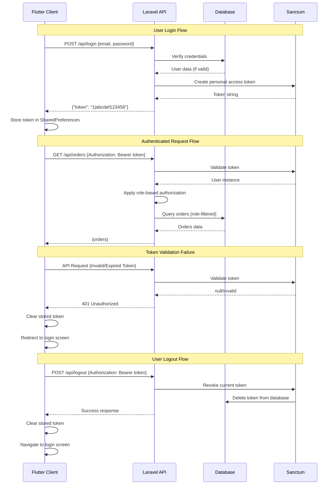

# Backend Architecture

<!--docs/architecture/[title].md-->

This document defines the backend-specific architecture for the Laravel Pharmacy Management System, establishing the patterns, structure, and conventions that will guide all backend development. This architecture is built on Laravel 12.x with SQLite as the exclusive database, following the simplified architectural mandates defined in the coding standards document.

## Service Architecture

### Controller/Route Organization

The backend follows Laravel's conventional MVC structure with strict adherence to the simplified architecture mandates. Controllers remain lean by delegating all business logic to dedicated Service classes, while maintaining clear separation between API concerns and business operations.

```
app/
├── Http/
│   ├── Controllers/
│   │   ├── AuthController.php                    # Authentication endpoints
│   │   ├── PrescriptionController.php            # Prescription CRUD operations
│   │   ├── OrderController.php                   # Order management endpoints
│   │   ├── MedicationController.php              # Medication catalog endpoints
│   │   ├── AdviceRequestController.php           # Advice request endpoints
│   │   ├── NotificationController.php            # Notification endpoints
│   │   └── UserController.php                    # User management endpoints
│   ├── Requests/
│   │   ├── Auth/
│   │   │   ├── LoginRequest.php                  # Login validation
│   │   │   └── RegisterRequest.php               # Registration validation
│   │   ├── Prescriptions/
│   │   │   ├── UploadPrescriptionRequest.php     # Prescription upload validation
│   │   │   └── ProcessPrescriptionRequest.php    # Prescription processing validation
│   │   ├── Orders/
│   │   │   ├── CreateOrderRequest.php            # Order creation validation
│   │   │   └── UpdateOrderStatusRequest.php      # Order status update validation
│   │   ├── Medications/
│   │   │   ├── CreateMedicationRequest.php       # Medication creation validation
│   │   │   └── UpdateMedicationRequest.php       # Medication update validation
│   │   └── AdviceRequests/
│   │       ├── CreateAdviceRequestRequest.php    # Advice request creation
│   │       └── RespondToAdviceRequestRequest.php # Advice response validation
│   ├── Resources/
│   │   ├── UserResource.php                      # User API response transformation
│   │   ├── PrescriptionResource.php              # Prescription API response transformation
│   │   ├── OrderResource.php                     # Order API response transformation
│   │   ├── OrderItemResource.php                 # Order item API response transformation
│   │   ├── MedicationResource.php                # Medication API response transformation
│   │   ├── AdviceRequestResource.php             # Advice request API response transformation
│   │   └── NotificationResource.php              # Notification API response transformation
│   └── Middleware/
│       ├── RoleMiddleware.php                    # Role-based access control
│       └── EnsureActiveUser.php                  # User status validation
├── Services/
│   ├── AuthService.php                          # Authentication business logic
│   ├── PrescriptionService.php                  # Prescription business logic
│   ├── OrderService.php                         # Order business logic
│   ├── MedicationService.php                    # Medication business logic
│   ├── AdviceRequestService.php                 # Advice request business logic
│   ├── NotificationService.php                  # Notification business logic
│   └── FileStorageService.php                   # File upload/storage logic
└── Models/
    ├── User.php                                 # User Eloquent model
    ├── Prescription.php                         # Prescription Eloquent model
    ├── Order.php                               # Order Eloquent model
    ├── OrderItem.php                           # Order item Eloquent model
    ├── Medication.php                          # Medication Eloquent model
    ├── AdviceRequest.php                       # Advice request Eloquent model
    └── Notification.php                        # Notification Eloquent model

routes/
└── api.php                                     # All API routes (RESTful)

config/
├── sanctum.php                                 # Sanctum authentication configuration
├── cors.php                                   # CORS configuration for Flutter app
└── filesystems.php                            # File storage configuration
```

### Controller Template

All controllers must follow this standardized template with mandatory documentation and strict adherence to the architectural patterns:

```php
<?php

namespace App\Http\Controllers;

use App\Http\Requests\Orders\CreateOrderRequest;
use App\Http\Requests\Orders\UpdateOrderStatusRequest;
use App\Http\Resources\OrderResource;
use App\Services\OrderService;
use Illuminate\Http\JsonResponse;
use Illuminate\Http\Request;
use Illuminate\Http\Resources\Json\AnonymousResourceCollection;

/**
 * Handles HTTP requests for order management operations.
 * 
 * This controller manages order-related endpoints including creation, retrieval,
 * status updates, and order history. All business logic is delegated to the
 * OrderService class following the architectural mandate.
 */
class OrderController extends Controller
{
    /**
     * The order service instance for handling business logic.
     */
    private OrderService $orderService;

    /**
     * Creates a new OrderController instance.
     * 
     * @param OrderService $orderService The service handling order business logic.
     */
    public function __construct(OrderService $orderService)
    {
        $this->orderService = $orderService;
    }

    /**
     * Retrieves a paginated list of orders for the authenticated user.
     * 
     * For clients, returns their own orders. For staff users, returns
     * orders relevant to their role (e.g., delivery orders for delivery users).
     * 
     * @param Request $request The HTTP request containing query parameters.
     * @return AnonymousResourceCollection The paginated orders collection.
     */
    public function index(Request $request): AnonymousResourceCollection
    {
        $user = $request->user();
        $orders = $this->orderService->getOrdersForUser($user, $request->query());
        
        return OrderResource::collection($orders);
    }

    /**
     * Retrieves a specific order by ID.
     * 
     * Authorization is handled within the service layer to ensure users
     * can only access orders they are permitted to view.
     * 
     * @param Request $request The HTTP request.
     * @param int $orderId The ID of the order to retrieve.
     * @return OrderResource The order resource.
     */
    public function show(Request $request, int $orderId): OrderResource
    {
        $user = $request->user();
        $order = $this->orderService->getOrderById($orderId, $user);
        
        return new OrderResource($order);
    }

    /**
     * Creates a new order from a processed prescription.
     * 
     * This endpoint is typically called by pharmacists after processing
     * a prescription. The order creation process includes stock validation
     * and inventory updates within a database transaction.
     * 
     * @param CreateOrderRequest $request The validated request containing order data.
     * @return JsonResponse The created order resource with 201 status.
     */
    public function store(CreateOrderRequest $request): JsonResponse
    {
        $user = $request->user();
        $order = $this->orderService->createOrder($request->validated(), $user);
        
        return (new OrderResource($order))
            ->response()
            ->setStatusCode(201);
    }

    /**
     * Updates the status of an existing order.
     * 
     * This endpoint handles order status transitions such as marking
     * orders as ready for delivery, completed, or cancelled.
     * 
     * @param UpdateOrderStatusRequest $request The validated status update request.
     * @param int $orderId The ID of the order to update.
     * @return OrderResource The updated order resource.
     */
    public function updateStatus(UpdateOrderStatusRequest $request, int $orderId): OrderResource
    {
        $user = $request->user();
        $order = $this->orderService->updateOrderStatus(
            $orderId,
            $request->validated(),
            $user
        );
        
        return new OrderResource($order);
    }

    /**
     * Retrieves orders assigned to the authenticated delivery user.
     * 
     * This endpoint is specifically for delivery personnel to view
     * orders assigned to them for delivery.
     * 
     * @param Request $request The HTTP request.
     * @return AnonymousResourceCollection The collection of delivery orders.
     */
    public function deliveryOrders(Request $request): AnonymousResourceCollection
    {
        $user = $request->user();
        $orders = $this->orderService->getDeliveryOrdersForUser($user);
        
        return OrderResource::collection($orders);
    }

    /**
     * Assigns a delivery user to an order.
     * 
     * This endpoint is used by managers or staff to assign specific
     * delivery personnel to orders that are ready for delivery.
     * 
     * @param Request $request The HTTP request containing delivery_user_id.
     * @param int $orderId The ID of the order to assign.
     * @return OrderResource The updated order resource.
     */
    public function assignDelivery(Request $request, int $orderId): OrderResource
    {
        $request->validate([
            'delivery_user_id' => 'required|integer|exists:users,id'
        ]);
        
        $user = $request->user();
        $order = $this->orderService->assignDeliveryUser(
            $orderId,
            $request->input('delivery_user_id'),
            $user
        );
        
        return new OrderResource($order);
    }
}
```

## Database Architecture

### Schema Design

The database architecture leverages SQLite's capabilities while ensuring data integrity and performance through proper indexing and constraint management. The schema is implemented using Laravel's migration system for version control and portability.

```sql
-- SQLite Schema Generated from Laravel Migrations
-- This represents the final database structure after all migrations

-- Users table with role-based access control
CREATE TABLE users (
    id INTEGER PRIMARY KEY AUTOINCREMENT,
    name VARCHAR(255) NOT NULL,
    email VARCHAR(255) NOT NULL UNIQUE,
    password VARCHAR(255) NOT NULL,
    phone_number VARCHAR(255) NULL,
    address TEXT NULL,
    role VARCHAR(20) NOT NULL DEFAULT 'client' CHECK(role IN ('client', 'pharmacist', 'salesperson', 'delivery', 'manager')),
    status VARCHAR(10) NOT NULL DEFAULT 'active' CHECK(status IN ('active', 'disabled')),
    created_at TIMESTAMP DEFAULT CURRENT_TIMESTAMP,
    updated_at TIMESTAMP DEFAULT CURRENT_TIMESTAMP
);

-- Indexes for users table
CREATE INDEX idx_users_email ON users(email);
CREATE INDEX idx_users_role ON users(role);
CREATE INDEX idx_users_status ON users(status);

-- Medications table for inventory management
CREATE TABLE medications (
    id INTEGER PRIMARY KEY AUTOINCREMENT,
    name VARCHAR(255) NOT NULL,
    strength_form VARCHAR(255) NOT NULL,
    description TEXT NOT NULL,
    price DECIMAL(8,2) NOT NULL,
    current_quantity INTEGER NOT NULL DEFAULT 0,
    minimum_threshold INTEGER NOT NULL DEFAULT 10,
    category VARCHAR(50) NOT NULL CHECK(category IN ('Pain Relief', 'Antibiotics', 'Vitamins', 'Cold & Flu', 'Skincare')),
    status VARCHAR(10) NOT NULL DEFAULT 'active' CHECK(status IN ('active', 'disabled')),
    created_at TIMESTAMP DEFAULT CURRENT_TIMESTAMP,
    updated_at TIMESTAMP DEFAULT CURRENT_TIMESTAMP
);

-- Indexes for medications table
CREATE INDEX idx_medications_name ON medications(name);
CREATE INDEX idx_medications_category_status ON medications(category, status);
CREATE INDEX idx_medications_current_quantity ON medications(current_quantity);
CREATE INDEX idx_medications_low_stock ON medications(current_quantity, minimum_threshold);

-- Prescriptions table for tracking prescription uploads
CREATE TABLE prescriptions (
    id INTEGER PRIMARY KEY AUTOINCREMENT,
    client_id INTEGER NOT NULL,
    image_path VARCHAR(255) NOT NULL,
    status VARCHAR(20) NOT NULL DEFAULT 'pending' CHECK(status IN ('pending', 'processed', 'rejected')),
    processed_by INTEGER NULL,
    rejection_reason TEXT NULL,
    reference_number VARCHAR(20) NOT NULL UNIQUE,
    created_at TIMESTAMP DEFAULT CURRENT_TIMESTAMP,
    updated_at TIMESTAMP DEFAULT CURRENT_TIMESTAMP,
    FOREIGN KEY (client_id) REFERENCES users(id) ON DELETE RESTRICT,
    FOREIGN KEY (processed_by) REFERENCES users(id) ON DELETE SET NULL
);

-- Indexes for prescriptions table
CREATE INDEX idx_prescriptions_client_id ON prescriptions(client_id);
CREATE INDEX idx_prescriptions_status ON prescriptions(status);
CREATE INDEX idx_prescriptions_reference_number ON prescriptions(reference_number);

-- Orders table for order management
CREATE TABLE orders (
    id INTEGER PRIMARY KEY AUTOINCREMENT,
    client_id INTEGER NOT NULL,
    prescription_id INTEGER NULL UNIQUE,
    total_amount DECIMAL(10,2) NOT NULL,
    status VARCHAR(30) NOT NULL DEFAULT 'in_preparation' CHECK(status IN ('in_preparation', 'ready_for_delivery', 'completed', 'cancelled', 'failed_delivery')),
    assigned_delivery_user_id INTEGER NULL,
    cancellation_reason TEXT NULL,
    created_at TIMESTAMP DEFAULT CURRENT_TIMESTAMP,
    updated_at TIMESTAMP DEFAULT CURRENT_TIMESTAMP,
    FOREIGN KEY (client_id) REFERENCES users(id) ON DELETE RESTRICT,
    FOREIGN KEY (prescription_id) REFERENCES prescriptions(id) ON DELETE RESTRICT,
    FOREIGN KEY (assigned_delivery_user_id) REFERENCES users(id) ON DELETE SET NULL
);

-- Indexes for orders table
CREATE INDEX idx_orders_client_id ON orders(client_id);
CREATE INDEX idx_orders_status ON orders(status);
CREATE INDEX idx_orders_client_status ON orders(client_id, status);
CREATE INDEX idx_orders_delivery_user ON orders(assigned_delivery_user_id);

-- Order items join table for order-medication relationships
CREATE TABLE order_items (
    id INTEGER PRIMARY KEY AUTOINCREMENT,
    order_id INTEGER NOT NULL,
    medication_id INTEGER NOT NULL,
    quantity INTEGER NOT NULL,
    unit_price DECIMAL(8,2) NOT NULL,
    created_at TIMESTAMP DEFAULT CURRENT_TIMESTAMP,
    FOREIGN KEY (order_id) REFERENCES orders(id) ON DELETE CASCADE,
    FOREIGN KEY (medication_id) REFERENCES medications(id) ON DELETE RESTRICT,
    UNIQUE(order_id, medication_id)
);

-- Indexes for order_items table
CREATE INDEX idx_order_items_order_id ON order_items(order_id);
CREATE INDEX idx_order_items_medication_id ON order_items(medication_id);

-- Advice requests table for client-pharmacist communication
CREATE TABLE advice_requests (
    id INTEGER PRIMARY KEY AUTOINCREMENT,
    client_id INTEGER NOT NULL,
    question TEXT NOT NULL,
    status VARCHAR(20) NOT NULL DEFAULT 'pending' CHECK(status IN ('pending', 'responded', 'rejected')),
    response TEXT NULL,
    responder_id INTEGER NULL,
    rejection_reason TEXT NULL,
    created_at TIMESTAMP DEFAULT CURRENT_TIMESTAMP,
    updated_at TIMESTAMP DEFAULT CURRENT_TIMESTAMP,
    FOREIGN KEY (client_id) REFERENCES users(id) ON DELETE CASCADE,
    FOREIGN KEY (responder_id) REFERENCES users(id) ON DELETE SET NULL
);

-- Indexes for advice_requests table
CREATE INDEX idx_advice_requests_client_id ON advice_requests(client_id);
CREATE INDEX idx_advice_requests_status ON advice_requests(status);
CREATE INDEX idx_advice_requests_responder_id ON advice_requests(responder_id);

-- Notifications table for in-app messaging
CREATE TABLE notifications (
    id INTEGER PRIMARY KEY AUTOINCREMENT,
    user_id INTEGER NOT NULL,
    title VARCHAR(255) NOT NULL,
    message TEXT NOT NULL,
    type VARCHAR(30) NOT NULL CHECK(type IN ('order_status', 'prescription_update', 'advice_response', 'system_alert')),
    read_at TIMESTAMP NULL,
    created_at TIMESTAMP DEFAULT CURRENT_TIMESTAMP,
    FOREIGN KEY (user_id) REFERENCES users(id) ON DELETE CASCADE
);

-- Indexes for notifications table
CREATE INDEX idx_notifications_user_id ON notifications(user_id);
CREATE INDEX idx_notifications_read_at ON notifications(read_at);
CREATE INDEX idx_notifications_user_unread ON notifications(user_id, read_at);

-- Personal access tokens table for Sanctum authentication
CREATE TABLE personal_access_tokens (
    id INTEGER PRIMARY KEY AUTOINCREMENT,
    tokenable_type VARCHAR(255) NOT NULL,
    tokenable_id INTEGER NOT NULL,
    name VARCHAR(255) NOT NULL,
    token VARCHAR(64) NOT NULL UNIQUE,
    abilities TEXT NULL,
    last_used_at TIMESTAMP NULL,
    expires_at TIMESTAMP NULL,
    created_at TIMESTAMP DEFAULT CURRENT_TIMESTAMP,
    updated_at TIMESTAMP DEFAULT CURRENT_TIMESTAMP
);

-- Indexes for personal_access_tokens table
CREATE INDEX idx_personal_access_tokens_tokenable ON personal_access_tokens(tokenable_type, tokenable_id);
CREATE INDEX idx_personal_access_tokens_token ON personal_access_tokens(token);
```

### Data Access Layer

Following the architectural mandate, the Repository pattern is explicitly prohibited. All data access occurs directly through Eloquent models, ensuring a simple and traceable data flow from Controller → Service → Eloquent Model.

```php
<?php

namespace App\Services;

use App\Models\Order;
use App\Models\OrderItem;
use App\Models\Medication;
use App\Models\User;
use App\Models\Prescription;
use Illuminate\Database\Eloquent\Collection;
use Illuminate\Pagination\LengthAwarePaginator;
use Illuminate\Support\Facades\DB;
use InvalidArgumentException;

/**
 * Service class handling all order-related business logic.
 * 
 * This service encapsulates order creation, status management, and retrieval
 * operations. It directly interacts with Eloquent models as mandated by the
 * architectural standards, avoiding the Repository pattern.
 */
class OrderService
{
    /**
     * The notification service for sending order status updates.
     */
    private NotificationService $notificationService;

    /**
     * Creates a new OrderService instance.
     * 
     * @param NotificationService $notificationService Service for handling notifications.
     */
    public function __construct(NotificationService $notificationService)
    {
        $this->notificationService = $notificationService;
    }

    /**
     * Retrieves orders for a specific user based on their role.
     * 
     * @param User $user The authenticated user.
     * @param array $filters Query parameters for filtering and pagination.
     * @return LengthAwarePaginator The paginated orders collection.
     */
    public function getOrdersForUser(User $user, array $filters = []): LengthAwarePaginator
    {
        $query = Order::query();

        // Apply role-based filtering
        switch ($user->role) {
            case 'client':
                $query->where('client_id', $user->id);
                break;
            case 'delivery':
                $query->where('assigned_delivery_user_id', $user->id)
                      ->whereIn('status', ['ready_for_delivery', 'failed_delivery']);
                break;
            case 'pharmacist':
            case 'manager':
                // No restriction - can view all orders
                break;
            default:
                // Salesperson and other roles see no orders by default
                $query->whereRaw('1 = 0');
        }

        // Apply status filter if provided
        if (!empty($filters['status'])) {
            $query->where('status', $filters['status']);
        }

        // Apply date range filter if provided
        if (!empty($filters['from_date'])) {
            $query->whereDate('created_at', '>=', $filters['from_date']);
        }
        if (!empty($filters['to_date'])) {
            $query->whereDate('created_at', '<=', $filters['to_date']);
        }

        // Eager load relationships to prevent N+1 queries
        $query->with(['client', 'items.medication', 'deliveryUser']);

        // Apply sorting
        $sortBy = $filters['sort_by'] ?? 'created_at';
        $sortDirection = $filters['sort_direction'] ?? 'desc';
        $query->orderBy($sortBy, $sortDirection);

        // Return paginated results
        $perPage = min($filters['per_page'] ?? 15, 50); // Limit max per page
        return $query->paginate($perPage);
    }

    /**
     * Retrieves a specific order by ID with authorization check.
     * 
     * @param int $orderId The ID of the order to retrieve.
     * @param User $user The authenticated user.
     * @return Order The order model with loaded relationships.
     * @throws InvalidArgumentException If user cannot access the order.
     */
    public function getOrderById(int $orderId, User $user): Order
    {
        $query = Order::with(['client', 'items.medication', 'deliveryUser', 'prescription']);

        // Apply role-based authorization
        switch ($user->role) {
            case 'client':
                $query->where('client_id', $user->id);
                break;
            case 'delivery':
                $query->where('assigned_delivery_user_id', $user->id);
                break;
            case 'pharmacist':
            case 'manager':
                // Can access any order
                break;
            default:
                throw new InvalidArgumentException('User not authorized to view orders');
        }

        $order = $query->find($orderId);

        if (!$order) {
            throw new InvalidArgumentException('Order not found or access denied');
        }

        return $order;
    }

    /**
     * Creates a new order from a processed prescription.
     * 
     * This operation is wrapped in a database transaction to ensure atomicity
     * during stock validation and inventory updates.
     * 
     * @param array $validatedData The validated order data from the FormRequest.
     * @param User $user The user creating the order (typically a pharmacist).
     * @return Order The created order with loaded relationships.
     * @throws InvalidArgumentException If prescription is invalid or stock insufficient.
     */
    public function createOrder(array $validatedData, User $user): Order
    {
        return DB::transaction(function () use ($validatedData, $user) {
            // Validate prescription exists and is processed
            $prescription = Prescription::where('id', $validatedData['prescription_id'])
                ->where('status', 'processed')
                ->first();

            if (!$prescription) {
                throw new InvalidArgumentException('Invalid or unprocessed prescription');
            }

            // Check if prescription already has an order
            if ($prescription->order()->exists()) {
                throw new InvalidArgumentException('Prescription already has an associated order');
            }

            $totalAmount = 0;
            $orderItems = [];

            // Validate stock availability and calculate total
            foreach ($validatedData['items'] as $item) {
                $medication = Medication::lockForUpdate()->find($item['medication_id']);

                if (!$medication || $medication->status !== 'active') {
                    throw new InvalidArgumentException("Medication ID {$item['medication_id']} is not available");
                }

                if ($medication->current_quantity < $item['quantity']) {
                    throw new InvalidArgumentException("Insufficient stock for {$medication->name}");
                }

                // Prepare order item data
                $lineTotal = $item['quantity'] * $medication->price;
                $totalAmount += $lineTotal;

                $orderItems[] = [
                    'medication_id' => $medication->id,
                    'quantity' => $item['quantity'],
                    'unit_price' => $medication->price,
                    'created_at' => now(),
                ];

                // Update medication stock
                $medication->current_quantity -= $item['quantity'];
                $medication->save();
            }

            // Create the order
            $order = Order::create([
                'client_id' => $prescription->client_id,
                'prescription_id' => $prescription->id,
                'total_amount' => $totalAmount,
                'status' => 'in_preparation',
            ]);

            // Create order items
            foreach ($orderItems as $item) {
                $item['order_id'] = $order->id;
                OrderItem::create($item);
            }

            // Send notification to client
            $this->notificationService->notifyOrderCreated($order);

            // Load relationships for response
            $order->load(['client', 'items.medication', 'prescription']);

            return $order;
        });
    }

    /**
     * Updates the status of an existing order.
     * 
     * @param int $orderId The ID of the order to update.
     * @param array $validatedData The validated update data.
     * @param User $user The user performing the update.
     * @return Order The updated order.
     * @throws InvalidArgumentException If update is not allowed.
     */
    public function updateOrderStatus(int $orderId, array $validatedData, User $user): Order
    {
        $order = Order::with(['client', 'items.medication'])->find($orderId);

        if (!$order) {
            throw new InvalidArgumentException('Order not found');
        }

        $newStatus = $validatedData['status'];
        $oldStatus = $order->status;

        // Validate status transitions
        if (!$this->isValidStatusTransition($oldStatus, $newStatus, $user)) {
            throw new InvalidArgumentException("Invalid status transition from {$oldStatus} to {$newStatus}");
        }

        // Update order status and related fields
        $order->status = $newStatus;

        if ($newStatus === 'cancelled' && !empty($validatedData['cancellation_reason'])) {
            $order->cancellation_reason = $validatedData['cancellation_reason'];
        }

        if ($newStatus === 'ready_for_delivery' && !empty($validatedData['assigned_delivery_user_id'])) {
            $order->assigned_delivery_user_id = $validatedData['assigned_delivery_user_id'];
        }

        $order->save();

        // Send status change notification
        $this->notificationService->notifyOrderStatusChanged($order, $oldStatus);

        return $order;
    }

    /**
     * Retrieves orders assigned to a specific delivery user.
     * 
     * @param User $deliveryUser The delivery user.
     * @return Collection The collection of assigned orders.
     */
    public function getDeliveryOrdersForUser(User $deliveryUser): Collection
    {
        return Order::with(['client', 'items.medication'])
            ->where('assigned_delivery_user_id', $deliveryUser->id)
            ->whereIn('status', ['ready_for_delivery', 'failed_delivery'])
            ->orderBy('created_at', 'asc')
            ->get();
    }

    /**
     * Assigns a delivery user to an order.
     * 
     * @param int $orderId The order ID.
     * @param int $deliveryUserId The delivery user ID.
     * @param User $assigningUser The user making the assignment.
     * @return Order The updated order.
     * @throws InvalidArgumentException If assignment is invalid.
     */
    public function assignDeliveryUser(int $orderId, int $deliveryUserId, User $assigningUser): Order
    {
        if (!in_array($assigningUser->role, ['manager', 'pharmacist'])) {
            throw new InvalidArgumentException('User not authorized to assign delivery personnel');
        }

        $order = Order::find($orderId);
        if (!$order) {
            throw new InvalidArgumentException('Order not found');
        }

        if ($order->status !== 'ready_for_delivery') {
            throw new InvalidArgumentException('Order must be ready for delivery to assign delivery personnel');
        }

        $deliveryUser = User::where('id', $deliveryUserId)
            ->where('role', 'delivery')
            ->where('status', 'active')
            ->first();

        if (!$deliveryUser) {
            throw new InvalidArgumentException('Invalid delivery user');
        }

        $order->assigned_delivery_user_id = $deliveryUserId;
        $order->save();

        // Notify delivery user of assignment
        $this->notificationService->notifyDeliveryAssigned($order, $deliveryUser);

        return $order->load(['client', 'items.medication', 'deliveryUser']);
    }

    /**
     * Validates if a status transition is allowed for a given user role.
     * 
     * @param string $fromStatus Current order status.
     * @param string $toStatus Desired order status.
     * @param User $user The user attempting the transition.
     * @return bool Whether the transition is valid.
     */
    private function isValidStatusTransition(string $fromStatus, string $toStatus, User $user): bool
    {
        $allowedTransitions = [
            'in_preparation' => ['ready_for_delivery', 'cancelled'],
            'ready_for_delivery' => ['completed', 'failed_delivery', 'cancelled'],
            'failed_delivery' => ['ready_for_delivery', 'cancelled'],
        ];

        // Check if transition is generally allowed
        if (!isset($allowedTransitions[$fromStatus]) || 
            !in_array($toStatus, $allowedTransitions[$fromStatus])) {
            return false;
        }

        // Check role-based permissions
        switch ($toStatus) {
            case 'ready_for_delivery':
                return in_array($user->role, ['pharmacist', 'manager']);
            case 'completed':
                return in_array($user->role, ['delivery', 'manager']);
            case 'failed_delivery':
                return in_array($user->role, ['delivery', 'manager']);
            case 'cancelled':
                return in_array($user->role, ['pharmacist', 'manager']);
            default:
                return false;
        }
    }
}
```

## Authentication and Authorization

### Auth Flow



### Middleware/Guards

The authentication and authorization system uses Laravel Sanctum for API token management with custom middleware for role-based access control:

```php
<?php

namespace App\Http\Middleware;

use Closure;
use Illuminate\Http\Request;
use Symfony\Component\HttpFoundation\Response;

/**
 * Middleware for role-based access control.
 * 
 * This middleware ensures that only users with the specified roles
 * can access protected routes. It works in conjunction with Sanctum
 * authentication to provide comprehensive authorization.
 */
class RoleMiddleware
{
    /**
     * Handle an incoming request.
     *
     * @param Request $request The incoming HTTP request.
     * @param Closure $next The next middleware in the pipeline.
     * @param string ...$roles The allowed roles for this route.
     * @return Response The HTTP response.
     */
    public function handle(Request $request, Closure $next, string ...$roles): Response
    {
        $user = $request->user();

        // Ensure user is authenticated (should be handled by auth:sanctum)
        if (!$user) {
            return response()->json([
                'message' => 'Authentication required'
            ], 401);
        }

        // Check if user's role is in the allowed roles
        if (!in_array($user->role, $roles)) {
            return response()->json([
                'message' => 'Access denied. Insufficient permissions.',
                'required_roles' => $roles,
                'user_role' => $user->role
            ], 403);
        }

        return $next($request);
    }
}

```php
<?php

namespace App\Http\Middleware;

use Closure;
use Illuminate\Http\Request;
use Symfony\Component\HttpFoundation\Response;

/**
 * Middleware to ensure the authenticated user account is active.
 * 
 * This middleware prevents disabled users from accessing the API
 * even if they have a valid authentication token.
 */
class EnsureActiveUser
{
    /**
     * Handle an incoming request.
     *
     * @param Request $request The incoming HTTP request.
     * @param Closure $next The next middleware in the pipeline.
     * @return Response The HTTP response.
     */
    public function handle(Request $request, Closure $next): Response
    {
        $user = $request->user();

        if (!$user) {
            return response()->json([
                'message' => 'Authentication required'
            ], 401);
        }

        if ($user->status !== 'active') {
            // Revoke all tokens for disabled users
            $user->tokens()->delete();

            return response()->json([
                'message' => 'Account has been disabled. Please contact support.',
                'error_code' => 'ACCOUNT_DISABLED'
            ], 403);
        }

        return $next($request);
    }
}
```

```php
<?php

// routes/api.php - Complete API routing structure with middleware

use Illuminate\Http\Request;
use Illuminate\Support\Facades\Route;
use App\Http\Controllers\AuthController;
use App\Http\Controllers\PrescriptionController;
use App\Http\Controllers\OrderController;
use App\Http\Controllers\MedicationController;
use App\Http\Controllers\AdviceRequestController;
use App\Http\Controllers\NotificationController;
use App\Http\Controllers\UserController;

/*
|--------------------------------------------------------------------------
| API Routes
|--------------------------------------------------------------------------
|
| This file defines all API endpoints for the Pharmacy Management System.
| Routes are organized by feature and protected with appropriate middleware
| for authentication and role-based access control.
|
*/

    // Public routes (no authentication required)
    Route::post('/login', [AuthController::class, 'login'])
        ->middleware('throttle:5,1'); // Rate limit: 5 attempts per minute

    Route::post('/register', [AuthController::class, 'register'])
        ->middleware('throttle:3,1'); // Rate limit: 3 attempts per minute

    // Protected routes (authentication required)
    Route::middleware(['auth:sanctum', 'active.user'])->group(function () {
        
        // Authentication endpoints
        Route::post('/logout', [AuthController::class, 'logout']);
        
        Route::prefix('auth')->group(function () {
            Route::get('/user', [AuthController::class, 'user']);
            Route::put('/profile', [AuthController::class, 'updateProfile']);
        });


    // Prescription routes
    Route::apiResource('prescriptions', PrescriptionController::class)->only(['index', 'show']);
    
    // Client-specific prescription routes
    Route::middleware('role:client')->group(function () {
        Route::post('prescriptions', [PrescriptionController::class, 'store']);
    });

    // Staff prescription routes (pharmacists can process prescriptions)
    Route::middleware('role:pharmacist,manager')->group(function () {
        Route::get('prescriptions/pending', [PrescriptionController::class, 'pending']);
        Route::put('prescriptions/{prescription}/process', [PrescriptionController::class, 'process']);
        Route::put('prescriptions/{prescription}/reject', [PrescriptionController::class, 'reject']);
    });

    // Order routes
    Route::apiResource('orders', OrderController::class)->only(['index', 'show']);
    
    // Order management routes (pharmacists and managers)
    Route::middleware('role:pharmacist,manager')->group(function () {
        Route::post('orders', [OrderController::class, 'store']);
        Route::put('orders/{order}/status', [OrderController::class, 'updateStatus']);
        Route::put('orders/{order}/assign-delivery', [OrderController::class, 'assignDelivery']);
    });

    // Delivery-specific order routes
    Route::middleware('role:delivery,manager')->group(function () {
        Route::get('orders/delivery', [OrderController::class, 'deliveryOrders']);
        Route::put('orders/{order}/delivery-status', [OrderController::class, 'updateDeliveryStatus']);
    });

    // Medication routes
    Route::apiResource('medications', MedicationController::class)->only(['index', 'show']);
    
    // Medication management routes (salesperson, manager)
    Route::middleware('role:salesperson,manager')->group(function () {
        Route::post('medications', [MedicationController::class, 'store']);
        Route::put('medications/{medication}', [MedicationController::class, 'update']);
        Route::delete('medications/{medication}', [MedicationController::class, 'destroy']);
        Route::get('medications/low-stock', [MedicationController::class, 'lowStock']);
        Route::put('medications/{medication}/stock', [MedicationController::class, 'updateStock']);
    });

    // Advice request routes
    Route::apiResource('advice-requests', AdviceRequestController::class)->only(['index', 'show']);
    
    // Client advice request routes
    Route::middleware('role:client')->group(function () {
        Route::post('advice-requests', [AdviceRequestController::class, 'store']);
    });

    // Pharmacist advice request routes
    Route::middleware('role:pharmacist')->group(function () {
        Route::put('advice-requests/{adviceRequest}', [AdviceRequestController::class, 'update']);
    });

    // Notification routes
    Route::prefix('notifications')->group(function () {
        Route::get('/', [NotificationController::class, 'index']);
        Route::put('/{notification}/read', [NotificationController::class, 'markAsRead']);
        Route::put('/read-all', [NotificationController::class, 'markAllAsRead']);
        Route::get('/unread-count', [NotificationController::class, 'unreadCount']);
    });

    // User management routes (managers only)
    Route::middleware('role:manager')->group(function () {
        Route::apiResource('users', UserController::class);
        Route::put('users/{user}/status', [UserController::class, 'updateStatus']);
        Route::get('reports/dashboard', [UserController::class, 'dashboardStats']);
        Route::get('reports/orders', [UserController::class, 'orderReports']);
    });
});
```

```php
<?php

// config/sanctum.php - Sanctum configuration for API authentication

return [
    /*
    |--------------------------------------------------------------------------
    | Stateful Domains
    |--------------------------------------------------------------------------
    |
    | Requests from the following domains / hosts will receive stateful API
    | authentication cookies. Typically, these should include your local
    | and production domains which access your API via a frontend SPA.
    |
    */

    'stateful' => explode(',', env('SANCTUM_STATEFUL_DOMAINS', sprintf(
        '%s%s',
        'localhost,localhost:3000,127.0.0.1,127.0.0.1:8000,::1',
        Sanctum::currentApplicationUrlWithPort()
    ))),

    /*
    |--------------------------------------------------------------------------
    | Sanctum Guards
    |--------------------------------------------------------------------------
    |
    | This array contains the authentication guards that will be checked when
    | Sanctum is trying to authenticate a request. If none of these guards
    | return an authenticated user, Sanctum will use the bearer token that's
    | present on an incoming request for authentication.
    |
    */

    'guard' => ['web'],

    /*
    |--------------------------------------------------------------------------
    | Expiration Minutes
    |--------------------------------------------------------------------------
    |
    | This value controls the number of minutes until an issued token will be
    | considered expired. If this value is null, personal access tokens do
    | not expire. This won't tweak the lifetime of first-party sessions.
    |
    */

    'expiration' => null, // Tokens never expire as per architectural requirement

    /*
    |--------------------------------------------------------------------------
    | Token Prefix
    |--------------------------------------------------------------------------
    |
    | Sanctum can prefix new tokens in order to take advantage of numerous
    | security scanning initiatives maintained by open source platforms
    | that notify developers if they commit tokens into repositories.
    |
    */

    'token_prefix' => env('SANCTUM_TOKEN_PREFIX', ''),

    /*
    |--------------------------------------------------------------------------
    | Sanctum Middleware
    |--------------------------------------------------------------------------
    |
    | When authenticating your first-party SPA with Sanctum you may need to
    | customize some of the middleware Sanctum uses while processing the
    | request. You may change the middleware listed below as required.
    |
    */

    'middleware' => [
        'authenticate_session' => Laravel\Sanctum\Http\Middleware\AuthenticateSession::class,
        'encrypt_cookies' => Illuminate\Cookie\Middleware\EncryptCookies::class,
    ],
];
```

```php
<?php

// bootstrap/app.php - Application bootstrap with middleware registration

use Illuminate\Foundation\Application;
use Illuminate\Foundation\Configuration\Exceptions;
use Illuminate\Foundation\Configuration\Middleware;
use App\Http\Middleware\RoleMiddleware;
use App\Http\Middleware\EnsureActiveUser;

return Application::configure(basePath: dirname(__DIR__))
    ->withRouting(
        web: __DIR__.'/../routes/web.php',
        api: __DIR__.'/../routes/api.php',
        commands: __DIR__.'/../routes/console.php',
        health: '/up',
    )
    ->withMiddleware(function (Middleware $middleware) {
        // Register custom middleware aliases
        $middleware->alias([
            'role' => RoleMiddleware::class,
            'active.user' => EnsureActiveUser::class,
        ]);

        // CORS configuration for Flutter app
        $middleware->api(prepend: [
            \Laravel\Sanctum\Http\Middleware\EnsureFrontendRequestsAreStateful::class,
        ]);
    })
    ->withExceptions(function (Exceptions $exceptions) {
        // Custom exception handling for API responses
        $exceptions->render(function (InvalidArgumentException $e, $request) {
            if ($request->is('api/*')) {
                return response()->json([
                    'message' => $e->getMessage(),
                    'error_type' => 'validation_error'
                ], 400);
            }
        });

        $exceptions->render(function (Illuminate\Auth\AuthenticationException $e, $request) {
            if ($request->is('api/*')) {
                return response()->json([
                    'message' => 'Authentication required',
                    'error_type' => 'authentication_error'
                ], 401);
            }
        });

        $exceptions->render(function (Symfony\Component\HttpKernel\Exception\AccessDeniedHttpException $e, $request) {
            if ($request->is('api/*')) {
                return response()->json([
                    'message' => 'Access denied. Insufficient permissions.',
                    'error_type' => 'authorization_error'
                ], 403);
            }
        });
    })
    ->create();
```

## API Response Structure

All API endpoints follow a consistent response structure to ensure predictable client-side handling:

### Success Response Format

```php
<?php

// app/Http/Resources/BaseResource.php - Base resource for consistent responses

namespace App\Http\Resources;

use Illuminate\Http\Resources\Json\JsonResource;

/**
 * Base resource class that provides consistent API response structure.
 * 
 * All feature-specific resources should extend this base class to ensure
 * uniform response formatting across the API.
 */
abstract class BaseResource extends JsonResource
{
    /**
     * Transform the resource into an array.
     * 
     * @param \Illuminate\Http\Request $request The incoming request.
     * @return array The transformed resource array.
     */
    public function toArray($request): array
    {
        return [
            'data' => $this->transformData($request),
            'meta' => $this->when($this->shouldIncludeMeta(), $this->getMeta()),
        ];
    }

    /**
     * Transform the core data for the resource.
     * 
     * This method should be implemented by subclasses to define
     * the specific data transformation logic.
     * 
     * @param \Illuminate\Http\Request $request The incoming request.
     * @return array The transformed data array.
     */
    abstract protected function transformData($request): array;

    /**
     * Determine if metadata should be included in the response.
     * 
     * @return bool Whether to include metadata.
     */
    protected function shouldIncludeMeta(): bool
    {
        return false;
    }

    /**
     * Get metadata for the response.
     * 
     * @return array The metadata array.
     */
    protected function getMeta(): array
    {
        return [];
    }
}

// Success Response Examples:

// Single Resource Response
{
    "data": {
        "id": 1,
        "name": "Paracetamol",
        "strength_form": "500mg Tablet",
        "price": "5.99",
        "current_quantity": 150,
        "status": "active",
        "created_at": "2024-01-01T12:00:00Z"
    }
}

// Collection Response
{
    "data": [
        {
            "id": 1,
            "client_id": 5,
            "total_amount": "45.99",
            "status": "in_preparation",
            "created_at": "2024-01-01T12:00:00Z"
        }
    ],
    "links": {
        "first": "http://api.pharmacy.local/api/orders?page=1",
        "last": "http://api.pharmacy.local/api/orders?page=3",
        "prev": null,
        "next": "http://api.pharmacy.local/api/orders?page=2"
    },
    "meta": {
        "current_page": 1,
        "per_page": 15,
        "total": 42,
        "last_page": 3
    }
}
```

### Error Response Format

```php
<?php

// Error Response Examples - Handled by Exception Handler

// Validation Error Response (422)
{
    "message": "The given data was invalid.",
    "errors": {
        "email": [
            "The email field is required."
        ],
        "password": [
            "The password must be at least 8 characters."
        ]
    },
    "error_type": "validation_error"
}

// Authentication Error Response (401)
{
    "message": "Authentication required",
    "error_type": "authentication_error"
}

// Authorization Error Response (403)
{
    "message": "Access denied. Insufficient permissions.",
    "required_roles": ["pharmacist", "manager"],
    "user_role": "client",
    "error_type": "authorization_error"
}

// Business Logic Error Response (400)
{
    "message": "Insufficient stock for Paracetamol 500mg",
    "error_type": "validation_error"
}

// Server Error Response (500)
{
    "message": "An unexpected error occurred. Please try again later.",
    "error_type": "server_error"
}
```

## Performance and Security Considerations

### Database Optimization

- **Query Optimization**: All services use eager loading (`with()`) to prevent N+1 query problems
- **Database Transactions**: Stock-sensitive operations are wrapped in transactions for data consistency
- **Proper Indexing**: Strategic indexes on frequently queried columns (see schema section)
- **Query Scoping**: Role-based query filtering at the database level to minimize data transfer

### Security Implementation

- **Input Validation**: All inputs validated through FormRequest classes with server-side rules
- **Mass Assignment Protection**: All models use `$fillable` arrays to whitelist assignable attributes
- **SQL Injection Prevention**: Exclusive use of Eloquent ORM with parameter binding
- **Rate Limiting**: Authentication endpoints protected with throttling middleware
- **Token Management**: Sanctum handles secure API token generation and validation
- **Role-Based Authorization**: Multi-layered authorization through middleware and service-level checks

This backend architecture provides a robust, scalable foundation for the Pharmacy Management System while maintaining the simplicity mandated by the architectural standards. The clear separation of concerns, consistent patterns, and comprehensive documentation ensure maintainability and ease of development.

---