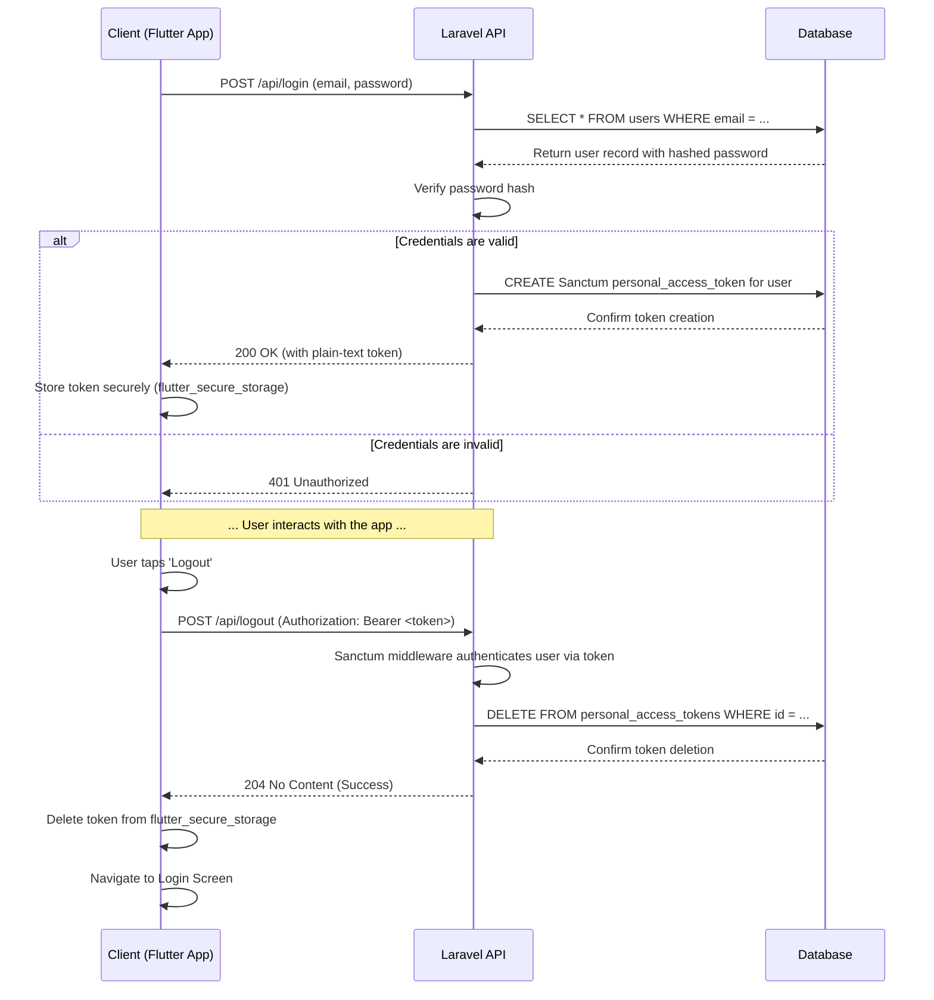

# Backend Architecture

<!--docs/architecture/[title].md-->

This section defines the architectural patterns, structure, and standards for the Laravel backend API. The design prioritizes simplicity, maintainability, and testability, directly aligning with the project's constraints as an educational capstone. As a monolithic service, its primary responsibility is to serve the Flutter frontend by providing a secure and efficient RESTful interface to the application's data and business logic.

## Service Architecture

The backend will be implemented as a **traditional, server-based monolith**. This is a direct implementation of the PRD's constraints, which favor a self-contained, easy-to-manage system over the complexities of microservices or serverless architectures. The internal structure of the monolith will be organized by feature, with a clear separation between the HTTP layer (Controllers) and the business logic layer (Services).

### Controller/Route Organization

To fulfill the requirement for a "clean, feature-based structure," the Laravel application will group related logic into feature-specific directories within `app/`. This modular approach keeps the codebase organized and makes it easier for developers to locate and work on related files.

```plaintext
backend/
└── app/
    ├── Http/
    │   ├── Controllers/
    │   │   ├── AuthController.php
    │   │   ├── OrderController.php
    │   │   └── ...
    │   ├── Middleware/
    │   │   └── EnsureUserHasRole.php
    │   └── Requests/
    │       ├── StoreOrderRequest.php
    │       └── ...
    ├── Models/
    │   ├── User.php
    │   ├── Order.php
    │   └── ...
    ├── Providers/
    ├── Exceptions/
    │   └── InsufficientStockException.php
    └── Services/                 # Business logic layer
        ├── OrderService.php
        ├── PrescriptionService.php
        ├── InventoryService.php
        └── ...
```

### Controller Template

**Architectural Rule:** Controllers must be lean. Their sole responsibility is to handle the HTTP request/response cycle. All business logic, validation, and data manipulation must be delegated to Form Requests and dedicated Service classes.

```php
<?php

namespace App\Http\Controllers;

use App\Http\Requests\UpdateOrderStatusRequest;
use App\Models\Order;
use App\Services\OrderService;
use Illuminate\Http\JsonResponse;

class OrderController extends Controller
{
    protected $orderService;

    public function __construct(OrderService $orderService)
    {
        $this->orderService = $orderService;
    }

    public function updateStatus(UpdateOrderStatusRequest $request, Order $order): JsonResponse
    {
        $updatedOrder = $this->orderService->updateStatus(
            $request->user(),
            $order,
            $request->validated()['status'],
            $request->validated()['cancellation_reason'] ?? null
        );

        return response()->json($updatedOrder);
    }
}
```

### Service Layer Pattern

All business logic will be encapsulated within Service classes. These services are responsible for orchestrating complex operations, enforcing business rules, and ensuring data integrity.

**Simple Workflow Example: `OrderService`**

This service demonstrates the core pattern for handling a single business process, including authorization, validation, data mutation, and side effects.

```php
<?php

namespace App\Services;

use App\Models\Order;
use App\Models\User;
use Illuminate\Support\Facades\Gate;
use Illuminate\Auth\Access\AuthorizationException;
use InvalidArgumentException;

class OrderService
{
    protected $notificationService;

    public function __construct(NotificationService $notificationService)
    {
        $this->notificationService = $notificationService;
    }

    public function updateStatus(User $user, Order $order, string $newStatus, ?string $cancellationReason = null): Order
    {
        // 1. Authorization
        Gate::forUser($user)->authorize('updateStatus', [$order, $newStatus]);

        // 2. State Machine Validation
        if (!$this->isValidTransition($order->status, $newStatus)) {
            throw new InvalidArgumentException("Invalid status transition from '{$order->status}' to '{$newStatus}'.");
        }

        // 3. Data Mutation
        $order->status = $newStatus;
        if ($newStatus === 'cancelled') {
            $order->cancellation_reason = $cancellationReason;
            // Delegation to another service would happen here
            // e.g., $this->inventoryService->incrementStockForOrder($order);
        }
        $order->save();

        // 4. Side Effects (Post-Persistence)
        $this->notificationService->createOrderStatusUpdateNotification($order);

        return $order;
    }

    private function isValidTransition(string $fromStatus, string $toStatus): bool
    {
        $validTransitions = [
            'in_preparation' => ['ready_for_delivery', 'cancelled'],
            'ready_for_delivery' => ['completed', 'failed_delivery'],
            'failed_delivery' => ['ready_for_delivery', 'cancelled'],
        ];
        return in_array($toStatus, $validTransitions[$fromStatus] ?? []);
    }
}
```

**Complex Orchestration Example: `PrescriptionService`**

This service acts as an orchestrator, coordinating multiple other services within a single, atomic database transaction to ensure the system's most critical business process is safe and reliable.

```php
<?php

namespace App\Services;

use App\Exceptions\InsufficientStockException;
use App\Models\Order;
use App\Models\Prescription;
use App\Models\User;
use Illuminate\Support\Facades\DB;
use Illuminate\Support\Facades\Gate;
use Throwable;

class PrescriptionService
{
    protected $inventoryService;
    protected $orderService;
    protected $notificationService;

    public function __construct(InventoryService $inventoryService, OrderService $orderService, NotificationService $notificationService)
    {
        $this->inventoryService = $inventoryService;
        $this->orderService = $orderService;
        $this->notificationService = $notificationService;
    }

    public function processPrescriptionIntoOrder(User $salesperson, Prescription $prescription, array $items): Order
    {
        Gate::forUser($salesperson)->authorize('process', $prescription);
        $this->inventoryService->checkAvailability($items); // Fail-fast check

        $newOrder = DB::transaction(function () use ($salesperson, $prescription, $items) {
            $this->inventoryService->decrementStock($items);
            $order = $this->orderService->createFromPrescription($prescription, $items);

            $prescription->status = 'processed';
            $prescription->processed_by = $salesperson->id;
            $prescription->save();

            return $order;
        });

        $this->notificationService->createOrderProcessedNotification($newOrder);

        return $newOrder;
    }
}
```

**Critical Sub-System: `InventoryService` with Race Condition Prevention**

This service demonstrates the mandatory pattern for handling critical, concurrent operations. It uses pessimistic locking to prevent race conditions during stock updates.

```php
<?php

namespace App\Services;

use App\Exceptions\InsufficientStockException;
use Illuminate\Support\Facades\DB;

class InventoryService
{
    public function checkAvailability(array $items): void
    {
        // ... Implementation for fail-fast check ...
    }

    public function decrementStock(array $items): void
    {
        $medicationIds = array_column($items, 'medication_id');

        // 1. Lock rows to serialize access
        $lockedMedications = DB::table('medications')
            ->whereIn('id', $medicationIds)
            ->lockForUpdate()
            ->get();

        // 2. Re-verify stock on locked data to prevent race conditions
        // ... Logic to check quantities and throw InsufficientStockException ...

        // 3. Decrement stock and manually update timestamp
        foreach ($items as $item) {
            DB::table('medications')
                ->where('id', $item['medication_id'])
                ->decrement(
                    'current_quantity',
                    $item['quantity'],
                    ['updated_at' => now()] // Mandatory timestamp update
                );
        }
    }
}
```

### Architectural Guidance: Query Builder vs. Eloquent ORM

**Guiding Principle:** Use Eloquent as the default for its rich features and developer convenience. Use the Query Builder for surgical, performance-critical, or batch operations where bypassing the ORM's overhead and event model is required.

**Mandatory Pattern:** When using the Query Builder for any write operation (`update`, `decrement`, etc.), the `updated_at` timestamp **must** be updated manually within the same atomic query to ensure data integrity and a correct audit trail.

## Database Architecture

This subsection defines the patterns and practices for interacting with the SQLite database. The primary goal is to create a data access layer that is decoupled, testable, and maintainable, directly supporting the architectural principle of Separation of Concerns.

### Schema Design

The definitive database schema is specified in the main `## Database Schema` section of this document. That section's SQLite DDL serves as the single source of truth for all table structures, relationships, and constraints. All database migrations in the Laravel application must adhere strictly to that schema.

### Data Access Layer (Repository Pattern)

**Architectural Rule:** All direct interactions with Eloquent models or the Query Builder **must** be encapsulated within Repository classes. Service classes **must not** contain any Eloquent queries directly; they must depend on Repository interfaces.

This pattern decouples our business logic (Services) from the data persistence mechanism (Eloquent), which is a critical enabler for unit testing. It allows us to mock the data layer when testing services, ensuring our tests are fast and focused solely on the business logic itself.

**1. Define the Contract (Interface):**

First, we define an interface that establishes the contract for data operations related to a specific model. This allows for dependency inversion.

File: `app/Repositories/Contracts/OrderRepositoryInterface.php`
```php
<?php

namespace App\Repositories\Contracts;

use App\Models\Order;

interface OrderRepositoryInterface
{
    public function findById(int $orderId): ?Order;
    public function create(array $data): Order;
    public function update(int $orderId, array $data): bool;
    // ... other necessary methods
}
```

**2. Create the Implementation:**

Next, we create a concrete implementation of the interface that uses Eloquent to perform the database operations.

File: `app/Repositories/Eloquent/EloquentOrderRepository.php`
```php
<?php

namespace App\Repositories\Eloquent;

use App\Models\Order;
use App\Repositories\Contracts\OrderRepositoryInterface;

class EloquentOrderRepository implements OrderRepositoryInterface
{
    public function findById(int $orderId): ?Order
    {
        return Order::with('items.medication')->find($orderId);
    }

    public function create(array $data): Order
    {
        return Order::create($data);
    }

    public function update(int $orderId, array $data): bool
    {
        return Order::where('id', $orderId)->update($data);
    }
}
```

**3. Bind in Service Provider and Use in Service:**

Finally, we bind the interface to its implementation in a service provider (e.g., `AppServiceProvider.php` or a dedicated `RepositoryServiceProvider.php`) and inject it into our service classes.

```php
// In a Service Provider's register() method:
$this->app->bind(OrderRepositoryInterface::class, EloquentOrderRepository::class);

// In a Service class:
class OrderService
{
    protected $orderRepository;

    public function __construct(OrderRepositoryInterface $orderRepository)
    {
        $this->orderRepository = $orderRepository;
    }

    public function getOrderDetails(int $orderId): ?Order
    {
        // The service is completely unaware of Eloquent.
        return $this->orderRepository->findById($orderId);
    }
}
```

## Authentication and Authorization

This section defines the mandatory security architecture for the API. It is the primary gatekeeper for all protected resources, ensuring that users are who they say they are (Authentication) and that they only have access to what they are permitted to see and do (Authorization). The implementation will adhere strictly to the non-negotiable project requirement of using **Laravel Sanctum** for token-based authentication and a custom middleware for Role-Based Access Control (RBAC).

### Authentication Flow and Session Lifecycle

The system will use a stateless, token-based authentication flow. Upon successful login, the Laravel API will issue a plain-text Sanctum API token to the client. The client is then responsible for securely storing this token and including it in the `Authorization` header as a `Bearer` token for all subsequent requests. The session is terminated when the client explicitly logs out, which invalidates the token on the server and deletes it from the client device.

This complete session lifecycle is visualized in the following sequence diagram:



**Server-Side Token Invalidation:**

The `POST /api/logout` endpoint's sole responsibility is to invalidate the specific token used to make the request, effectively logging the user out on that single device.

*   **Architectural Rule:** The logout endpoint **must** use Sanctum's `currentAccessToken()->delete()` method. This ensures that only the token making the request is revoked.

File: `backend/app/Http/Controllers/AuthController.php`
```php
<?php

namespace App\Http\Controllers;

use Illuminate\Http\Request;
use Illuminate\Http\Response;

class AuthController extends Controller
{
    // ... other methods like login, register ...

    /**
     * Log the user out of the application.
     *
     * This revokes the Sanctum token that was used to authenticate the current request.
     *
     * @param  \Illuminate\Http\Request  $request
     * @return \Illuminate\Http\Response
     */
    public function logout(Request $request): Response
    {
        // Revoke the token that was used to authenticate the current request.
        $request->user()->currentAccessToken()->delete();

        // Return a successful response with no content.
        return response()->noContent();
    }
}
```

**Client-Side Responsibility:**

*   **Architectural Rule:** Upon receiving a successful (`204 No Content`) response from the `POST /api/logout` endpoint, the Flutter client **must** immediately and irrevocably delete the authentication token from `flutter_secure_storage`. This action is critical for transitioning the client application's state to "logged out" and triggering the navigation back to the login screen.

### Role-Based Access Control (RBAC) Middleware

While Sanctum handles *authentication* (who you are), a custom middleware will handle *authorization* (what you are allowed to do). This provides a centralized, declarative way to enforce the permission matrix defined in the use case specifications.

*   **Architectural Rule:** All role-based authorization checks **must** be performed within a dedicated `EnsureUserHasRole` middleware. Authorization logic **must not** be placed directly within controller methods.

**Middleware Template:**

File: `backend/app/Http/Middleware/EnsureUserHasRole.php`
```php
<?php

namespace App\Http\Middleware;

use Closure;
use Illuminate\Http\Request;
use Illuminate\Support\Facades\Auth;
use Symfony\Component\HttpFoundation\Response;
use Illuminate\Auth\Access\AuthorizationException;

class EnsureUserHasRole
{
    /**
     * Handle an incoming request.
     *
     * @param  \Closure(\Illuminate\Http\Request): (\Symfony\Component\HttpFoundation\Response)  $next
     * @param  string  ...$roles
     * @return \Symfony\Component\HttpFoundation\Response
     * @throws \Illuminate\Auth\Access\AuthorizationException
     */
    public function handle(Request $request, Closure $next, ...$roles): Response
    {
        $user = Auth::user();

        if (!$user || !in_array($user->role, $roles)) {
            // This exception is automatically converted to a 403 Forbidden response by Laravel.
            throw new AuthorizationException('This action is unauthorized.');
        }

        return $next($request);
    }
}
```

**Route Protection Example:**

This middleware will be registered in `app/Http/Kernel.php` and then applied declaratively in the `routes/api.php` file.

File: `backend/routes/api.php`
```php
<?php

use Illuminate\Support\Facades\Route;
use App\Http\Controllers\MedicationController;
use App\Http\Controllers\ClientController;

// All routes in this group require the user to be authenticated via Sanctum.
Route::middleware('auth:sanctum')->group(function () {

    // This route group is only accessible to users with the 'manager' role.
    Route::middleware('role:manager')->group(function () {
        Route::get('/clients', [ClientController::class, 'index']);
        Route::apiResource('/medications', MedicationController::class)->except(['index']);
    });

    // This route is accessible to multiple roles.
    Route::get('/medications', [MedicationController::class, 'index'])
        ->middleware('role:manager,salesperson,pharmacist,delivery');

});
```

---
