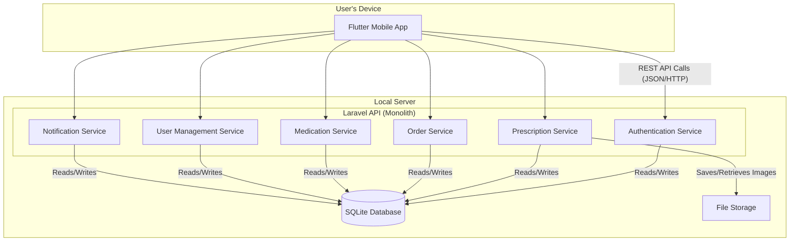

# Components

<!--docs/architecture/[title].md-->

This section breaks down the Pharmacy Management System into its major logical components, defining their responsibilities, boundaries, and interactions. This component-based view provides a clear roadmap for development, ensuring a clean separation of concerns that aligns with the feature-based organization specified in the project's technical requirements. Each component is designed to have a single, well-defined responsibility, which is crucial for maintainability and for enabling effective, focused implementation by AI developer agents.

## Component List

### Backend (Laravel API)

-   **Component: Authentication Service**
    -   **Responsibility:** Manages all aspects of user authentication and session management. It is the sole gatekeeper for accessing protected resources.
    -   **Key Interfaces:** Exposes the `/api/register`, `/api/login`, and `/api/logout` endpoints. Implements the Laravel Sanctum token issuance and validation logic.
    -   **Dependencies:** `User` data model.
    -   **Technology Stack:** Laravel, PHP, Laravel Sanctum.

-   **Component: Role-Based Access Control (RBAC) Middleware**
    -   **Responsibility:** A cross-cutting concern that protects API endpoints by verifying the authenticated user's role against the required permissions defined in the use case specifications.
    -   **Key Interfaces:** Acts as a middleware layer for all protected API routes.
    -   **Dependencies:** `Authentication Service` (to get the authenticated user).
    -   **Technology Stack:** Laravel Middleware.

-   **Component: Prescription Service**
    -   **Responsibility:** Handles the complete lifecycle of a prescription submission, from initial image upload and validation to its final state of 'Processed' or 'Rejected'.
    -   **Key Interfaces:** Exposes the `/api/prescriptions` and `/api/prescriptions/{id}/process` endpoints. Interacts with the File Storage component.
    -   **Dependencies:** `Order Service` (to trigger order creation), `Notification Service` (to inform the client), `File Storage`, `Prescription` data model.
    -   **Technology Stack:** Laravel, PHP, Filesystem API.

-   **Component: Order Service**
    -   **Responsibility:** Manages the entire order fulfillment workflow. This component contains the most critical business logic, including the **atomic, transactional stock management** required by the PRD.
    -   **Key Interfaces:** Exposes the `/api/orders` endpoints for creation, modification, and status updates.
    -   **Dependencies:** `Medication Service` (to check and reserve stock), `Notification Service`, `Order` and `OrderItem` data models.
    -   **Technology Stack:** Laravel, PHP, SQLite (with database transactions).

-   **Component: Medication & Inventory Service**
    -   **Responsibility:** Acts as the source of truth for the medication catalog and inventory levels. Manages all CRUD operations for medications and provides the low-stock report.
    -   **Key Interfaces:** Exposes the `/api/medications` and `/api/medications/low-stock` endpoints.
    -   **Dependencies:** `Medication` data model.
    -   **Technology Stack:** Laravel, PHP.

-   **Component: User Management Service**
    -   **Responsibility:** Provides administrative capabilities for managing client and employee accounts, including creation, modification, and disabling of users.
    -   **Key Interfaces:** Exposes the `/api/clients` and `/api/employees` endpoints.
    -   **Dependencies:** `User` data model.
    -   **Technology Stack:** Laravel, PHP.

-   **Component: Notification Service**
    -   **Responsibility:** An internal, backend-only service responsible for creating and persisting notifications in the database. It is called by other services (like `Order Service` and `Prescription Service`) to queue asynchronous updates for users.
    -   **Key Interfaces:** Internal methods (not a public API endpoint). Exposes the `/api/notifications` endpoint for users to fetch their messages.
    -   **Dependencies:** `Notification` data model.
    -   **Technology Stack:** Laravel, PHP.

### Frontend (Flutter App)

-   **Component: API Client Service**
    -   **Responsibility:** A dedicated, singleton service that handles all HTTP communication with the Laravel backend. It is responsible for adding the authentication token to headers, handling base URLs, and parsing standard API responses and errors.
    -   **Key Interfaces:** Provides methods like `get()`, `post()`, `put()`, `delete()` for other frontend components to use.
    -   **Dependencies:** `dio` package, `flutter_secure_storage` (to retrieve the auth token).
    -   **Technology Stack:** Dart, Dio.

-   **Component: Authentication Module**
    -   **Responsibility:** Manages the user's authentication state and provides the UI for login, registration, and logout.
    -   **Key Interfaces:** Provides the Login and Registration screens. Manages the storage and retrieval of the auth token via `flutter_secure_storage`.
    -   **Dependencies:** `API Client Service`.
    -   **Technology Stack:** Flutter, Provider, `flutter_secure_storage`.

-   **Component: Core Feature Modules (Prescriptions, Orders, Admin, etc.)**
    -   **Responsibility:** Each module encapsulates a specific feature area of the application, containing all the necessary screens, widgets, and state management (ViewModels) for that feature. This aligns with the "clean, feature-based structure" requirement.
    -   **Key Interfaces:** Exposes the primary screens for each feature (e.g., `PrescriptionSubmissionScreen`, `OrderManagementScreen`).
    -   **Dependencies:** `API Client Service`, shared UI components.
    -   **Technology Stack:** Flutter, Provider.

## Component Diagrams

This diagram illustrates the high-level relationships between the primary system components, following the C4 model's "Container" diagram style. It provides a clear overview of the system's structure and the primary channels of communication.

---
