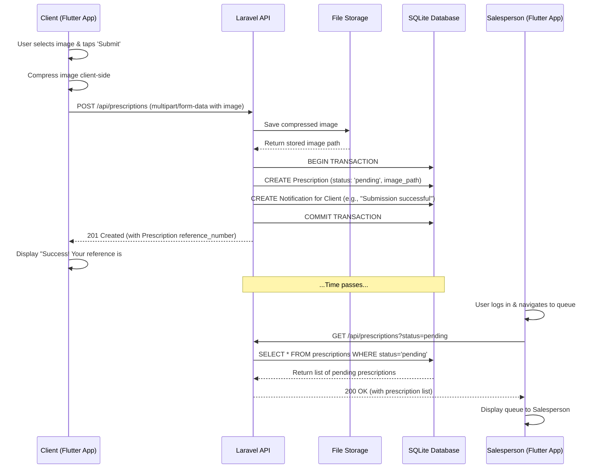

# Core Workflows

<!--docs/architecture/[title].md-->

This section illustrates the most critical end-to-end user journeys in the system using sequence diagrams. These diagrams provide a dynamic view of how different components—from the frontend application to the backend services and database—collaborate to achieve a user's goal. They are essential for clarifying complex interactions, validating the component architecture, and highlighting the asynchronous nature of the system's communication patterns.

## Prescription Submission and Initial Processing Workflow

The following diagram details the most critical user journey: a client submitting a new prescription. This workflow was chosen for visualization because it touches every major part of the architecture: the Flutter client, the Laravel API, file storage, the database, and the asynchronous notification system that eventually alerts a staff member. It makes the abstract concept of the "asynchronous workflow" concrete.



## Order Fulfillment and Transactional Stock Management Workflow

This diagram illustrates the process for `UC-17: Process Prescription into Order`. It is the system's most important business logic workflow, demonstrating how a salesperson's action triggers a series of coordinated, transactional steps in the backend to ensure data integrity. The diagram explicitly shows the separation of concerns between services and the critical "all-or-nothing" nature of the stock reservation and order creation process.

```mermaid
sequenceDiagram
    participant SalespersonApp as Salesperson (Flutter App)
    participant API as Laravel API
    participant PresSvc as Prescription Service
    participant OrderSvc as Order Service
    participant MedSvc as Medication Service
    participant NotifSvc as Notification Service
    participant DB as SQLite Database

    SalespersonApp->>API: PUT /prescriptions/{id}/process (items)
    API->>PresSvc: processPrescription(id, items)
    PresSvc->>OrderSvc: createOrderFromPrescription(items)

    box "Database Transaction"
        OrderSvc->>DB: BEGIN TRANSACTION
        loop For each item in order
            OrderSvc->>MedSvc: checkAndReserveStock(item)
            MedSvc->>DB: SELECT current_quantity
            alt Stock is sufficient
                MedSvc->>DB: UPDATE medications SET current_quantity = ...
            else Stock is insufficient
                MedSvc-->>OrderSvc: Throw InsufficientStockException
                OrderSvc->>DB: ROLLBACK TRANSACTION
                OrderSvc-->>PresSvc: Propagate error
                PresSvc-->>API: Return 409 Conflict Error
                API-->>SalespersonApp: 409 Conflict (e.g., "Item X is out of stock")
                break
            end
        end
        OrderSvc->>DB: INSERT into orders, order_items
        OrderSvc->>DB: COMMIT TRANSACTION
    end

    OrderSvc-->>PresSvc: Return new Order object
    PresSvc->>DB: UPDATE prescriptions SET status='processed'
    PresSvc->>NotifSvc: createOrderNotification(client_id, order_id)
    NotifSvc->>DB: INSERT into notifications
    PresSvc-->>API: Return success response
    API-->>SalespersonApp: 201 Created (Success)
```

---
