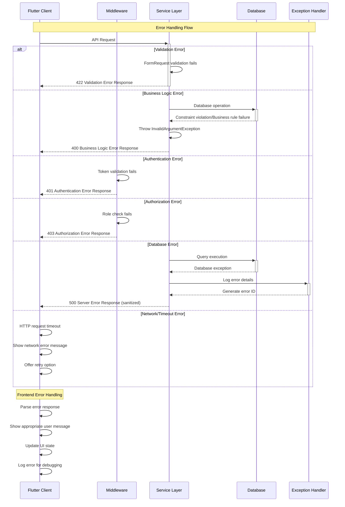

# Error Handling Strategy

<!--docs/architecture/error-handling-strategy.md-->

This document defines the unified error handling strategy for the Laravel Pharmacy Management System, establishing consistent patterns for error management across both backend and frontend components. This strategy ensures predictable error responses, proper user feedback, and comprehensive error tracking throughout the application.

## Error Flow



## Error Response Format

```php
<?php

// Backend Error Response Format (PHP)

/**
 * Standardized API error response structure.
 * 
 * All API endpoints must return errors in this format to ensure
 * consistent client-side error handling.
 */
interface ApiError {
    public function toArray(): array;
}

class StandardApiError implements ApiError {
    private string $code;
    private string $message;
    private ?array $details;
    private string $timestamp;
    private string $requestId;
    
    public function __construct(
        string $code,
        string $message,
        ?array $details = null,
        ?string $requestId = null
    ) {
        $this->code = $code;
        $this->message = $message;
        $this->details = $details;
        $this->timestamp = now()->toISOString();
        $this->requestId = $requestId ?? Str::uuid();
    }
    
    public function toArray(): array {
        return [
            'error' => [
                'code' => $this->code,
                'message' => $this->message,
                'details' => $this->details,
                'timestamp' => $this->timestamp,
                'request_id' => $this->requestId,
            ]
        ];
    }
}

// Example error responses:

// Validation Error (422)
{
    "error": {
        "code": "VALIDATION_FAILED",
        "message": "The given data was invalid.",
        "details": {
            "email": ["The email field is required."],
            "password": ["The password must be at least 8 characters."]
        },
        "timestamp": "2024-01-01T12:00:00Z",
        "request_id": "550e8400-e29b-41d4-a716-446655440000"
    }
}

// Business Logic Error (400)
{
    "error": {
        "code": "INSUFFICIENT_STOCK",
        "message": "Insufficient stock for Paracetamol 500mg. Only 5 units available.",
        "details": {
            "medication_id": 123,
            "requested_quantity": 10,
            "available_quantity": 5
        },
        "timestamp": "2024-01-01T12:00:00Z",
        "request_id": "550e8400-e29b-41d4-a716-446655440001"
    }
}

// Authentication Error (401)
{
    "error": {
        "code": "AUTHENTICATION_REQUIRED",
        "message": "Authentication token is missing or invalid.",
        "details": null,
        "timestamp": "2024-01-01T12:00:00Z",
        "request_id": "550e8400-e29b-41d4-a716-446655440002"
    }
}
```

```dart
// Frontend Error Response Format (Dart)

/// Standardized error response structure for API communication.
/// 
/// All API errors are parsed into this format to ensure consistent
/// error handling across the Flutter application.
class ApiError {
  final String code;
  final String message;
  final Map<String, dynamic>? details;
  final DateTime timestamp;
  final String requestId;

  const ApiError({
    required this.code,
    required this.message,
    this.details,
    required this.timestamp,
    required this.requestId,
  });

  /// Creates an [ApiError] from JSON response data.
  factory ApiError.fromJson(Map<String, dynamic> json) {
    final errorData = json['error'] as Map<String, dynamic>;
    
    return ApiError(
      code: errorData['code'] as String,
      message: errorData['message'] as String,
      details: errorData['details'] as Map<String, dynamic>?,
      timestamp: DateTime.parse(errorData['timestamp'] as String),
      requestId: errorData['request_id'] as String,
    );
  }

  /// Creates an [ApiError] for network-related failures.
  factory ApiError.networkError() {
    return ApiError(
      code: 'NETWORK_ERROR',
      message: 'Unable to connect to server. Please check your internet connection.',
      timestamp: DateTime.now(),
      requestId: 'local-${DateTime.now().millisecondsSinceEpoch}',
    );
  }

  /// Creates an [ApiError] for timeout failures.
  factory ApiError.timeoutError() {
    return ApiError(
      code: 'REQUEST_TIMEOUT',
      message: 'Request timed out. Please try again.',
      timestamp: DateTime.now(),
      requestId: 'local-${DateTime.now().millisecondsSinceEpoch}',
    );
  }

  /// Gets user-friendly message for common error codes.
  String get userFriendlyMessage {
    switch (code) {
      case 'VALIDATION_FAILED':
        return 'Please check your input and try again.';
      case 'AUTHENTICATION_REQUIRED':
        return 'Please log in to continue.';
      case 'ACCESS_DENIED':
        return 'You do not have permission to perform this action.';
      case 'INSUFFICIENT_STOCK':
        return 'Not enough stock available for this medication.';
      case 'PRESCRIPTION_ALREADY_PROCESSED':
        return 'This prescription has already been processed.';
      case 'NETWORK_ERROR':
        return 'Connection problem. Please check your internet.';
      case 'REQUEST_TIMEOUT':
        return 'Request took too long. Please try again.';
      default:
        return message;
    }
  }

  /// Checks if this error requires user authentication.
  bool get requiresAuthentication => code == 'AUTHENTICATION_REQUIRED';

  /// Checks if this error is due to network connectivity.
  bool get isNetworkError => code == 'NETWORK_ERROR' || code == 'REQUEST_TIMEOUT';
}
```

## Frontend Error Handling

```dart
import 'package:flutter/material.dart';
import 'package:provider/provider.dart';

/// Centralized error handling service for the Flutter application.
/// 
/// This service provides consistent error display, logging, and recovery
/// mechanisms across all features of the app.
class ErrorHandler {
  static final ErrorHandler _instance = ErrorHandler._internal();
  factory ErrorHandler() => _instance;
  ErrorHandler._internal();

  /// Handles API errors and shows appropriate user feedback.
  /// 
  /// This method should be called by all providers when catching API exceptions.
  /// It automatically determines the appropriate user feedback based on error type.
  Future<void> handleApiError(
    BuildContext context,
    ApiError error, {
    bool showSnackBar = true,
    VoidCallback? onRetry,
  }) async {
    // Log error for debugging
    _logError(error);

    // Handle authentication errors
    if (error.requiresAuthentication) {
      await _handleAuthenticationError(context);
      return;
    }

    // Handle network errors with retry option
    if (error.isNetworkError && onRetry != null) {
      _showNetworkErrorDialog(context, error, onRetry);
      return;
    }

    // Show standard error feedback
    if (showSnackBar && context.mounted) {
      _showErrorSnackBar(context, error);
    }
  }

  /// Handles validation errors by showing field-specific messages.
  void handleValidationError(
    BuildContext context,
    ApiError error,
    GlobalKey<FormState>? formKey,
  ) {
    _logError(error);

    // If we have form validation details, try to show field-specific errors
    if (error.details != null && formKey?.currentState != null) {
      // Laravel validation errors are in format: {"field": ["error message"]}
      final validationErrors = error.details!;
      
      // For complex forms, you might want to implement field-specific error display
      // For now, show a general validation error message
      _showErrorSnackBar(context, error);
      return;
    }

    // Fallback to general error display
    _showErrorSnackBar(context, error);
  }

  /// Handles authentication errors by redirecting to login.
  Future<void> _handleAuthenticationError(BuildContext context) async {
    // Clear stored authentication data
    final authProvider = context.read<AuthProvider>();
    await authProvider.logout();

    // Show user-friendly message
    if (context.mounted) {
      ScaffoldMessenger.of(context).showSnackBar(
        const SnackBar(
          content: Text('Your session has expired. Please log in again.'),
          backgroundColor: Colors.orange,
        ),
      );

      // Navigate to login screen
      // Navigation will be handled by go_router redirect logic
    }
  }

  /// Shows network error dialog with retry option.
  void _showNetworkErrorDialog(
    BuildContext context,
    ApiError error,
    VoidCallback onRetry,
  ) {
    showDialog(
      context: context,
      builder: (context) => AlertDialog(
        title: const Text('Connection Problem'),
        content: Text(error.userFriendlyMessage),
        actions: [
          TextButton(
            onPressed: () => Navigator.of(context).pop(),
            child: const Text('Cancel'),
          ),
          ElevatedButton(
            onPressed: () {
              Navigator.of(context).pop();
              onRetry();
            },
            child: const Text('Retry'),
          ),
        ],
      ),
    );
  }

  /// Shows error message in a snackbar.
  void _showErrorSnackBar(BuildContext context, ApiError error) {
    if (!context.mounted) return;

    ScaffoldMessenger.of(context).showSnackBar(
      SnackBar(
        content: Text(error.userFriendlyMessage),
        backgroundColor: Colors.red,
        action: SnackBarAction(
          label: 'Dismiss',
          textColor: Colors.white,
          onPressed: () {
            ScaffoldMessenger.of(context).hideCurrentSnackBar();
          },
        ),
      ),
    );
  }

  /// Logs error for debugging and analytics.
  void _logError(ApiError error) {
    debugPrint('API Error: ${error.code} - ${error.message}');
    debugPrint('Request ID: ${error.requestId}');
    debugPrint('Timestamp: ${error.timestamp}');
    if (error.details != null) {
      debugPrint('Details: ${error.details}');
    }
    
    // In production, send to crash reporting service
    // FirebaseCrashlytics.instance.recordError(error, null);
  }
}

/// Enhanced ApiClient with integrated error handling.
class ApiClient {
  static final ApiClient _instance = ApiClient._internal();
  factory ApiClient() => _instance;
  ApiClient._internal();

  final StorageService _storage = StorageService();
  final ErrorHandler _errorHandler = ErrorHandler();

  /// Makes a GET request with comprehensive error handling.
  Future<Map<String, dynamic>> get(String endpoint) async {
    final uri = Uri.parse('${ApiConstants.baseUrl}$endpoint');
    final headers = await _getHeaders();
    
    try {
      final response = await http.get(uri, headers: headers)
          .timeout(const Duration(seconds: 30));
      return _handleResponse(response);
    } on TimeoutException {
      throw ApiException.fromError(ApiError.timeoutError());
    } on SocketException {
      throw ApiException.fromError(ApiError.networkError());
    } catch (e) {
      throw ApiException('Unexpected error: $e');
    }
  }

  /// Handles HTTP response with standardized error parsing.
  Map<String, dynamic> _handleResponse(http.Response response) {
    if (response.statusCode >= 200 && response.statusCode < 300) {
      if (response.body.isEmpty) {
        return {'success': true};
      }
      return json.decode(response.body);
    } else {
      // Parse standardized error response
      if (response.body.isNotEmpty) {
        try {
          final errorData = json.decode(response.body);
          final apiError = ApiError.fromJson(errorData);
          throw ApiException.fromError(apiError);
        } catch (e) {
          // Fallback for non-standard error responses
          throw ApiException('HTTP ${response.statusCode}: ${response.body}');
        }
      } else {
        throw ApiException('HTTP ${response.statusCode}');
      }
    }
  }

  Future<Map<String, String>> _getHeaders() async {
    final headers = {
      'Content-Type': 'application/json',
      'Accept': 'application/json',
    };
    
    final token = await _storage.getAuthToken();
    if (token != null) {
      headers['Authorization'] = 'Bearer $token';
    }
    
    return headers;
  }
}

/// Exception wrapper for API errors.
class ApiException implements Exception {
  final String message;
  final int? statusCode;
  final ApiError? apiError;
  
  const ApiException(this.message, {this.statusCode, this.apiError});
  
  factory ApiException.fromError(ApiError error) {
    return ApiException(
      error.message,
      apiError: error,
    );
  }
  
  @override
  String toString() => message;
}

/// Enhanced provider with integrated error handling.
abstract class BaseProvider extends ChangeNotifier {
  final ErrorHandler _errorHandler = ErrorHandler();
  
  bool _isLoading = false;
  ApiError? _lastError;
  
  bool get isLoading => _isLoading;
  ApiError? get lastError => _lastError;
  bool get hasError => _lastError != null;
  
  /// Executes an async operation with built-in error handling.
  Future<T?> executeWithErrorHandling<T>(
    Future<T> Function() operation, {
    bool showErrorToUser = true,
    VoidCallback? onRetry,
  }) async {
    _setLoading(true);
    _clearError();
    
    try {
      final result = await operation();
      return result;
    } on ApiException catch (e) {
      _setError(e.apiError ?? ApiError(
        code: 'UNKNOWN_ERROR',
        message: e.message,
        timestamp: DateTime.now(),
        requestId: 'unknown',
      ));
      
      if (showErrorToUser) {
        // Context access in providers requires careful handling
        // In practice, you'd pass context through the operation
        // or handle error display at the widget level
      }
      
      return null;
    } catch (e) {
      final unknownError = ApiError(
        code: 'UNKNOWN_ERROR',
        message: e.toString(),
        timestamp: DateTime.now(),
        requestId: 'unknown',
      );
      _setError(unknownError);
      return null;
    } finally {
      _setLoading(false);
    }
  }
  
  void _setLoading(bool loading) {
    _isLoading = loading;
    notifyListeners();
  }
  
  void _setError(ApiError error) {
    _lastError = error;
    notifyListeners();
  }
  
  void _clearError() {
    _lastError = null;
    notifyListeners();
  }
  
  void clearError() {
    _clearError();
  }
}
```

## Backend Error Handling

```php
<?php

namespace App\Exceptions;

use Illuminate\Foundation\Exceptions\Handler as ExceptionHandler;
use Illuminate\Validation\ValidationException;
use Illuminate\Auth\AuthenticationException;
use Illuminate\Auth\Access\AuthorizationException;
use Illuminate\Database\Eloquent\ModelNotFoundException;
use Symfony\Component\HttpKernel\Exception\NotFoundHttpException;
use Symfony\Component\HttpKernel\Exception\AccessDeniedHttpException;
use InvalidArgumentException;
use Throwable;

/**
 * Global exception handler for the Laravel application.
 * 
 * This handler ensures all exceptions are converted to standardized
 * API error responses following the defined error format.
 */
class Handler extends ExceptionHandler
{
    /**
     * The list of the inputs that are never flashed to the session on validation exceptions.
     *
     * @var array<int, string>
     */
    protected $dontFlash = [
        'current_password',
        'password',
        'password_confirmation',
    ];

    /**
     * Register the exception handling callbacks for the application.
     */
    public function register(): void
    {
        $this->reportable(function (Throwable $e) {
            // Log all exceptions for debugging and monitoring
            if ($this->shouldReport($e)) {
                \Log::error('Exception occurred', [
                    'exception' => get_class($e),
                    'message' => $e->getMessage(),
                    'file' => $e->getFile(),
                    'line' => $e->getLine(),
                    'trace' => $e->getTraceAsString(),
                    'request_id' => request()->header('X-Request-ID', \Str::uuid()),
                    'user_id' => auth()->id(),
                    'url' => request()->fullUrl(),
                    'method' => request()->method(),
                ]);
            }
        });

        // Handle API-specific exceptions
        $this->renderable(function (Throwable $e, $request) {
            if ($request->is('api/*')) {
                return $this->handleApiException($e, $request);
            }
        });
    }

    /**
     * Convert exceptions to standardized API error responses.
     */
    private function handleApiException(Throwable $e, $request)
    {
        $requestId = $request->header('X-Request-ID', \Str::uuid());

        // Validation errors
        if ($e instanceof ValidationException) {
            return $this->validationErrorResponse($e, $requestId);
        }

        // Authentication errors
        if ($e instanceof AuthenticationException) {
            return $this->authenticationErrorResponse($requestId);
        }

        // Authorization errors
        if ($e instanceof AuthorizationException || $e instanceof AccessDeniedHttpException) {
            return $this->authorizationErrorResponse($requestId);
        }

        // Model not found errors
        if ($e instanceof ModelNotFoundException || $e instanceof NotFoundHttpException) {
            return $this->notFoundErrorResponse($requestId);
        }

        // Business logic errors
        if ($e instanceof InvalidArgumentException) {
            return $this->businessLogicErrorResponse($e, $requestId);
        }

        // Database constraint errors
        if ($e instanceof \Illuminate\Database\QueryException) {
            return $this->databaseErrorResponse($e, $requestId);
        }

        // Generic server errors
        return $this->serverErrorResponse($e, $requestId);
    }

    /**
     * Handle validation exceptions.
     */
    private function validationErrorResponse(ValidationException $e, string $requestId)
    {
        return response()->json([
            'error' => [
                'code' => 'VALIDATION_FAILED',
                'message' => 'The given data was invalid.',
                'details' => $e->errors(),
                'timestamp' => now()->toISOString(),
                'request_id' => $requestId,
            ]
        ], 422);
    }

    /**
     * Handle authentication exceptions.
     */
    private function authenticationErrorResponse(string $requestId)
    {
        return response()->json([
            'error' => [
                'code' => 'AUTHENTICATION_REQUIRED',
                'message' => 'Authentication token is missing or invalid.',
                'details' => null,
                'timestamp' => now()->toISOString(),
                'request_id' => $requestId,
            ]
        ], 401);
    }

    /**
     * Handle authorization exceptions.
     */
    private function authorizationErrorResponse(string $requestId)
    {
        return response()->json([
            'error' => [
                'code' => 'ACCESS_DENIED',
                'message' => 'You do not have permission to perform this action.',
                'details' => null,
                'timestamp' => now()->toISOString(),
                'request_id' => $requestId,
            ]
        ], 403);
    }

    /**
     * Handle not found exceptions.
     */
    private function notFoundErrorResponse(string $requestId)
    {
        return response()->json([
            'error' => [
                'code' => 'RESOURCE_NOT_FOUND',
                'message' => 'The requested resource was not found.',
                'details' => null,
                'timestamp' => now()->toISOString(),
                'request_id' => $requestId,
            ]
        ], 404);
    }

    /**
     * Handle business logic exceptions.
     */
    private function businessLogicErrorResponse(InvalidArgumentException $e, string $requestId)
    {
        // Extract error code from message if available
        $message = $e->getMessage();
        $code = 'BUSINESS_LOGIC_ERROR';

        // Map common business logic errors to specific codes
        if (str_contains($message, 'Insufficient stock')) {
            $code = 'INSUFFICIENT_STOCK';
        } elseif (str_contains($message, 'Prescription already processed')) {
            $code = 'PRESCRIPTION_ALREADY_PROCESSED';
        } elseif (str_contains($message, 'Invalid status transition')) {
            $code = 'INVALID_STATUS_TRANSITION';
        } elseif (str_contains($message, 'Order not found')) {
            $code = 'ORDER_NOT_FOUND';
        }

        return response()->json([
            'error' => [
                'code' => $code,
                'message' => $message,
                'details' => null,
                'timestamp' => now()->toISOString(),
                'request_id' => $requestId,
            ]
        ], 400);
    }

    /**
     * Handle database exceptions.
     */
    private function databaseErrorResponse(\Illuminate\Database\QueryException $e, string $requestId)
    {
        // Don't expose database details in production
        $message = 'A database error occurred.';
        $code = 'DATABASE_ERROR';

        // Handle specific constraint violations
        if (str_contains($e->getMessage(), 'UNIQUE constraint failed')) {
            $code = 'DUPLICATE_ENTRY';
            $message = 'The provided data conflicts with existing records.';
        } elseif (str_contains($e->getMessage(), 'FOREIGN KEY constraint failed')) {
            $code = 'INVALID_REFERENCE';
            $message = 'The operation references invalid or non-existent data.';
        }

        return response()->json([
            'error' => [
                'code' => $code,
                'message' => $message,
                'details' => app()->environment('production') ? null : [
                    'sql_error' => $e->getMessage(),
                ],
                'timestamp' => now()->toISOString(),
                'request_id' => $requestId,
            ]
        ], 500);
    }

    /**
     * Handle generic server errors.
     */
    private function serverErrorResponse(Throwable $e, string $requestId)
    {
        return response()->json([
            'error' => [
                'code' => 'INTERNAL_SERVER_ERROR',
                'message' => 'An unexpected error occurred. Please try again later.',
                'details' => app()->environment('production') ? null : [
                    'exception' => get_class($e),
                    'message' => $e->getMessage(),
                    'file' => $e->getFile(),
                    'line' => $e->getLine(),
                ],
                'timestamp' => now()->toISOString(),
                'request_id' => $requestId,
            ]
        ], 500);
    }
}

/**
 * Custom exception for business logic errors with specific error codes.
 */
class BusinessLogicException extends \Exception
{
    private string $errorCode;
    private ?array $details;

    public function __construct(string $errorCode, string $message, ?array $details = null)
    {
        parent::__construct($message);
        $this->errorCode = $errorCode;
        $this->details = $details;
    }

    public function getErrorCode(): string
    {
        return $this->errorCode;
    }

    public function getDetails(): ?array
    {
        return $this->details;
    }
}

/**
 * Enhanced Service class with proper error handling.
 */
abstract class BaseService
{
    /**
     * Handles database operations with proper exception management.
     */
    protected function executeWithTransaction(callable $operation)
    {
        return \DB::transaction(function () use ($operation) {
            try {
                return $operation();
            } catch (\Illuminate\Database\QueryException $e) {
                // Re-throw with more context
                throw new BusinessLogicException(
                    'DATABASE_OPERATION_FAILED',
                    'Database operation failed due to constraint violation or data integrity issue.',
                    ['original_error' => $e->getMessage()]
                );
            }
        });
    }

    /**
     * Validates business rules and throws appropriate exceptions.
     */
    protected function validateBusinessRule(bool $condition, string $errorCode, string $message, ?array $details = null): void
    {
        if (!$condition) {
            throw new BusinessLogicException($errorCode, $message, $details);
        }
    }
}

/**
 * Example enhanced OrderService with proper error handling.
 */
class OrderService extends BaseService
{
    public function createOrder(array $validatedData, User $user): Order
    {
        return $this->executeWithTransaction(function () use ($validatedData, $user) {
            // Validate prescription exists and is processed
            $prescription = Prescription::where('id', $validatedData['prescription_id'])
                ->where('status', 'processed')
                ->first();

            $this->validateBusinessRule(
                $prescription !== null,
                'PRESCRIPTION_NOT_FOUND',
                'The specified prescription was not found or has not been processed.',
                ['prescription_id' => $validatedData['prescription_id']]
            );

            // Check if prescription already has an order
            $this->validateBusinessRule(
                !$prescription->order()->exists(),
                'PRESCRIPTION_ALREADY_PROCESSED',
                'This prescription already has an associated order.',
                ['prescription_id' => $prescription->id]
            );

            $totalAmount = 0;
            $orderItems = [];

            // Validate stock availability and calculate total
            foreach ($validatedData['items'] as $item) {
                $medication = Medication::lockForUpdate()->find($item['medication_id']);

                $this->validateBusinessRule(
                    $medication && $medication->status === 'active',
                    'MEDICATION_NOT_AVAILABLE',
                    "Medication with ID {$item['medication_id']} is not available.",
                    ['medication_id' => $item['medication_id']]
                );

                $this->validateBusinessRule(
                    $medication->current_quantity >= $item['quantity'],
                    'INSUFFICIENT_STOCK',
                    "Insufficient stock for {$medication->name}. Only {$medication->current_quantity} units available.",
                    [
                        'medication_id' => $medication->id,
                        'medication_name' => $medication->name,
                        'requested_quantity' => $item['quantity'],
                        'available_quantity' => $medication->current_quantity,
                    ]
                );

                // Continue with order creation logic...
                $lineTotal = $item['quantity'] * $medication->price;
                $totalAmount += $lineTotal;

                $orderItems[] = [
                    'medication_id' => $medication->id,
                    'quantity' => $item['quantity'],
                    'unit_price' => $medication->price,
                    'created_at' => now(),
                ];

                // Update medication stock
                $medication->current_quantity -= $item['quantity'];
                $medication->save();
            }

            // Create the order
            $order = Order::create([
                'client_id' => $prescription->client_id,
                'prescription_id' => $prescription->id,
                'total_amount' => $totalAmount,
                'status' => 'in_preparation',
            ]);

            // Create order items
            foreach ($orderItems as $item) {
                $item['order_id'] = $order->id;
                OrderItem::create($item);
            }

            // Load relationships for response
            $order->load(['client', 'items.medication', 'prescription']);

            return $order;
        });
    }
}
```

## Error Handling Best Practices

### Backend Guidelines

1. **Use Specific Exception Types**: Throw `BusinessLogicException` with specific error codes for business rule violations
2. **Database Transaction Wrapping**: All multi-step operations must be wrapped in database transactions
3. **Sanitize Production Errors**: Never expose sensitive information in production error responses
4. **Request ID Tracking**: Include unique request IDs in all error responses for debugging
5. **Comprehensive Logging**: Log all exceptions with full context for debugging and monitoring

### Frontend Guidelines

1. **Centralized Error Display**: Use the `ErrorHandler` service for consistent error presentation
2. **Network Error Recovery**: Always provide retry options for network-related failures
3. **Authentication Error Handling**: Automatically redirect to login on authentication failures
4. **Validation Error Mapping**: Map server validation errors to appropriate form field displays
5. **Error State Management**: Include error states in all providers and handle gracefully in UI

This error handling strategy ensures consistent, user-friendly error management across both the Laravel backend and Flutter frontend, providing proper feedback to users while maintaining comprehensive error tracking for debugging and monitoring.