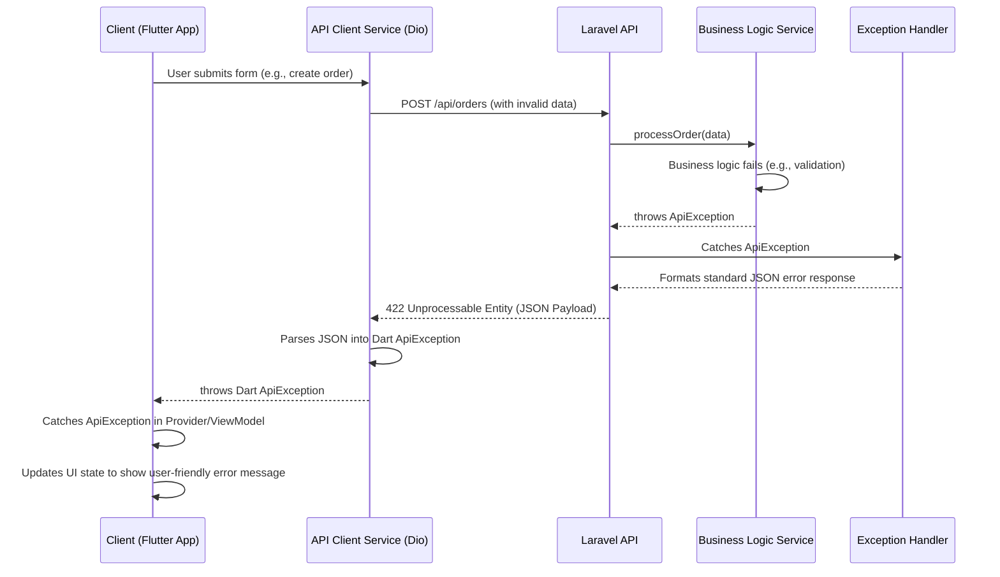

# Error Handling Strategy

<!--docs/architecture/[title].md-->

This section defines the unified, end-to-end strategy for managing and communicating errors across the fullstack application. The primary goal is to create a system that is robust, predictable, and provides clear, actionable feedback. A consistent error handling contract between the Laravel backend and the Flutter frontend is critical for building a reliable application and a streamlined developer experience.

## Error Flow

The following diagram illustrates the standard flow for handling a client-initiated action that results in a server-side validation error. This pattern applies to all API interactions, ensuring that errors are caught, structured, and communicated back to the user in a consistent manner.



## API Error Response Format

**Architectural Rule:** All API error responses (status codes `4xx` and `5xx`) **must** conform to a consistent JSON structure. This provides a predictable contract that the Flutter frontend can rely on to parse errors and display appropriate feedback.

The structure consists of a mandatory `message` field and an optional `errors` object for detailed validation failures.

**Example: General Error (e.g., 403 Forbidden, 409 Conflict)**
```json
{
  "message": "This action is unauthorized."
}
```

**Example: Validation Error (422 Unprocessable Entity)**
```json
{
  "message": "The given data was invalid.",
  "errors": {
    "email": [
      "The email field is required."
    ],
    "password": [
      "The password must be at least 8 characters."
    ]
  }
}
```

## Backend Implementation (Laravel)

Error responses will be centralized in Laravel's global exception handler. We will create a custom `ApiException` to be thrown from our Service layer, which the handler will then catch and format into the standard JSON response.

**1. Custom Exception:**

This custom exception allows our business logic to communicate structured errors to the HTTP layer.

File: `backend/app/Exceptions/ApiException.php`
```php
<?php

namespace App\Exceptions;

use Exception;
use Illuminate\Http\JsonResponse;

class ApiException extends Exception
{
    protected $errors;

    public function __construct(string $message, int $code = 400, array $errors = null)
    {
        parent::__construct($message, $code);
        $this->errors = $errors;
    }

    public function render($request): JsonResponse
    {
        $response = ['message' => $this->getMessage()];
        if ($this->errors) {
            $response['errors'] = $this->errors;
        }
        return response()->json($response, $this->getCode());
    }
}
```

**2. Global Exception Handler:**

The `app/Exceptions/Handler.php` will be modified to specifically render our custom `ApiException`.

File: `backend/app/Exceptions/Handler.php`
```php
// ... inside the Handler class
use App\Exceptions\ApiException;

public function register(): void
{
    $this->renderable(function (ApiException $e, $request) {
        if ($request->wantsJson()) {
            return $e->render($request);
        }
    });

    // ... other handlers
}
```

**3. Usage in a Service:**

Business logic can now throw this exception to halt execution and return a structured error.

```php
// In OrderService.php
if ($stockIsInsufficient) {
    throw new ApiException('One or more items are out of stock.', 409); // 409 Conflict
}
```

## Frontend Implementation (Flutter)

The `ApiClientService` is responsible for catching HTTP errors from `dio` and converting them into a strongly-typed Dart `ApiException`. The application's state management layer (Providers) will then catch this specific exception type to manage the UI state.

**1. Custom Exception:**

File: `frontend/lib/core/api/api_exception.dart`
```dart
/// A custom exception to represent structured errors from the API.
class ApiException implements Exception {
  final String message;
  final int? statusCode;
  final Map<String, dynamic>? errors;

  ApiException({required this.message, this.statusCode, this.errors});

  @override
  String toString() => 'ApiException: $message (Status Code: $statusCode)';
}
```

**2. `dio` Interceptor Logic:**

The `onError` interceptor in `ApiClientService` will be responsible for parsing the JSON error and creating the `ApiException`.

```dart
// In ApiClientService's InterceptorsWrapper
onError: (DioException e, handler) {
  if (e.response != null && e.response!.data is Map<String, dynamic>) {
    final data = e.response!.data as Map<String, dynamic>;
    final apiException = ApiException(
      message: data['message'] ?? 'An unknown error occurred.',
      statusCode: e.response!.statusCode,
      errors: data['errors'],
    );
    // Pass the structured exception along
    return handler.next(e..error = apiException);
  }
  return handler.next(e);
}
```

**3. Usage in a Provider:**

The state management layer catches the `ApiException` and updates the UI state accordingly.

```dart
// In AuthProvider.dart
Future<void> login(String email, String password) async {
  _isLoading = true;
  _error = null;
  notifyListeners();

  try {
    final token = await _authApiService.login(email, password);
    await _secureStorage.writeToken(token);
    _isAuthenticated = true;
  } on ApiException catch (e) {
    // The UI can now display a specific, user-friendly error message.
    _error = e.message;
  } catch (e) {
    // Fallback for unexpected errors
    _error = 'An unexpected error occurred. Please try again.';
  } finally {
    _isLoading = false;
    notifyListeners();
  }
}
```

---
