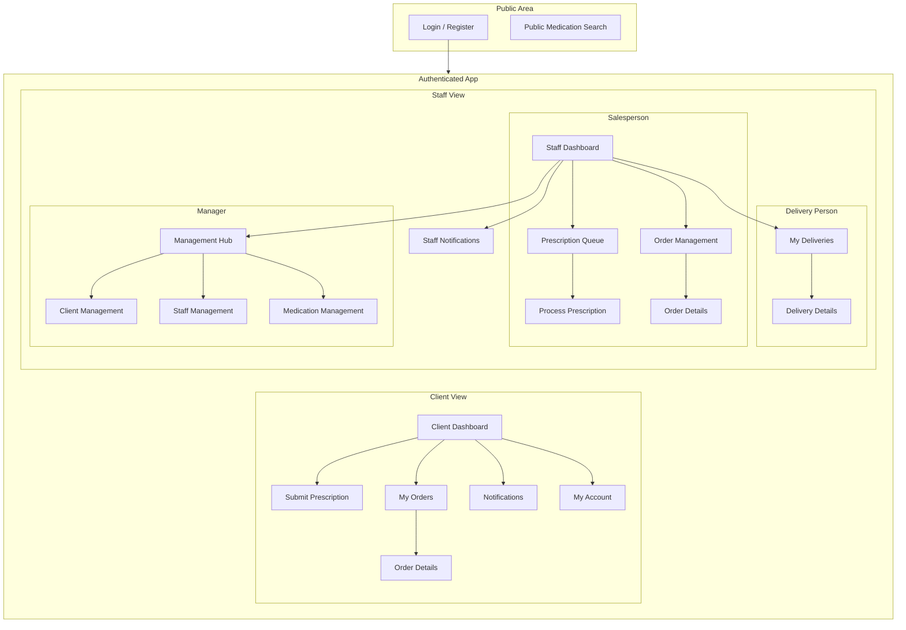

# Information Architecture (IA)

The information architecture is designed to provide a clear, logical, and role-specific structure for the application. It separates the user experience into two primary contexts: the public-facing (unauthenticated) area and the secure, role-based (authenticated) areas for clients and staff.

## Site Map / Screen Inventory

This diagram illustrates the high-level structure and key screens of the application, organized by user role.

## Navigation Structure

**Primary Navigation:** The primary navigation will be a bottom tab bar, providing persistent access to the most critical sections for the user's role. This mobile-first pattern ensures high-priority tasks are always one tap away.

*   **For Clients:**
    *   **Dashboard:** Main landing screen with key summaries.
    *   **Submit Rx:** A dedicated, high-visibility tab for the core user action.
    *   **My Orders:** Quick access to order history and status.
    *   **Notifications:** Central hub for all updates.
*   **For Staff (Salesperson/Manager):**
    *   **Dashboard:** Role-specific overview.
    *   **Prescriptions:** The queue of pending prescriptions to be processed.
    *   **Orders:** The main order management view.
    *   **Notifications:** All relevant staff alerts.
*   **For Staff (Delivery Person):**
    *   **My Deliveries:** A focused list of assigned orders.
    *   **Notifications:** Alerts relevant to their deliveries.
    *   **Profile:** Access to account settings.

**Secondary Navigation:** Navigation to deeper screens (e.g., viewing specific order details) will be handled through a standard "stack" navigation model. Users will tap items in a list to push a new screen onto the view stack, with a clear "Back" button in the header to return to the previous screen.

**Breadcrumb Strategy:** Traditional web-style breadcrumbs are not applicable to this mobile application. Clear screen titles in the header will serve as the primary method of orientation, ensuring the user always knows where they are in the app.

## Dashboard Content Strategy

The dashboard is the primary landing screen for every authenticated user. Its purpose is to provide an at-a-glance summary of the most relevant information and quick access to the most critical actions for that user's role, directly supporting our "Efficiency is the Feature" design principle.

### Client Dashboard

The client's dashboard is designed to provide immediate reassurance and easy access to the app's core function.

*   **Primary Call-to-Action (CTA):** A large, prominent "Submit New Prescription" button. This is the client's main job-to-be-done and should be the easiest action to find.
*   **Recent Order Status Card:** A dynamic card displaying the real-time status of their most recent order (e.g., "Order #12345 - In Preparation"). This directly addresses the "Provide Constant Reassurance" principle by answering the user's most likely question first. Tapping this card will navigate to the order's detail screen.
*   **Notification Summary:** A small, non-intrusive summary indicating the number of unread notifications (e.g., "You have 2 new notifications"). Tapping this navigates to the full notification list.

### Salesperson Dashboard

The salesperson's dashboard is a command center focused on their primary workflow: processing incoming prescriptions.

*   **Actionable Stat Cards:** A set of clear, bold metric cards at the top of the screen to show the current workload:
    *   **Pending Prescriptions:** A large number indicating how many new submissions are in the queue.
    *   **Orders in Preparation:** A count of orders currently being worked on.
*   **Primary Task Button:** A "Go to Prescription Queue" button that takes them directly to the list of pending prescriptions to begin processing.
*   **Recent Activity Feed (Optional):** A short list of the 3-5 most recent events (e.g., "Prescription #P67890 submitted by J. Doe," "Order #12344 marked Ready for Delivery").

### Manager Dashboard

The manager's dashboard provides a high-level overview of business operations and highlights urgent issues that require attention.

*   **Key Performance Indicators (KPIs):** A series of summary cards displaying critical real-time business metrics for the day:
    *   Total Orders
    *   Total Revenue
    *   New Prescriptions Submitted
*   **Urgent Alerts Section:** A high-visibility section for critical alerts. The most important alert will be:
    *   **Low Stock Warning:** (e.g., "⚠️ 5 items are low on stock"). Tapping this alert navigates directly to the low-stock report.
    *   **Note for MVP:** As the low-stock report is a post-MVP feature, this alert will be a non-functional UI element or hidden in the initial release. The interaction (tapping to navigate) will be implemented in a future phase.
*   **Quick Links:** A set of navigation buttons for easy access to the core administrative sections:
    *   Manage Medications
    *   Manage Staff
    *   Manage Clients

### Dashboard Empty States

"Empty states" occur when there is no data to display, such as on a user's first login or when a task queue is empty. These states are designed to be informative, guiding, and encouraging.

*   **Client Dashboard (First-Time Use):**
    A new client has no order history. Instead of showing a blank space where the "Recent Order Status Card" would be, the dashboard will display a welcoming "Getting Started" card.
    *   **Content:**
        *   **Headline:** "Welcome to a simpler pharmacy experience!"
        *   **Body:** "Submit your first prescription to see its status here. It's fast, easy, and secure."
    *   **Interaction:** This card will be tappable and will navigate the user directly to the "Submit Prescription" screen, providing a clear and immediate path to their primary goal.
*   **Salesperson Dashboard (Empty Queue):**
    When the prescription queue is empty, it signifies that all work is complete. The dashboard should reflect this as a positive achievement.
    *   **Content:**
        *   The "Pending Prescriptions" stat card will clearly display "0".
        *   The main content area will display a positive confirmation message.
        *   **Headline:** "All Caught Up!"
        *   **Body:** "The prescription queue is clear. You'll be notified when new submissions arrive."
        *   **Visual:** A simple, positive icon (e.g., a checkmark ✅) will accompany the message.

---
