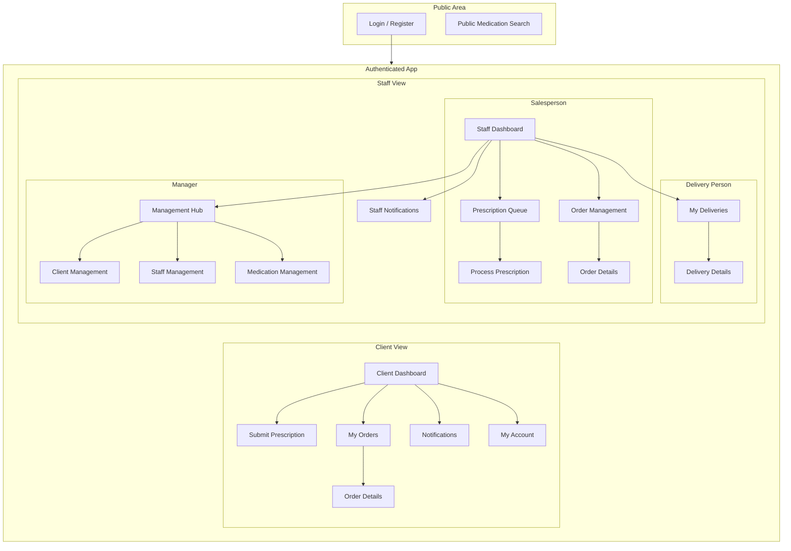

# Information Architecture (IA)

<!--docs/front-end-spec/[title].md-->

The information architecture is designed to provide a clear, logical, and role-specific structure for the application. It separates the user experience into two primary contexts: the public-facing (unauthenticated) area and the secure, role-based (authenticated) areas.

This architecture is built upon the core technical principle that the application is **strictly online-only**. All data is fetched directly from the network on demand, with no client-side caching or offline capabilities.

## Site Map / Screen Inventory

This diagram illustrates the high-level structure and key screens of the application, organized by user role.

## Navigation Structure

### Primary and Secondary Navigation

*   **Primary Navigation:** A bottom tab bar provides persistent access to the most critical sections for the user's role. This mobile-first pattern ensures high-priority tasks are always one tap away.
    *   **Client:** Dashboard, Submit Rx, My Orders, Notifications
    *   **Salesperson/Manager:** Dashboard, Prescriptions, Orders, Notifications
    *   **Delivery Person:** My Deliveries, Notifications, Profile
*   **Secondary Navigation:** Deeper screens (e.g., order details) are handled through a standard "stack" navigation model. Tapping an item pushes a new screen onto the view stack, with a "Back" button in the header to return.

### Routing and Access Control

In accordance with the simplification plan, navigation will be managed declaratively using the `go_router` package. This approach is essential for handling the application's multi-role architecture.

*   **Centralized Logic:** A single, centralized redirect function in `go_router` will handle all authentication and role-based access control. This eliminates the need for auth checks scattered across individual screens.
*   **Role-Based Redirects:** Upon login, the router will automatically direct users to the appropriate dashboard (Client, Salesperson, etc.) based on their role.
*   **Declarative Routes:** The app's entire navigation structure will be defined in a single, clear configuration, mapping directly to the site map.

## Data Presentation and Connectivity

As the application is strictly online-only and does not use `connectivity_plus`, the user interface must be designed around a universal data-fetching pattern. Offline status is inferred exclusively from failed API requests.

**Universal Screen Loading Pattern:**
1.  **Initial State:** When a screen is opened, a loading indicator (e.g., a spinner) is displayed immediately.
2.  **Data Fetch:** An API request is made to fetch the necessary data.
3.  **Success State:** Upon a successful response, the loading indicator is hidden, and the data is rendered on the screen.
4.  **Failure State:** If the API request fails (due to no network, a server error, or an invalid token), the loading indicator is hidden and replaced with a user-friendly error message and a "Retry" button. If the failure is due to an invalid token, the user will be logged out and redirected to the login screen.

## Dashboard Content Strategy

The dashboard is the primary landing screen for every authenticated user. Its content is dynamic and fetched from the network each time the screen is viewed, adhering to the universal loading pattern described above.

### Client Dashboard

*   **Primary CTA:** A large "Submit New Prescription" button.
*   **Recent Order Status Card:** Displays the status of the most recent order. Tapping navigates to the order's detail screen.
*   **Notification Summary:** Indicates the number of unread notifications.

### Salesperson Dashboard

*   **Actionable Stat Cards:**
    *   **Pending Prescriptions:** A count of new submissions in the queue.
    *   **Orders in Preparation:** A count of orders being worked on.
*   **Primary Task Button:** A "Go to Prescription Queue" button.

### Manager Dashboard

*   **Key Performance Indicators (KPIs):** Summary cards for daily metrics (Total Orders, Total Revenue, etc.).
*   **Urgent Alerts Section:**
    *   **Low Stock Warning:** A high-visibility alert (e.g., "⚠️ 5 items are low on stock"). **For the MVP, this will be a non-functional UI element**, as the underlying report is a post-MVP feature.
*   **Quick Links:** Navigation buttons to core administrative sections (Manage Medications, Staff, Clients).

## In-App Alerts / Notifications

To maintain a minimal dependency footprint, the app will not use a real-time push notification service. The "Notifications" feature will function as an in-app alert system.

*   **Fetch on Demand:** A list of notifications is fetched from an API endpoint only when the user navigates to the Notifications screen.
*   **No Background Updates:** The notification count/indicator will update upon app launch or when the dashboard is loaded, reflecting the latest state from the server at that moment.

## Dashboard Empty States

Empty states are displayed after a successful API call returns no data.

*   **Client Dashboard (First-Time Use):** A "Getting Started" card is shown instead of the "Recent Order Status" card. It contains a welcome message and a button that navigates directly to the "Submit Prescription" screen.
*   **Salesperson Dashboard (Empty Queue):** The "Pending Prescriptions" stat card will display "0". The main content area will show a positive confirmation message like "All Caught Up! The prescription queue is clear." with a checkmark icon.

---