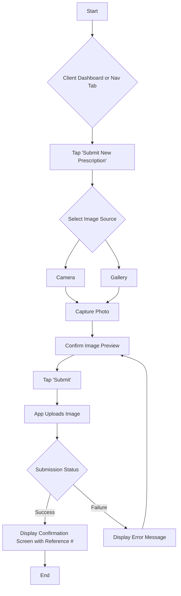
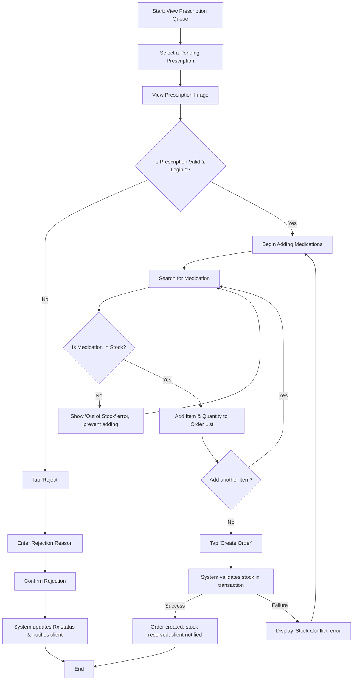

# User Flows

<!--docs/front-end-spec/[title].md-->

This section details the step-by-step pathways for the most critical user tasks within the application. Each flow is designed to be as intuitive and efficient as possible, considering the user's goal, potential edge cases, and necessary system feedback. These flows serve as a blueprint for the interaction design of each key feature.

## User Flow: Prescription Submission (Client)

This is the primary workflow for the Client persona. The entire experience is optimized for speed, clarity, and reassurance, transforming a high-friction manual task into a simple digital one.

*   **User Goal:** To quickly and confidently submit a prescription image for processing without visiting the pharmacy.
*   **Entry Points:**
    *   Primary Call-to-Action (CTA) on the Client Dashboard.
    *   Dedicated "Submit Rx" tab in the primary navigation.
*   **Success Criteria:** The client receives an immediate on-screen confirmation with a unique reference number, and a corresponding notification is generated in their account.

### Flow Diagram

This diagram illustrates the client's journey from initiation to successful submission.

### Key Screen: Confirmation

To fulfill the "Provide Constant Reassurance" principle, the confirmation screen displayed upon successful submission (Step L) is critical. It must contain:
*   **Primary Confirmation:** A large, clear headline and icon (e.g., a green checkmark ✅ with "Submission Successful!").
*   **The Reference Number:** A prominent, easy-to-copy reference number (e.g., "Your reference number is: **#P12345**").
*   **Clear Next Steps:** A brief, reassuring message setting expectations (e.g., "Our team will now review your prescription. You will be notified once it has been processed.").
*   **A Single, Clear Action:** A button to conclude the flow (e.g., "Done" or "Return to Dashboard").

### Edge Cases & Error Handling:

Error handling is centralized around the server's response after an upload attempt. The client application does not perform pre-upload validation on file type or size.

*   **Upload Failure:** If the upload fails for any reason, a clear, non-dismissible message will appear with a "Retry" button. This single failure state covers multiple scenarios:
    *   **Network Error:** The device is offline or has an unstable connection.
    *   **Server-Side Validation Error:** The server rejects the file (e.g., "Invalid file type. Please upload a JPG or PNG." or "File is too large. Please limit to 5MB.").
    *   **Server Issue:** A general server error occurred during processing.
    The message will be user-friendly (e.g., "Submission Failed. Please check your connection or file and try again.") and the "Retry" button will return the user to the image preview screen (Step H).
*   **User Cancels:** If the user cancels the image selection process, they are returned to the "Submit Prescription" screen without any change.
*   **Authentication Error:** If the user's session has expired, the app will prevent the submission and gracefully redirect them to the login screen with an explanatory message.

## User Flow: Prescription Processing (Salesperson)

This workflow is the operational heart of the system for the sales staff. It's designed for maximum efficiency and accuracy, enabling a salesperson to quickly and correctly convert a client's submitted prescription into a formal order, while handling critical business logic like stock validation.

*   **User Goal:** To accurately process a pending prescription, create a new order, and ensure inventory is correctly updated, all within a single, seamless interface.
*   **Entry Points:**
    *   Tapping the "Pending Prescriptions" stat card on the Salesperson Dashboard.
    *   Tapping a specific prescription from the "Prescription Queue" screen.
*   **Success Criteria:** A new order is created with the status 'In Preparation', the original prescription's status is updated to 'Processed', inventory for the ordered items is reserved (decremented), and the client receives a notification that their order is being prepared.

### Flow Diagram

This diagram maps the salesperson's decision-making process, from viewing the queue to successfully creating an order or rejecting an invalid submission.

### Edge Cases & Error Handling:

*   **Out of Stock:** The UI must provide real-time stock availability as the salesperson searches for medications. An out-of-stock item cannot be added to the order list, preventing errors before they happen.
*   **Invalid Prescription:** If the uploaded image is blurry, incomplete, or otherwise invalid, the salesperson has a clear "Reject" path, which requires a reason to ensure the client receives clear feedback.
*   **Concurrent Processing:** If two salespeople attempt to process the same prescription simultaneously, the system should use optimistic locking. The first to submit the 'Create Order' request will succeed. The second will receive a "This prescription has already been processed" error, preventing duplicate orders.
*   **Stock Conflict on Submission:** In the case that stock changes between adding an item and submitting the order, the system will handle the error gracefully to respect the user's effort:
    1.  **API Response:** The API will return a specific error identifying the conflicting item, its requested quantity, and the available quantity.
    2.  **UI Presentation:** The UI will **not** clear the order list. It will display an error banner and visually highlight the specific line item causing the conflict with an inline message (e.g., "Only 50 units available.").
    3.  **User Action:** The "Create Order" button will be disabled until the salesperson edits the quantity of the conflicting item or removes it, at which point the button will become active again.

---